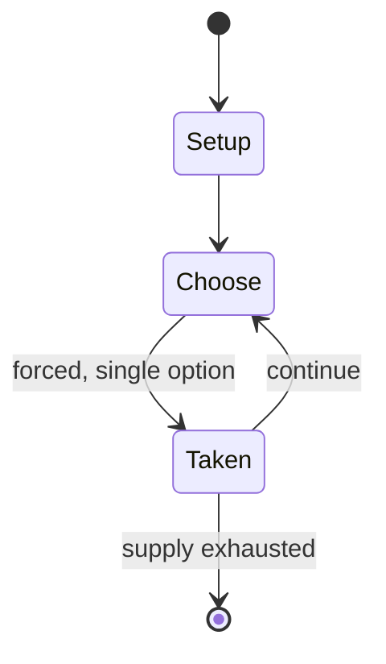

# Kang Sanaba

*traditional Meitei sport of Manipur, India*

`kang_sanaba` &nbsp; state: **DEEPENED** &nbsp; method: **heuristic**

## Found layer (recorded, not trusted)

| field | value |
| --- | --- |
| wikidata | Q135112080 |
| wikipedia | Kang Shanaba |
| genres (source) | -- |
| instance of (source) | traditional game |
| country of origin | -- |

## Declared layer (orders bench work)

| field | value |
| --- | --- |
| year created | -- |
| epoch | -- |
| region | -- |
| media | SPORT |
| players | -- |
| age band | -- |
| exogenous process | -- |
| loss shape | -- |
| live axes | - |
| horizon | -- |
| scoring shape | -- |
| information | -- |
| interaction | -- |
| turn structure | PHASE_STRUCTURED |
| tractability | SAMPLING_ONLY |
| randomness | -- |
| luck factor | 0.35 |
| rules complexity | 2.48 |
| strategic depth | 2.0 |
| novelty | 0.4995 |
| solved status | -- |
| strategies | -- |
| algorithms | -- |

## Object model

```
Episode
  players      : ?
  turn_structure: PHASE_STRUCTURED
  horizon       : ?
  scoring       : ?

Pitch          -- bounded physical region
Player         -- embodied agent with a foul count
Clock          -- counts down; stoppages are rule events
Official       -- detects infractions and applies penalties
```

## State transition diagram



## Research item -- turn trace

```
# Kang Sanaba -- simulated turn events
# generated from the DECLARED vector, not from a rulebook.
# structure: exo=None loss=None horizon=None scoring=None axes=-

t=0    SETUP        players=2  pot=0  capacity=6
t=1    FORCED       p1 single legal option taken (pot_gain=+0.9)
t=2    FORCED       p1 single legal option taken (pot_gain=+1.2)
t=3    FORCED       p1 single legal option taken (pot_gain=+1.5)
t=4    ENDTURN      turn passes to p2
t=5    FORCED       p2 single legal option taken (pot_gain=+1.6)
t=6    FORCED       p2 single legal option taken (pot_gain=+2.0)
t=7    ENDTURN      turn passes to p1
t=8    FORCED       p1 single legal option taken (pot_gain=+1.1)
t=9    FORCED       p1 single legal option taken (pot_gain=+1.0)
t=10   FORCED       p1 single legal option taken (pot_gain=+1.9)
t=11   FORCED       p1 single legal option taken (pot_gain=+0.6)
t=12   ENDTURN      turn passes to p2
t=13   FORCED       p2 single legal option taken (pot_gain=+1.6)
t=14   FORCED       p2 single legal option taken (pot_gain=+1.1)
t=15   FORCED       p2 single legal option taken (pot_gain=+1.6)
t=16   ENDTURN      turn passes to p1
t=17   FORCED       p1 single legal option taken (pot_gain=+1.7)
t=18   ENDTURN      turn passes to p2
t=19   FORCED       p2 single legal option taken (pot_gain=+1.8)
t=20   FORCED       p2 single legal option taken (pot_gain=+0.7)
t=21   FORCED       p2 single legal option taken (pot_gain=+1.1)
t=22   ENDTURN      turn passes to p1
t=23   FORCED       p1 single legal option taken (pot_gain=+0.7)
t=24   FORCED       p1 single legal option taken (pot_gain=+1.9)
t=25   FORCED       p1 single legal option taken (pot_gain=+1.4)
t=26   FORCED       p1 single legal option taken (pot_gain=+1.9)

terminal: VARIABLE
```

## Source extract

Kang Shanaba or Kang Sanaba or Kang Sannaba, literally "playing the kang" or "the game of kang",
is an indigenous Meitei game. It is a type of indoor activity that utilizes a rounded or oval
object known as a "kang", which is the seed of a creeper, and can be tossed onto the ground. The
game is typically enjoyed on the smooth earthen surfaces found in traditional homes and temple
courtyards. Regarded as sacred, it is thought that the deities participated in this game,
especially during the Meitei lunar new year, known as Cheiraoba (the first day of the Sajibu
month), and continuing through the Rath Yatra festival (Kang Chingba).   == Origin ==   ===
Mythology === The Meitei people believe that Kang was originally played by seven Lainingthous
(deities) and seven goddesses known as Leimarens (female deities) to commemorate the creation of
the earth and the splendor of the rising Sun and Moon. The term "Kang" is derived from the
Manipuri word "Kangba", which means to begin.The game represented the commencement of a new life
following the formation of the earth. The Lainingthous and Leimarens competed in seven rounds,
with the goddesses emerging victorious in each round. They utilized

<sub>Wikipedia, CC BY-SA. Retained as evidence for the structural
classification above. Every rule inferred from it is HYPOTHESIZED
until audited against a rulebook.</sub>
