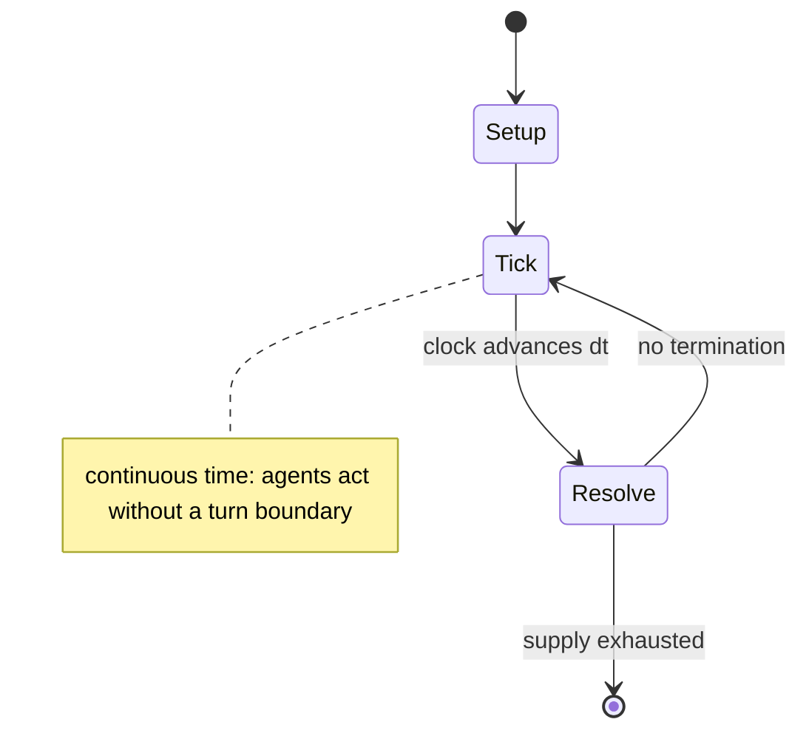

# karaoke

*form of entertainment involving singing to recorded music*

`karaoke` &nbsp; state: **DEEPENED** &nbsp; method: **heuristic**

## Found layer (recorded, not trusted)

| field | value |
| --- | --- |
| wikidata | Q229345 |
| wikipedia | Karaoke |
| genres (source) | -- |
| instance of (source) | action, party game |
| country of origin | -- |

## Declared layer (orders bench work)

| field | value |
| --- | --- |
| year created | 1987 |
| epoch | DIGITAL |
| region | -- |
| media | PARTY, VIDEO |
| players | -- |
| age band | -- |
| exogenous process | CONTINUOUS_TIME |
| loss shape | -- |
| live axes | SELECT, TRADE |
| horizon | -- |
| scoring shape | -- |
| information | -- |
| interaction | COMPETITIVE |
| turn structure | REAL_TIME |
| tractability | SAMPLING_ONLY |
| randomness | REAL_TIME_PHYSICAL |
| luck factor | 0.35 |
| rules complexity | 1.86 |
| strategic depth | 2.0 |
| novelty | 0.0938 |
| solved status | -- |
| strategies | route_optimisation |
| algorithms | -- |

## Object model

```
Episode
  players      : ?
  turn_structure: REAL_TIME
  horizon       : ?
  scoring       : ?

WorldState     -- simulation state advanced by the engine
Avatar         -- player-controlled agent
Clock          -- frame or tick counter
OptionSet      -- the choices available after an exogenous draw
Offer          -- proposed exchange between two agents
```

## State transition diagram



## Research item -- clock trace

```
# karaoke -- simulated clock trace (no turn boundary)
# generated from the DECLARED vector, not from a rulebook.
# structure: exo=CONTINUOUS_TIME loss=None horizon=None scoring=None axes=SELECT,TRADE

clk=0.000s  START        agents=4  clock=free running
clk=2.918s  CONTEST      a2 and a3 contend for the same resource
clk=3.791s  ACTION       a3 acts continuously; no turn boundary crossed
clk=4.606s  ACTION       a1 acts continuously; no turn boundary crossed
clk=6.092s  SCORE        a4 scores (+1)
clk=7.731s  ACTION       a1 acts continuously; no turn boundary crossed
clk=10.683s  CONTEST      a3 and a4 contend for the same resource
clk=13.655s  STOPPAGE     clock halts; state frozen
clk=14.225s  CONTEST      a4 and a1 contend for the same resource
clk=17.196s  ACTION       a4 acts continuously; no turn boundary crossed
clk=19.210s  ACTION       a2 acts continuously; no turn boundary crossed
clk=21.585s  STOPPAGE     clock halts; state frozen
clk=23.328s  ACTION       a2 acts continuously; no turn boundary crossed
clk=23.914s  CONTEST      a2 and a3 contend for the same resource
clk=25.346s  INFRACTION   a3 commits infraction (count=1)
clk=28.301s  ACTION       a3 acts continuously; no turn boundary crossed
clk=31.117s  ACTION       a2 acts continuously; no turn boundary crossed
clk=31.502s  ACTION       a3 acts continuously; no turn boundary crossed
clk=31.967s  CONTEST      a2 and a3 contend for the same resource
clk=34.409s  ACTION       a4 acts continuously; no turn boundary crossed
clk=35.939s  CONTEST      a4 and a1 contend for the same resource
clk=37.315s  SCORE        a3 scores (+2)
clk=38.544s  CONTEST      a3 and a4 contend for the same resource
clk=40.513s  STOPPAGE     clock halts; state frozen
clk=42.375s  STOPPAGE     clock halts; state frozen
clk=44.492s  ACTION       a4 acts continuously; no turn boundary crossed
clk=47.370s  ACTION       a1 acts continuously; no turn boundary crossed

note: elapsed time, not move count, is the episode's ordering variable.
```

## Conditions

| kind | threshold | effect | trigger |
| --- | --- | --- | --- |
| BOUNDARY | -- | -- | In the Philippines, at least half a dozen killings of people singing "My Way" caused newspapers there to label the phenomenon "My Way killings"; such that some bars refused to allow the song, and some singers refrained f |
| BOUNDARY | -- | -- | Hemmings, of Adelaide, South Australia, offered systems manufactured by Pioneer which used 12in (30 cm) double-sided laser discs containing a maximum of 24 songs with accompanying video track and subtitled lyrics. |
| BOUNDARY | -- | -- | Each system came complete with up to 24 discs containing a maximum of 576 music video tracks. |
| BOUNDARY | -- | -- | In Adelaide, karaoke reached its zenith in 1991 with virtually every hotel offering at least one karaoke night per week with many having undertaken alterations to their premises with the addition of purpose built stages  |

## Source extract

Karaoke (カラオケ) is a type of interactive entertainment system usually offered in nightclubs and
bars, where people sing along to pre-recorded accompaniment using a microphone.  Its musical
content is an instrumental rendition of a well-known popular song. In recent times, lyrics are
typically displayed on a video screen, along with a moving symbol, changing colour, or music
video images, to guide the singer. In Chinese-speaking countries and regions such as mainland
China, Hong Kong, Taiwan, and Singapore, a karaoke box is called a KTV. The global karaoke
market has been estimated to be worth nearly $10 billion. Karaoke's global popularity has been
fueled by technological advancements, making it a staple of social gatherings and entertainment
venues all over the world. The precursors of karaoke machines using cassette tapes made their
first appearances in Japan and the Philippines in the 1970s. Commercial versions manufactured by
Japanese companies using LaserDisc became available worldwide in the 1980s, leading to a surge
in popularity. Karaoke machines are commonly found in lounges, nightclubs, and bars; as well as
in-home versions which later combined with home theater systems. O

<sub>Wikipedia, CC BY-SA. Retained as evidence for the structural
classification above. Every rule inferred from it is HYPOTHESIZED
until audited against a rulebook.</sub>
