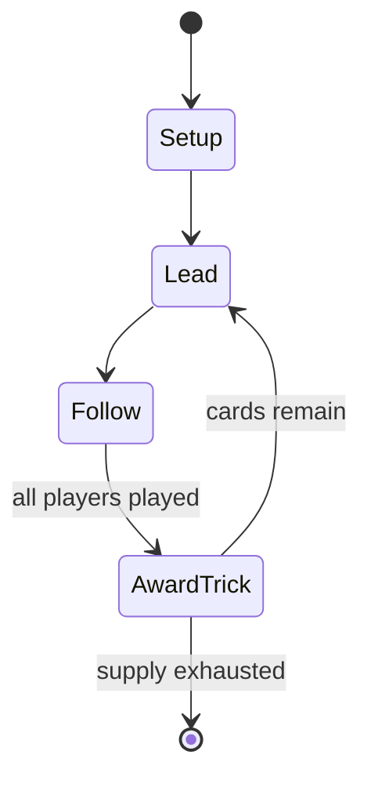

# Karnöffel

`karn_ffel` &nbsp; state: **DEEPENED** &nbsp; method: **heuristic**

## Found layer (recorded, not trusted)

| field | value |
| --- | --- |
| wikidata | Q458258 |
| wikipedia | Karnöffel |
| genres (source) | -- |
| instance of (source) | -- |
| country of origin | -- |

## Declared layer (orders bench work)

| field | value |
| --- | --- |
| year created | -- |
| epoch | -- |
| region | -- |
| media | CARD, TRICK_TAKING |
| players | -- |
| age band | -- |
| exogenous process | -- |
| loss shape | -- |
| live axes | - |
| horizon | -- |
| scoring shape | -- |
| information | -- |
| interaction | TEAM |
| turn structure | TRICK_ROUND |
| tractability | SAMPLING_ONLY |
| randomness | -- |
| luck factor | -- |
| rules complexity | 1.82 |
| strategic depth | 2.25 |
| novelty | 0.6368 |
| solved status | -- |
| strategies | spatial_packing |
| algorithms | -- |

## Object model

```
Episode
  players      : ?
  turn_structure: TRICK_ROUND
  horizon       : ?
  scoring       : ?

Deck           -- ordered multiset, drawn without replacement
Hand           -- private multiset held by one player
DiscardPile    -- public accumulation of spent cards
Trick          -- one card per player; a winner is determined
Trump          -- suit that dominates the ordering
```

## State transition diagram



## Research item -- turn trace

```
# Karnöffel -- simulated turn events
# generated from the DECLARED vector, not from a rulebook.
# structure: exo=None loss=None horizon=None scoring=None axes=-

t=0    SETUP        players=2  pot=0  capacity=3
t=1    FORCED       p1 single legal option taken (pot_gain=+1.8)
t=2    FORCED       p1 single legal option taken (pot_gain=+1.0)
t=3    ENDTURN      turn passes to p2
t=4    FORCED       p2 single legal option taken (pot_gain=+1.8)
t=5    FORCED       p2 single legal option taken (pot_gain=+2.0)
t=6    ENDTURN      turn passes to p1
t=7    FORCED       p1 single legal option taken (pot_gain=+0.5)
t=8    FORCED       p1 single legal option taken (pot_gain=+1.4)
t=9    ENDTURN      turn passes to p2
t=10   FORCED       p2 single legal option taken (pot_gain=+1.0)
t=11   ENDTURN      turn passes to p1
t=12   FORCED       p1 single legal option taken (pot_gain=+1.5)
t=13   FORCED       p1 single legal option taken (pot_gain=+1.8)
t=14   FORCED       p1 single legal option taken (pot_gain=+0.7)
t=15   FORCED       p1 single legal option taken (pot_gain=+1.7)
t=16   FORCED       p1 single legal option taken (pot_gain=+2.0)
t=17   FORCED       p1 single legal option taken (pot_gain=+2.0)
t=18   ENDTURN      turn passes to p2
t=19   FORCED       p2 single legal option taken (pot_gain=+1.0)
t=20   FORCED       p2 single legal option taken (pot_gain=+0.6)
t=21   FORCED       p2 single legal option taken (pot_gain=+1.9)
t=22   ENDTURN      turn passes to p1
t=23   FORCED       p1 single legal option taken (pot_gain=+0.5)
t=24   FORCED       p1 single legal option taken (pot_gain=+0.6)
t=25   FORCED       p1 single legal option taken (pot_gain=+1.9)
t=26   FORCED       p1 single legal option taken (pot_gain=+1.8)

terminal: VARIABLE
```

## Source extract

Karnöffel is a trick-taking card game which probably came from the upper-German language area in
Europe in the first quarter of the 15th century. It first appeared listed in a municipal
ordinance of Nördlingen, Bavaria, in 1426 among the games that could be lawfully played at the
annual city fête. This makes the game the oldest identifiable European card game in the history
of playing cards with a continuous tradition of play down to the present day.   == History ==
The earliest substantial reference to Karnöffel is a poem by Meissner, written in or before
1450. Historically karnöffeln meant "to cudgel, thrash or flog", but in medieval times, a
Karnöffel was also the word for an inguinal hernia. Karnöffel had a suit, the 'chosen suit', in
which some cards had a higher priority than cards in other suits, which indicates that it might
be a possible precursor to the trump suit of Tarot. The earliest forms of Karnöffel utilized a
deck of 48 cards, Aces having been removed from German and Swiss playing cards during the 14th
or early 15th century.   == Descendants == Karnöffel has a number of descendants that are still
played today including Swiss Kaisern or Kaiserjass, Schleswigian Knüf

<sub>Wikipedia, CC BY-SA. Retained as evidence for the structural
classification above. Every rule inferred from it is HYPOTHESIZED
until audited against a rulebook.</sub>
