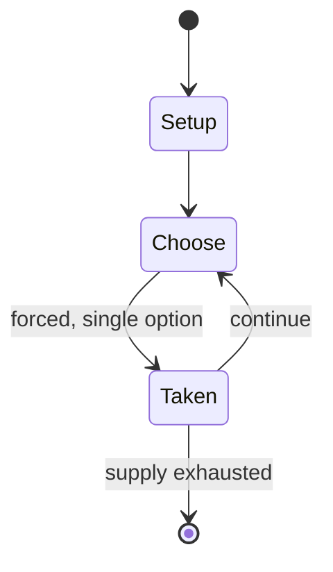

# Katro

*traditional mancala game*

`katro` &nbsp; state: **DEEPENED** &nbsp; method: **heuristic**

## Found layer (recorded, not trusted)

| field | value |
| --- | --- |
| wikidata | Q3813995 |
| wikipedia | Katro |
| genres (source) | abstract strategy game |
| instance of (source) | board game, mancala, two-player game |
| country of origin | -- |

## Declared layer (orders bench work)

| field | value |
| --- | --- |
| year created | -- |
| epoch | -- |
| region | -- |
| media | MANCALA |
| players | 2 |
| age band | -- |
| exogenous process | -- |
| loss shape | -- |
| live axes | - |
| horizon | -- |
| scoring shape | -- |
| information | -- |
| interaction | COMPETITIVE |
| turn structure | -- |
| tractability | SAMPLING_ONLY |
| randomness | -- |
| luck factor | 0.35 |
| rules complexity | 1.76 |
| strategic depth | 2.0 |
| novelty | 0.3553 |
| solved status | -- |
| strategies | -- |
| algorithms | -- |

## Object model

```
Episode
  players      : 2
  turn_structure: ?
  horizon       : ?
  scoring       : ?

Pits           -- cyclic array of counts
Store          -- player's banked seeds
```

## State transition diagram



## Research item -- turn trace

```
# Katro -- simulated turn events
# generated from the DECLARED vector, not from a rulebook.
# structure: exo=None loss=None horizon=None scoring=None axes=-

t=0    SETUP        players=2  pot=0  capacity=7
t=1    FORCED       p1 single legal option taken (pot_gain=+1.8)
t=2    FORCED       p1 single legal option taken (pot_gain=+1.3)
t=3    FORCED       p1 single legal option taken (pot_gain=+1.2)
t=4    FORCED       p1 single legal option taken (pot_gain=+1.6)
t=5    FORCED       p1 single legal option taken (pot_gain=+0.6)
t=6    ENDTURN      turn passes to p2
t=7    FORCED       p2 single legal option taken (pot_gain=+1.6)
t=8    FORCED       p2 single legal option taken (pot_gain=+0.7)
t=9    ENDTURN      turn passes to p1
t=10   FORCED       p1 single legal option taken (pot_gain=+1.4)
t=11   FORCED       p1 single legal option taken (pot_gain=+1.7)
t=12   ENDTURN      turn passes to p2
t=13   FORCED       p2 single legal option taken (pot_gain=+1.3)
t=14   FORCED       p2 single legal option taken (pot_gain=+1.9)
t=15   FORCED       p2 single legal option taken (pot_gain=+1.5)
t=16   ENDTURN      turn passes to p1
t=17   FORCED       p1 single legal option taken (pot_gain=+1.2)
t=18   FORCED       p1 single legal option taken (pot_gain=+1.8)
t=19   FORCED       p1 single legal option taken (pot_gain=+1.1)
t=20   FORCED       p1 single legal option taken (pot_gain=+1.9)
t=21   FORCED       p1 single legal option taken (pot_gain=+1.9)
t=22   FORCED       p1 single legal option taken (pot_gain=+1.0)
t=23   FORCED       p1 single legal option taken (pot_gain=+1.5)
t=24   FORCED       p1 single legal option taken (pot_gain=+1.0)
t=25   FORCED       p1 single legal option taken (pot_gain=+1.3)
t=26   FORCED       p1 single legal option taken (pot_gain=+1.1)

terminal: VARIABLE
```

## Conditions

| kind | threshold | effect | trigger |
| --- | --- | --- | --- |
| LOSE | -- | -- | The first player to be left without seeds loses the game. |

## Source extract

Katro is a traditional mancala game played by the Betsileo people in the Fianarantsoa Province
of Madagascar. The game was first described by Alex de Voogt in 1998.   == Rules == Katro is
played on a 6 × 6 board (6 rows of 6 pits each). Each player controls half of the board (three
rows). At game setup, two seeds are placed in each pit. At his or her turn, the player relay
sows the seeds from one of his or her pits, with the constraint that the chosen pit must be in
the outermost non-empty row. As with most mancala-IV (i.e., mancalas with 4 rows), sowing is
confined to the player's own rows. Sowing may occur in two "directions". Consider the following
scheme:  a b c d e f l k j i h g m n o p q r M N O P Q R L K J I H G A B C D E F  The southern
player can either sow like this:  A B C D E F G H I J K L M N O P Q R A B C....  or like this:
F E D C B A L K J I H G R Q P O N M F E D....  If the last seed of the sowing is dropped in an
empty pit, this may cause a capture if the following applies:  the pit where the seed was
dropped is in the innermost non-empty row; the opponent has a non-empty pit in his or her
innermost non-empty row, in the same column. If both conditions apply, all

<sub>Wikipedia, CC BY-SA. Retained as evidence for the structural
classification above. Every rule inferred from it is HYPOTHESIZED
until audited against a rulebook.</sub>
