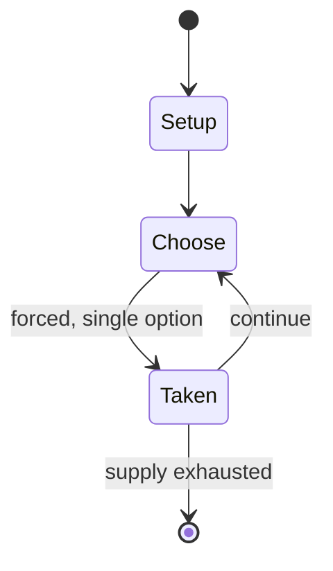

# Kemari

`kemari` &nbsp; state: **DEEPENED** &nbsp; method: **heuristic**

## Found layer (recorded, not trusted)

| field | value |
| --- | --- |
| wikidata | Q12224003 |
| wikipedia | Kemari |
| genres (source) | -- |
| instance of (source) | -- |
| country of origin | -- |

## Declared layer (orders bench work)

| field | value |
| --- | --- |
| year created | -- |
| epoch | -- |
| region | -- |
| media | SPORT |
| players | -- |
| age band | -- |
| exogenous process | -- |
| loss shape | -- |
| live axes | - |
| horizon | -- |
| scoring shape | NONLINEAR |
| information | -- |
| interaction | COMPETITIVE |
| turn structure | -- |
| tractability | SAMPLING_ONLY |
| randomness | -- |
| luck factor | 0.35 |
| rules complexity | 1.75 |
| strategic depth | 2.0 |
| novelty | 0.5504 |
| solved status | -- |
| strategies | -- |
| algorithms | -- |

## Object model

```
Episode
  players      : ?
  turn_structure: ?
  horizon       : ?
  scoring       : NONLINEAR

Pitch          -- bounded physical region
Player         -- embodied agent with a foul count
Clock          -- counts down; stoppages are rule events
Official       -- detects infractions and applies penalties
```

## State transition diagram



## Research item -- turn trace

```
# Kemari -- simulated turn events
# generated from the DECLARED vector, not from a rulebook.
# structure: exo=None loss=None horizon=None scoring=NONLINEAR axes=-

t=0    SETUP        players=2  pot=0  capacity=8
t=1    FORCED       p1 single legal option taken (pot_gain=+0.6)
t=2    ENDTURN      turn passes to p2
t=3    FORCED       p2 single legal option taken (pot_gain=+1.2)
t=4    FORCED       p2 single legal option taken (pot_gain=+1.6)
t=5    FORCED       p2 single legal option taken (pot_gain=+0.8)
t=6    ENDTURN      turn passes to p1
t=7    FORCED       p1 single legal option taken (pot_gain=+1.8)
t=8    ENDTURN      turn passes to p2
t=9    FORCED       p2 single legal option taken (pot_gain=+1.7)
t=10   FORCED       p2 single legal option taken (pot_gain=+1.9)
t=11   ENDTURN      turn passes to p1
t=12   FORCED       p1 single legal option taken (pot_gain=+1.8)
t=13   FORCED       p1 single legal option taken (pot_gain=+1.1)
t=14   FORCED       p1 single legal option taken (pot_gain=+1.8)
t=15   FORCED       p1 single legal option taken (pot_gain=+0.9)
t=16   FORCED       p1 single legal option taken (pot_gain=+2.0)
t=17   ENDTURN      turn passes to p2
t=18   FORCED       p2 single legal option taken (pot_gain=+1.0)
t=19   FORCED       p2 single legal option taken (pot_gain=+0.5)
t=20   ENDTURN      turn passes to p1
t=21   FORCED       p1 single legal option taken (pot_gain=+0.8)
t=22   FORCED       p1 single legal option taken (pot_gain=+1.8)
t=23   FORCED       p1 single legal option taken (pot_gain=+1.0)
t=24   FORCED       p1 single legal option taken (pot_gain=+2.0)
t=25   ENDTURN      turn passes to p2
t=26   FORCED       p2 single legal option taken (pot_gain=+1.4)

terminal: VARIABLE
```

## Source extract

Kemari (蹴鞠) is an athletic football game that was popular during the Heian (794–1185) and
Kamakura (1185–1333) periods of Japan. It resembles a game of keepie uppie or hacky sack. The
game was popular in Kyoto, the capital, and the surrounding Kansai region, and over time it
spread from the aristocracy to the samurai and chōnin classes.  Nowadays, kemari is played as a
seasonal event mainly at Shinto shrines in Kansai. Players play in a costume called kariginu
(ja:狩衣), which was worn as everyday clothing by court nobles during the Heian period.   ==
History ==  The earliest kemari was created under the influence of the Chinese sport cuju, which
is written with the same kanji.  It is often said that the earliest evidence of kemari is the
record for 644 in the Nihon Shoki, but this theory is disputed. In 644, Prince Naka-no-Ōe (later
enthroned as Emperor Tenji) and Fujiwara no Kamatari, who later initiated the Taika Reforms,
became friends during a ball game described as butsumari (打鞠), but it may have been a field
hockey-like ball game using a cane instead. The earliest reliable documentary evidence of the
word kemari (蹴鞠) is found in a record of an annual event called Honchō gatsur

<sub>Wikipedia, CC BY-SA. Retained as evidence for the structural
classification above. Every rule inferred from it is HYPOTHESIZED
until audited against a rulebook.</sub>
