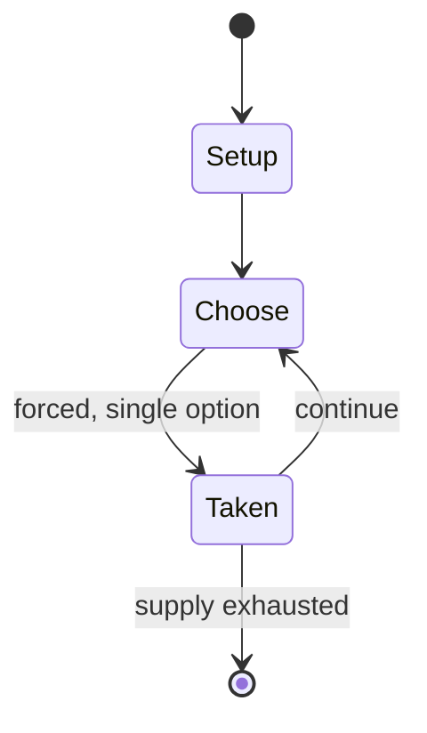

# Keno

`keno` &nbsp; state: **DEEPENED** &nbsp; method: **heuristic**

## Found layer (recorded, not trusted)

| field | value |
| --- | --- |
| wikidata | Q1165825 |
| wikipedia | Keno |
| genres (source) | -- |
| instance of (source) | -- |
| country of origin | -- |

## Declared layer (orders bench work)

| field | value |
| --- | --- |
| year created | -- |
| epoch | -- |
| region | -- |
| media | GAMBLING |
| players | -- |
| age band | -- |
| exogenous process | -- |
| loss shape | -- |
| live axes | - |
| horizon | -- |
| scoring shape | SET_COLLECTION_CONVEX |
| information | -- |
| interaction | -- |
| turn structure | TICK_BASED |
| tractability | SAMPLING_ONLY |
| randomness | DECK_SHUFFLE |
| luck factor | 0.48 |
| rules complexity | 1.9 |
| strategic depth | 2.25 |
| novelty | 0.6057 |
| solved status | -- |
| strategies | probability_estimation |
| algorithms | -- |

## Object model

```
Episode
  players      : ?
  turn_structure: TICK_BASED
  horizon       : ?
  scoring       : SET_COLLECTION_CONVEX

State          -- opaque; no medium or axis evidence was found
Player         -- an agent that selects among legal successors
```

## State transition diagram



## Research item -- clock trace

```
# Keno -- simulated clock trace (no turn boundary)
# generated from the DECLARED vector, not from a rulebook.
# structure: exo=None loss=None horizon=None scoring=SET_COLLECTION_CONVEX axes=-

clk=0.000s  START        agents=4  clock=free running
clk=0.689s  CONTEST      a1 and a2 contend for the same resource
clk=3.536s  ACTION       a3 acts continuously; no turn boundary crossed
clk=5.313s  SCORE        a2 scores (+1)
clk=6.751s  ACTION       a3 acts continuously; no turn boundary crossed
clk=9.477s  CONTEST      a4 and a1 contend for the same resource
clk=11.622s  CONTEST      a1 and a2 contend for the same resource
clk=12.519s  ACTION       a4 acts continuously; no turn boundary crossed
clk=13.785s  CONTEST      a3 and a4 contend for the same resource
clk=14.974s  SCORE        a2 scores (+1)
clk=17.312s  ACTION       a2 acts continuously; no turn boundary crossed
clk=20.023s  ACTION       a2 acts continuously; no turn boundary crossed
clk=22.570s  STOPPAGE     clock halts; state frozen
clk=23.069s  ACTION       a2 acts continuously; no turn boundary crossed
clk=24.175s  ACTION       a1 acts continuously; no turn boundary crossed
clk=26.600s  ACTION       a3 acts continuously; no turn boundary crossed
clk=28.555s  CONTEST      a2 and a3 contend for the same resource
clk=30.097s  INFRACTION   a3 commits infraction (count=1)
clk=31.843s  CONTEST      a3 and a4 contend for the same resource
clk=32.312s  STOPPAGE     clock halts; state frozen
clk=32.955s  INFRACTION   a3 commits infraction (count=2)
clk=34.072s  ACTION       a3 acts continuously; no turn boundary crossed
clk=35.013s  INFRACTION   a1 commits infraction (count=1)
clk=36.296s  INFRACTION   a1 commits infraction (count=2)
clk=36.951s  CONTEST      a2 and a3 contend for the same resource
clk=37.803s  SCORE        a4 scores (+1)
clk=40.048s  CONTEST      a1 and a2 contend for the same resource

note: elapsed time, not move count, is the episode's ordering variable.
```

## Source extract

Keno  is a lottery-like gambling game often played at modern casinos, and also offered as a game
in some lotteries. Players wager by choosing numbers ranging from 1 through (usually) 80. After
all players make their wagers, 20 numbers (some variants draw fewer numbers) are drawn at
random, either with a ball machine similar to ones used for lotteries and bingo, or with a
random number generator. Each casino sets its own series of payouts, called "paytables". The
player is paid based on how many numbers were chosen (either player selection, or the terminal
picking the numbers), the number of matches out of those chosen, and the wager. There are a wide
variety of keno paytables depending on the casino, usually with a larger "house edge" than other
games, ranging from less than 4 percent to over 35 percent in online play, and 20–40% in in-
person casinos. By way of comparison, the typical house edge for non-slot casino games is under
5%.   == History ==  The word "keno" has French or Latin roots (Fr. quine "five winning
numbers", L. quini "five each"), but by all accounts the game originated in China. Legend has it
that Zhang Liang invented the game during the Chu-Han Contention to rai

<sub>Wikipedia, CC BY-SA. Retained as evidence for the structural
classification above. Every rule inferred from it is HYPOTHESIZED
until audited against a rulebook.</sub>
