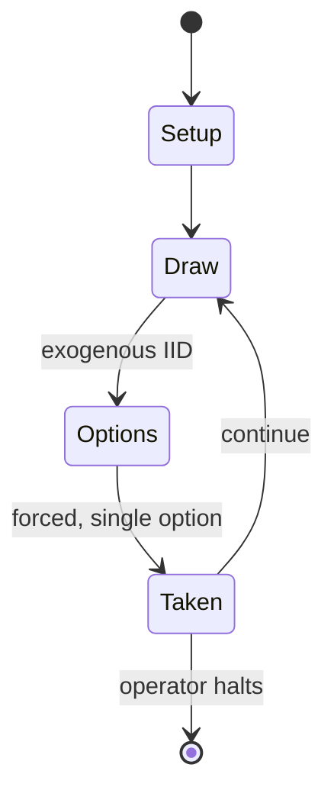

# KeyForge

*unique deck card game*

`keyforge` &nbsp; state: **DEEPENED** &nbsp; method: **heuristic**

## Found layer (recorded, not trusted)

| field | value |
| --- | --- |
| wikidata | Q56290125 |
| wikipedia | KeyForge |
| genres (source) | -- |
| instance of (source) | card game |
| country of origin | -- |

## Declared layer (orders bench work)

| field | value |
| --- | --- |
| year created | 2018 |
| epoch | CONTEMPORARY |
| region | -- |
| media | CARD |
| players | 2 |
| age band | -- |
| exogenous process | IID |
| loss shape | -- |
| live axes | DISCARD, TRADE |
| horizon | OPEN_ENDED |
| scoring shape | -- |
| information | -- |
| interaction | COMPETITIVE |
| turn structure | STRICT_TURN |
| tractability | SAMPLING_ONLY |
| randomness | DICE, HIDDEN_INFO |
| luck factor | 0.35 |
| rules complexity | 2.33 |
| strategic depth | 2.0 |
| novelty | 0.4937 |
| solved status | -- |
| strategies | -- |
| algorithms | -- |

## Object model

```
Episode
  players      : 2
  turn_structure: STRICT_TURN
  horizon       : OPEN_ENDED
  scoring       : ?

Deck           -- ordered multiset, drawn without replacement
Hand           -- private multiset held by one player
DiscardPile    -- public accumulation of spent cards
DiscardChoice  -- what is given up to satisfy a limit
Offer          -- proposed exchange between two agents
```

## State transition diagram



## Research item -- turn trace

```
# KeyForge -- simulated turn events
# generated from the DECLARED vector, not from a rulebook.
# structure: exo=IID loss=None horizon=OPEN_ENDED scoring=None axes=DISCARD,TRADE

t=0    SETUP        players=2  pot=0  capacity=4
t=1    DRAW         p1 roll from d6 pool -> outcome #3  (p=0.082)
t=2    FORCED       p1 single legal option taken (pot_gain=+1.7)
t=3    DRAW         p1 roll from d6 pool -> outcome #1  (p=0.045)
t=4    FORCED       p1 single legal option taken (pot_gain=+1.7)
t=5    TRADE        p1 offers 2:1 exchange to p2
t=6    DISCARD      p1 discards to hand limit
t=7    DRAW         p1 roll from d6 pool -> outcome #1  (p=0.064)
t=8    FORCED       p1 single legal option taken (pot_gain=+1.0)
t=9    TRADE        p1 offers 2:1 exchange to p2
t=10   DISCARD      p1 discards to hand limit
t=11   ENDTURN      turn passes to p2
t=12   DRAW         p2 roll from d6 pool -> outcome #6  (p=0.151)
t=13   FORCED       p2 single legal option taken (pot_gain=+0.5)
t=14   DISCARD      p2 discards to hand limit
t=15   DRAW         p2 roll from d6 pool -> outcome #5  (p=0.278)
t=16   FORCED       p2 single legal option taken (pot_gain=+1.8)
t=17   TRADE        p2 offers 2:1 exchange to p1
t=18   DRAW         p2 roll from d6 pool -> outcome #4  (p=0.143)
t=19   FORCED       p2 single legal option taken (pot_gain=+0.9)
t=20   TRADE        p2 offers 2:1 exchange to p1
t=21   DRAW         p2 roll from d6 pool -> outcome #2  (p=0.082)
t=22   FORCED       p2 single legal option taken (pot_gain=+1.9)
t=23   TRADE        p2 offers 2:1 exchange to p1
t=24   DISCARD      p2 discards to hand limit
t=25   ENDTURN      turn passes to p1
t=26   DRAW         p1 roll from d6 pool -> outcome #5  (p=0.117)
t=27   FORCED       p1 single legal option taken (pot_gain=+1.2)
t=28   DISCARD      p1 discards to hand limit

terminal: OPEN_ENDED
```

## Source extract

KeyForge is a card game designed by Richard Garfield and published by Ghost Galaxy. It was
released in 2018 and was originally published by Fantasy Flight Games.    == Gameplay ==
KeyForge is a two-player game, with each player using a single deck of cards to play creatures,
artifacts, actions, and upgrades. The game's aim is to gather enough Æmber (pronounced "amber")
to forge three keys before the opponent does the same. Creatures can collect Æmber and fight one
another, while artifacts provide unique effects. Actions are used and discarded, and upgrades
are attached to creatures to improve their abilities. Each card in KeyForge is associated with a
House, with each deck containing cards from three Houses. At the beginning of each player's
turn, that player declares a House – they may then only play, use, or discard cards belonging to
that House. Unlike similar card games such as Magic: The Gathering and Android: Netrunner, cards
do not typically require a cost to be paid such as the expenditure of mana or credits. Instead,
a player may play and use as many cards on their turn as they wish, provided the cards belong to
the declared House. Each deck features a unique card back wi

<sub>Wikipedia, CC BY-SA. Retained as evidence for the structural
classification above. Every rule inferred from it is HYPOTHESIZED
until audited against a rulebook.</sub>
