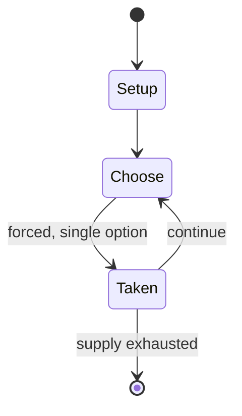

# Kharbaga

`kharbaga` &nbsp; state: **DEEPENED** &nbsp; method: **heuristic**

## Found layer (recorded, not trusted)

| field | value |
| --- | --- |
| wikidata | Q3196083 |
| wikipedia | Kharbaga |
| genres (source) | -- |
| instance of (source) | -- |
| country of origin | -- |

## Declared layer (orders bench work)

| field | value |
| --- | --- |
| year created | -- |
| epoch | -- |
| region | -- |
| media | BOARD |
| players | -- |
| age band | -- |
| exogenous process | NONE |
| loss shape | OPPORTUNITY_ONLY |
| live axes | ORDER, SPATIAL |
| horizon | -- |
| scoring shape | -- |
| information | PERFECT |
| interaction | COMPETITIVE |
| turn structure | -- |
| tractability | EXACT_WITH_CUT |
| randomness | NONE |
| luck factor | 0.02 |
| rules complexity | 2.61 |
| strategic depth | 2.4 |
| novelty | 0.7343 |
| solved status | -- |
| strategies | -- |
| algorithms | -- |

## Object model

```
Episode
  players      : ?
  turn_structure: ?
  horizon       : ?
  scoring       : ?

Board          -- spatial substrate; cells carry position and occupancy
Piece          -- movable token owned by a player
Sequence       -- the permutation under the player's control
Placement      -- position subject to geometric legality
```

## State transition diagram



## Research item -- turn trace

```
# Kharbaga -- simulated turn events
# generated from the DECLARED vector, not from a rulebook.
# structure: exo=NONE loss=OPPORTUNITY_ONLY horizon=None scoring=None axes=ORDER,SPATIAL

t=0    SETUP        players=2  pot=0  capacity=8
t=1    FORCED       p1 single legal option taken (pot_gain=+0.7)
t=2    FORCED       p1 single legal option taken (pot_gain=+0.8)
t=3    SPATIAL      p1 places at (1,3); adjacency legal
t=4    FORCED       p1 single legal option taken (pot_gain=+1.4)
t=5    SPATIAL      p1 places at (2,6); adjacency legal
t=6    ENDTURN      turn passes to p2
t=7    FORCED       p2 single legal option taken (pot_gain=+1.1)
t=8    SPATIAL      p2 places at (3,7); adjacency legal
t=9    FORCED       p2 single legal option taken (pot_gain=+0.7)
t=10   SPATIAL      p2 places at (6,3); adjacency legal
t=11   FORCED       p2 single legal option taken (pot_gain=+0.9)
t=12   FORCED       p2 single legal option taken (pot_gain=+0.7)
t=13   SPATIAL      p2 places at (1,2); adjacency legal
t=14   FORCED       p2 single legal option taken (pot_gain=+1.1)
t=15   FORCED       p2 single legal option taken (pot_gain=+1.6)
t=16   FORCED       p2 single legal option taken (pot_gain=+1.5)
t=17   FORCED       p2 single legal option taken (pot_gain=+1.6)
t=18   FORCED       p2 single legal option taken (pot_gain=+1.5)
t=19   SPATIAL      p2 places at (3,5); adjacency legal
t=20   ENDTURN      turn passes to p1
t=21   FORCED       p1 single legal option taken (pot_gain=+1.9)
t=22   SPATIAL      p1 places at (0,6); adjacency legal
t=23   FORCED       p1 single legal option taken (pot_gain=+1.8)
t=24   SPATIAL      p1 places at (3,0); adjacency legal
t=25   FORCED       p1 single legal option taken (pot_gain=+0.9)
t=26   ENDTURN      turn passes to p2

terminal: VARIABLE
```

## Conditions

| kind | threshold | effect | trigger |
| --- | --- | --- | --- |
| WIN | -- | -- | The player who captures all their opponent's pieces is the winner. |

## Source extract

Kharbaga is a two-player abstract strategy game from North Africa. In a way, it is a miniature
version of Zamma; however, there are more diagonal lines per square on the board as compared to
Zamma. The game is considered part of the Zamma family. The game is also similar to Alquerque
and draughts. The board is essentially an Alquerque board with twice the number of diagonal
lines or segments allowing for greater freedom of movement. The initial setup is also similar to
Alquerque, where every space on the board is filled with each player's pieces except for the
middle point of the board. Moreover, each player's pieces are also set up on each player's half
of the board. The game specifically resembles draughts in that pieces must move in the forward
directions until they are crowned "Mullah" (or "Sultan") which is the equivalent of the King in
draughts. The Mullah can move in any direction.  It is unknown how old the game is; however, the
idea that pieces must move forward until they are crowned Mullah is a feature thought to have
been developed and borrowed from draughts which came into being only in the 17th century. This
is, however, open to debate. Two similar games are played by

<sub>Wikipedia, CC BY-SA. Retained as evidence for the structural
classification above. Every rule inferred from it is HYPOTHESIZED
until audited against a rulebook.</sub>
