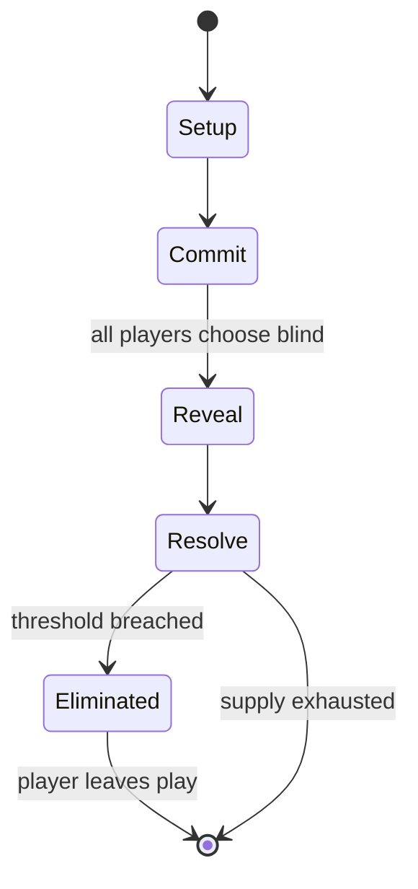

# Khet

*abstract strategy game*

`khet` &nbsp; state: **DEEPENED** &nbsp; method: **heuristic**

## Found layer (recorded, not trusted)

| field | value |
| --- | --- |
| wikidata | Q1086739 |
| wikipedia | Khet (game) |
| genres (source) | -- |
| instance of (source) | abstract strategy game |
| country of origin | -- |

## Declared layer (orders bench work)

| field | value |
| --- | --- |
| year created | -- |
| epoch | -- |
| region | -- |
| media | ABSTRACT, BOARD |
| players | 2 |
| age band | -- |
| exogenous process | NONE |
| loss shape | ELIMINATION |
| live axes | SPATIAL |
| horizon | -- |
| scoring shape | -- |
| information | PERFECT |
| interaction | COMPETITIVE |
| turn structure | SIMULTANEOUS |
| tractability | EXACT_WITH_CUT |
| randomness | SIMULTANEOUS_CHOICE |
| luck factor | 0.05 |
| rules complexity | 2.36 |
| strategic depth | 2.65 |
| novelty | 0.7556 |
| solved status | -- |
| strategies | sacrifice |
| algorithms | -- |

## Object model

```
Episode
  players      : 2
  turn_structure: SIMULTANEOUS
  horizon       : ?
  scoring       : ?

Board          -- spatial substrate; cells carry position and occupancy
Piece          -- movable token owned by a player
Placement      -- position subject to geometric legality
```

## State transition diagram



## Research item -- turn trace

```
# Khet -- simulated turn events
# generated from the DECLARED vector, not from a rulebook.
# structure: exo=NONE loss=ELIMINATION horizon=None scoring=None axes=SPATIAL

t=0    SETUP        players=2  pot=0  capacity=3
t=1    FORCED       p1 single legal option taken (pot_gain=+1.9)
t=2    SPATIAL      p1 places at (1,3); adjacency legal
t=3    FORCED       p1 single legal option taken (pot_gain=+1.4)
t=4    FORCED       p1 single legal option taken (pot_gain=+0.8)
t=5    FORCED       p1 single legal option taken (pot_gain=+1.0)
t=6    SPATIAL      p1 places at (2,7); adjacency legal
t=7    FORCED       p1 single legal option taken (pot_gain=+0.7)
t=8    ENDTURN      turn passes to p2
t=9    FORCED       p2 single legal option taken (pot_gain=+0.9)
t=10   SPATIAL      p2 places at (4,6); adjacency legal
t=11   ENDTURN      turn passes to p1
t=12   FORCED       p1 single legal option taken (pot_gain=+1.2)
t=13   FORCED       p1 single legal option taken (pot_gain=+1.0)
t=14   FORCED       p1 single legal option taken (pot_gain=+1.9)
t=15   FORCED       p1 single legal option taken (pot_gain=+1.2)
t=16   SPATIAL      p1 places at (6,5); adjacency legal
t=17   FORCED       p1 single legal option taken (pot_gain=+0.7)
t=18   SPATIAL      p1 places at (4,5); adjacency legal
t=19   FORCED       p1 single legal option taken (pot_gain=+2.0)
t=20   SPATIAL      p1 places at (7,5); adjacency legal
t=21   FORCED       p1 single legal option taken (pot_gain=+1.5)
t=22   FORCED       p1 single legal option taken (pot_gain=+0.8)
t=23   FORCED       p1 single legal option taken (pot_gain=+1.1)
t=24   FORCED       p1 single legal option taken (pot_gain=+0.8)
t=25   FORCED       p1 single legal option taken (pot_gain=+0.5)
t=26   FORCED       p1 single legal option taken (pot_gain=+1.8)

terminal: VARIABLE
```

## Conditions

| kind | threshold | effect | trigger |
| --- | --- | --- | --- |
| ELIMINATE | -- | eliminated | When a piece is struck by a laser on a non-mirrored side, it is eliminated from the game. |
| ELIMINATE | -- | removed | After moving, the player must fire their own laser, and any piece of either color hit on a non-reflecting side (with the exception of Anubis in Khet 2.0 being hit from the front) is removed from play. |
| ELIMINATE | -- | -- | They reflect a laser coming in from any direction, and thus cannot be eliminated from the board. |
| ELIMINATE | -- | -- | Anubis replaced Obelisks in Khet 2.0; they have the advantage that, despite still being unmirrored, they are not affected by a laser strike on the front; they must be hit on the sides or rear in order to be eliminated. |
| LOSE | -- | -- | If hit with a laser, it is destroyed and its owner loses the game. |

## Source extract

Khet is a chess-like abstract strategy board game that uses lasers, and was formerly known as
Deflexion. Players take turns moving Egyptian-themed pieces around the playing field, firing
their low-powered laser diode after each move. Most of the pieces are mirrored on one or more
sides, allowing the players to alter the path of the laser through the playing field. When a
piece is struck by a laser on a non-mirrored side, it is eliminated from the game.   == History
== Professor Michael Larson and two students, Del Segura and Luke Hooper, designed the game as a
class project at Tulane University. (Professor Larson is now at the University of Colorado.) The
game was introduced to the public in the spring of 2005, and was first brought to prominence at
the New York Toy Fair of that year. The game was first shipped in October 2005. The first
Deflexion World Championship was held December 10, 2005 under the dome at the Massachusetts
Institute of Technology. Registration was free, and the participants competed for cash and other
prizes. Initially the game was branded as Deflexion, but when confronted with a trademark
dispute the creators opted to rebrand and develop an Egyptian theme for

<sub>Wikipedia, CC BY-SA. Retained as evidence for the structural
classification above. Every rule inferred from it is HYPOTHESIZED
until audited against a rulebook.</sub>
