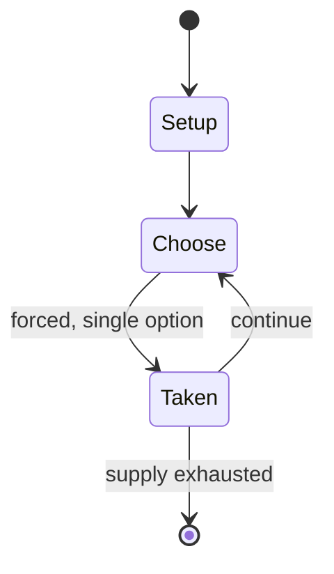

# Kingdomino

`kingdomino` &nbsp; state: **DEEPENED** &nbsp; method: **heuristic**

## Found layer (recorded, not trusted)

| field | value |
| --- | --- |
| wikidata | Q29936771 |
| wikipedia | Kingdomino |
| genres (source) | -- |
| instance of (source) | -- |
| country of origin | -- |

## Declared layer (orders bench work)

| field | value |
| --- | --- |
| year created | -- |
| epoch | -- |
| region | -- |
| media | BOARD, TILE |
| players | 2-4 |
| age band | -- |
| exogenous process | -- |
| loss shape | -- |
| live axes | SPATIAL |
| horizon | VARIABLE |
| scoring shape | -- |
| information | -- |
| interaction | -- |
| turn structure | STRICT_TURN |
| tractability | SAMPLING_ONLY |
| randomness | -- |
| luck factor | 0.35 |
| rules complexity | 2.44 |
| strategic depth | 2.0 |
| novelty | 0.0938 |
| solved status | -- |
| strategies | -- |
| algorithms | -- |

## Object model

```
Episode
  players      : 2-4
  turn_structure: STRICT_TURN
  horizon       : VARIABLE
  scoring       : ?

Board          -- spatial substrate; cells carry position and occupancy
Piece          -- movable token owned by a player
TileBag        -- unordered draw source
Layout         -- placed tiles and their adjacencies
Placement      -- position subject to geometric legality
```

## State transition diagram



## Research item -- turn trace

```
# Kingdomino -- simulated turn events
# generated from the DECLARED vector, not from a rulebook.
# structure: exo=None loss=None horizon=VARIABLE scoring=None axes=SPATIAL

t=0    SETUP        players=2  pot=0  capacity=5
t=1    FORCED       p1 single legal option taken (pot_gain=+1.5)
t=2    FORCED       p1 single legal option taken (pot_gain=+0.5)
t=3    FORCED       p1 single legal option taken (pot_gain=+1.1)
t=4    SPATIAL      p1 places at (4,4); adjacency legal
t=5    FORCED       p1 single legal option taken (pot_gain=+0.7)
t=6    FORCED       p1 single legal option taken (pot_gain=+1.0)
t=7    SPATIAL      p1 places at (2,4); adjacency legal
t=8    ENDTURN      turn passes to p2
t=9    FORCED       p2 single legal option taken (pot_gain=+1.8)
t=10   SPATIAL      p2 places at (1,1); adjacency legal
t=11   ENDTURN      turn passes to p1
t=12   FORCED       p1 single legal option taken (pot_gain=+1.4)
t=13   ENDTURN      turn passes to p2
t=14   FORCED       p2 single legal option taken (pot_gain=+1.0)
t=15   FORCED       p2 single legal option taken (pot_gain=+1.1)
t=16   SPATIAL      p2 places at (1,3); adjacency legal
t=17   FORCED       p2 single legal option taken (pot_gain=+1.9)
t=18   SPATIAL      p2 places at (6,1); adjacency legal
t=19   ENDTURN      turn passes to p1
t=20   FORCED       p1 single legal option taken (pot_gain=+0.6)
t=21   FORCED       p1 single legal option taken (pot_gain=+1.3)
t=22   FORCED       p1 single legal option taken (pot_gain=+1.5)
t=23   SPATIAL      p1 places at (3,3); adjacency legal
t=24   FORCED       p1 single legal option taken (pot_gain=+0.8)
t=25   FORCED       p1 single legal option taken (pot_gain=+1.5)
t=26   SPATIAL      p1 places at (3,3); adjacency legal

terminal: VARIABLE
```

## Conditions

| kind | threshold | effect | trigger |
| --- | --- | --- | --- |
| TERMINATE | -- | -- | The game ends when the tiles run out, and then each property is scored based on how big it is, multiplied by the number of crowns in it. |

## Source extract

Kingdomino is a 2016 tile board game for 2-4 players designed by Bruno Cathala and published by
Blue Orange Games. In this 15-20 minute, family-oriented game, players build a five by five
kingdom of oversized domino-like tiles, making sure as they place each tile that one of its
sides connects to a matching terrain type already in play. The game was critically successful
and won the 2017 Spiel des Jahres award, and was followed by several spin-offs and expansions.
== Gameplay ==  In the game, players take turns choosing domino-like tiles and adding them to
their kingdoms. Like traditional Dominoes, each tile has one or two different ends, which in
this case also show different landscapes, and possibly a number of crowns on it. Choosing a tile
with the most crowns gives a player last choice in the next round for choosing a tile, and vice
versa - choosing the worst tile now ensures the first choice in the following round.  When a
tile is placed next to other tiles of the same landscape, they form a larger property. Each
kingdom can be no larger than a 5x5 grid of landscapes. The game ends when the tiles run out,
and then each property is scored based on how big it is, multiplied by

<sub>Wikipedia, CC BY-SA. Retained as evidence for the structural
classification above. Every rule inferred from it is HYPOTHESIZED
until audited against a rulebook.</sub>
