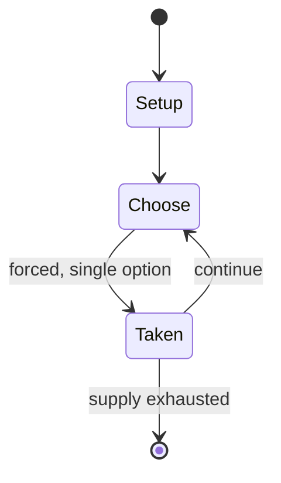

# Kiothi

*traditional mancala game*

`kiothi` &nbsp; state: **DEEPENED** &nbsp; method: **heuristic**

## Found layer (recorded, not trusted)

| field | value |
| --- | --- |
| wikidata | Q3815553 |
| wikipedia | Kiothi |
| genres (source) | -- |
| instance of (source) | board game, mancala |
| country of origin | -- |

## Declared layer (orders bench work)

| field | value |
| --- | --- |
| year created | -- |
| epoch | -- |
| region | -- |
| media | MANCALA |
| players | -- |
| age band | -- |
| exogenous process | -- |
| loss shape | -- |
| live axes | ORDER, SPATIAL |
| horizon | -- |
| scoring shape | -- |
| information | -- |
| interaction | COMPETITIVE |
| turn structure | -- |
| tractability | SAMPLING_ONLY |
| randomness | -- |
| luck factor | 0.35 |
| rules complexity | 2.35 |
| strategic depth | 2.0 |
| novelty | 0.3553 |
| solved status | -- |
| strategies | -- |
| algorithms | -- |

## Object model

```
Episode
  players      : ?
  turn_structure: ?
  horizon       : ?
  scoring       : ?

Pits           -- cyclic array of counts
Store          -- player's banked seeds
Sequence       -- the permutation under the player's control
Placement      -- position subject to geometric legality
```

## State transition diagram



## Research item -- turn trace

```
# Kiothi -- simulated turn events
# generated from the DECLARED vector, not from a rulebook.
# structure: exo=None loss=None horizon=None scoring=None axes=ORDER,SPATIAL

t=0    SETUP        players=2  pot=0  capacity=8
t=1    FORCED       p1 single legal option taken (pot_gain=+1.9)
t=2    SPATIAL      p1 places at (0,3); adjacency legal
t=3    ENDTURN      turn passes to p2
t=4    FORCED       p2 single legal option taken (pot_gain=+1.9)
t=5    FORCED       p2 single legal option taken (pot_gain=+1.4)
t=6    FORCED       p2 single legal option taken (pot_gain=+1.6)
t=7    FORCED       p2 single legal option taken (pot_gain=+1.5)
t=8    FORCED       p2 single legal option taken (pot_gain=+0.8)
t=9    SPATIAL      p2 places at (3,4); adjacency legal
t=10   FORCED       p2 single legal option taken (pot_gain=+1.0)
t=11   SPATIAL      p2 places at (2,2); adjacency legal
t=12   ENDTURN      turn passes to p1
t=13   FORCED       p1 single legal option taken (pot_gain=+0.5)
t=14   SPATIAL      p1 places at (6,7); adjacency legal
t=15   FORCED       p1 single legal option taken (pot_gain=+0.6)
t=16   FORCED       p1 single legal option taken (pot_gain=+1.3)
t=17   SPATIAL      p1 places at (2,0); adjacency legal
t=18   ENDTURN      turn passes to p2
t=19   FORCED       p2 single legal option taken (pot_gain=+0.7)
t=20   FORCED       p2 single legal option taken (pot_gain=+1.9)
t=21   SPATIAL      p2 places at (1,3); adjacency legal
t=22   FORCED       p2 single legal option taken (pot_gain=+1.4)
t=23   FORCED       p2 single legal option taken (pot_gain=+0.8)
t=24   SPATIAL      p2 places at (1,4); adjacency legal
t=25   ENDTURN      turn passes to p1
t=26   FORCED       p1 single legal option taken (pot_gain=+1.8)
t=27   ENDTURN      turn passes to p2

terminal: VARIABLE
```

## Source extract

Kiothi is a traditional mancala game played by the Meru people in Kenya. The word "kiothi"
simply means "to place" (i.e., placing the seeds in the pits). This mancala is closely related
to the Enkeshui and the Giuthi mancalas, respectively played by the Maasai, the Kikuyu and Embu
people.   == Rules == The Kiothi board is 2x10, i.e., 2 rows of 10 pits each. Each player owns a
row and 30 seeds. At game setup, seeds are placed in the 5 rightmost pits of each player's row,
6 per pit. Before the game starts, anyway, each player can take the seeds from one of his pits
and distribute those seeds freely on the board (including in the opponent's pits). At his or her
turn, the player takes all the seeds from one of his pits and relay-sows them counterclockwise.
When the last seed is dropped in an empty pit:  if the pit is in the opponent's row, the turn is
over; if the pit is in the player's row, and the sowing has crossed the opponent's row, the seed
is captured; any seeds in the opponent's opposite pit are also captured. As an exception to the
above, seeds in any pit cannot be captured if the player owning the pit has never been sowing
(or relay sowing) from that pit. Another exception is

<sub>Wikipedia, CC BY-SA. Retained as evidence for the structural
classification above. Every rule inferred from it is HYPOTHESIZED
until audited against a rulebook.</sub>
