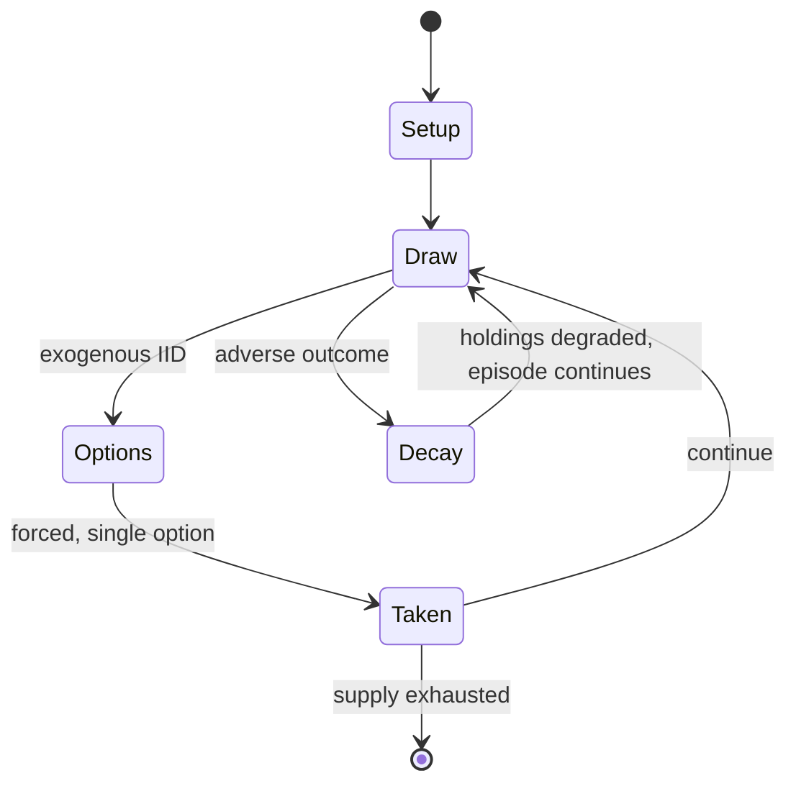

# Kismet

*dice game*

`kismet` &nbsp; state: **DEEPENED** &nbsp; method: **heuristic**

## Found layer (recorded, not trusted)

| field | value |
| --- | --- |
| wikidata | Q17082015 |
| wikipedia | Kismet (dice game) |
| genres (source) | -- |
| instance of (source) | dice game |
| country of origin | -- |

## Declared layer (orders bench work)

| field | value |
| --- | --- |
| year created | 1964 |
| epoch | MODERN |
| region | -- |
| media | DICE |
| players | -- |
| age band | -- |
| exogenous process | IID |
| loss shape | PARTIAL_DECAY |
| live axes | TRADE |
| horizon | -- |
| scoring shape | LINEAR_ACCUMULATION |
| information | -- |
| interaction | SOLITAIRE |
| turn structure | STRICT_TURN |
| tractability | EXACT_WITH_CUT |
| randomness | DICE |
| luck factor | 0.58 |
| rules complexity | 2.2 |
| strategic depth | 1.87 |
| novelty | 0.7398 |
| solved status | -- |
| strategies | -- |
| algorithms | -- |

## Object model

```
Episode
  players      : ?
  turn_structure: STRICT_TURN
  horizon       : ?
  scoring       : LINEAR_ACCUMULATION

DicePool       -- n dice, each an iid categorical draw
Roll           -- realised outcome of a pool
Offer          -- proposed exchange between two agents
```

## State transition diagram



## Research item -- turn trace

```
# Kismet -- simulated turn events
# generated from the DECLARED vector, not from a rulebook.
# structure: exo=IID loss=PARTIAL_DECAY horizon=None scoring=LINEAR_ACCUMULATION axes=TRADE

t=0    SETUP        players=2  pot=0  capacity=6
t=1    DRAW         p1 roll from d6 pool -> outcome #3  (p=0.165)
t=2    FORCED       p1 single legal option taken (pot_gain=+0.5)
t=3    TRADE        p1 offers 2:1 exchange to p2
t=4    ENDTURN      turn passes to p2
t=5    DRAW         p2 roll from d6 pool -> outcome #1  (p=0.017)
t=6    FORCED       p2 single legal option taken (pot_gain=+0.6)
t=7    DRAW         p2 roll from d6 pool -> outcome #1  (p=0.116)
t=8    FORCED       p2 single legal option taken (pot_gain=+0.9)
t=9    ENDTURN      turn passes to p1
t=10   DRAW         p1 roll from d6 pool -> outcome #6  (p=0.040)
t=11   FORCED       p1 single legal option taken (pot_gain=+0.6)
t=12   DRAW         p1 roll from d6 pool -> outcome #1  (p=0.092)
t=13   FORCED       p1 single legal option taken (pot_gain=+0.9)
t=14   DRAW         p1 roll from d6 pool -> outcome #6  (p=0.231)
t=15   FORCED       p1 single legal option taken (pot_gain=+0.8)
t=16   TRADE        p1 offers 2:1 exchange to p2
t=17   DRAW         p1 roll from d6 pool -> outcome #1  (p=0.033)
t=18   FORCED       p1 single legal option taken (pot_gain=+1.3)
t=19   DRAW         p1 roll from d6 pool -> outcome #1  (p=0.038)
t=20   FORCED       p1 single legal option taken (pot_gain=+1.3)
t=21   TRADE        p1 offers 2:1 exchange to p2
t=22   ENDTURN      turn passes to p2
t=23   DRAW         p2 roll from d6 pool -> outcome #1  (p=0.270)
t=24   FORCED       p2 single legal option taken (pot_gain=+1.2)
t=25   ENDTURN      turn passes to p1
t=26   DRAW         p1 roll from d6 pool -> outcome #5  (p=0.165)
t=27   FORCED       p1 single legal option taken (pot_gain=+1.7)
t=28   TRADE        p1 offers 2:1 exchange to p2
t=29   ENDTURN      turn passes to p2

terminal: VARIABLE
```

## Conditions

| kind | threshold | effect | trigger |
| --- | --- | --- | --- |
| BOUNDARY | 55 points | -- | Kismet provides two further bonus levels; a score of at least 71 but no more than 77 earns a bonus of 55 points; and 78 or more, a bonus of 75 points. |

## Source extract

Kismet is a commercial dice game introduced in 1964. The game's name is the Turkish word for
"fate". E. William DeLaittre holds the trademark on the game, which was originally published by
Lakeside Games, and which is currently produced by Endless Games. Marketed as "The Modern Game
of Yacht", the game play is similar to Yacht and Yahtzee, with a few variations. A primary
distinction is that in Kismet, the sides of the dice have different colored pips.   == Game
contents == The game consists of five white dice with colored pips ( and  have black pips,  and
have red pips, and  and  have green pips), a dice cup, a pad of scorecards, and a pencil.   ==
Game play == Players take turns rolling five dice. Each player can take up to three rolls per
turn. On the second and third rolls, the player may hold back dice from the previous rolls in
order to create better scoring combinations.  At the end of the third roll, the player must
enter a score into an open field on their scorecard. If the player cannot use their third roll
in any scorecard field, they must enter a zero into an open field.   === Scorecard === Each
player keeps a running tally of their rolls on a scorecard. The scorecard

<sub>Wikipedia, CC BY-SA. Retained as evidence for the structural
classification above. Every rule inferred from it is HYPOTHESIZED
until audited against a rulebook.</sub>
