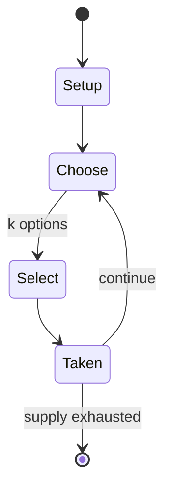

# Kiss, Marry, Kill

*forced choice question-and-answer game*

`kiss_marry_kill` &nbsp; state: **DEEPENED** &nbsp; method: **heuristic**

## Found layer (recorded, not trusted)

| field | value |
| --- | --- |
| wikidata | Q60764420 |
| wikipedia | Fuck, marry, kill |
| genres (source) | -- |
| instance of (source) | party game |
| country of origin | -- |

## Declared layer (orders bench work)

| field | value |
| --- | --- |
| year created | -- |
| epoch | -- |
| region | -- |
| media | PARTY, PLAYGROUND |
| players | -- |
| age band | -- |
| exogenous process | NONE |
| loss shape | OPPORTUNITY_ONLY |
| live axes | SELECT |
| horizon | -- |
| scoring shape | -- |
| information | PERFECT |
| interaction | -- |
| turn structure | -- |
| tractability | SAMPLING_ONLY |
| randomness | NONE |
| luck factor | 0.35 |
| rules complexity | 2.09 |
| strategic depth | 2.0 |
| novelty | 0.0938 |
| solved status | -- |
| strategies | -- |
| algorithms | -- |

## Object model

```
Episode
  players      : ?
  turn_structure: ?
  horizon       : ?
  scoring       : ?

OptionSet      -- the choices available after an exogenous draw
```

## State transition diagram



## Research item -- turn trace

```
# Kiss, Marry, Kill -- simulated turn events
# generated from the DECLARED vector, not from a rulebook.
# structure: exo=NONE loss=OPPORTUNITY_ONLY horizon=None scoring=None axes=SELECT

t=0    SETUP        players=2  pot=0  capacity=7
t=1    SELECT       p1 2 options; take #2  (pot_gain=+3.4, capacity=-2)
t=2    ENDTURN      turn passes to p2
t=3    SELECT       p2 2 options; take #2  (pot_gain=+0.9, capacity=-0)
t=4    SELECT       p2 4 options; take #4  (pot_gain=+1.1, capacity=-2)
t=5    SELECT       p2 1 options; take #1  (pot_gain=+0.6, capacity=-0)
t=6    SELECT       p2 1 options; take #1  (pot_gain=+0.7, capacity=-2)
t=7    SELECT       p2 1 options; take #1  (pot_gain=+1.4, capacity=-1)
t=8    SELECT       p2 1 options; take #1  (pot_gain=+1.4, capacity=-0)
t=9    SELECT       p2 3 options; take #3  (pot_gain=+1.1, capacity=-2)
t=10   ENDTURN      turn passes to p1
t=11   SELECT       p1 2 options; take #2  (pot_gain=+3.2, capacity=-2)
t=12   SELECT       p1 1 options; take #1  (pot_gain=+0.7, capacity=-2)
t=13   SELECT       p1 2 options; take #2  (pot_gain=+0.8, capacity=-1)
t=14   SELECT       p1 1 options; take #1  (pot_gain=+3.2, capacity=-2)
t=15   SELECT       p1 1 options; take #1  (pot_gain=+0.8, capacity=-1)
t=16   SELECT       p1 4 options; take #1  (pot_gain=+1.1, capacity=-1)
t=17   SELECT       p1 2 options; take #2  (pot_gain=+1.9, capacity=-2)
t=18   SELECT       p1 1 options; take #1  (pot_gain=+1.2, capacity=-2)
t=19   SELECT       p1 2 options; take #2  (pot_gain=+1.5, capacity=-1)
t=20   SELECT       p1 1 options; take #1  (pot_gain=+2.9, capacity=-2)
t=21   SELECT       p1 1 options; take #1  (pot_gain=+1.7, capacity=-1)
t=22   ENDTURN      turn passes to p2
t=23   SELECT       p2 2 options; take #1  (pot_gain=+2.3, capacity=-2)
t=24   ENDTURN      turn passes to p1
t=25   SELECT       p1 1 options; take #1  (pot_gain=+1.9, capacity=-2)
t=26   SELECT       p1 1 options; take #1  (pot_gain=+1.3, capacity=-2)

terminal: VARIABLE
```

## Source extract

Fuck, Marry, Kill, also known as Kiss, Marry, Kill, as Bang, Marry, Kill, or as Bang, Smash,
Dash, or with other synonyms or arrangements of the terms, is a social forced choice question-
and-answer game. As one source describes it, "[w]e have heard of the game "Kiss, Marry, Kill" in
which people fantasize about which of the three choices they would exercise on someone". In the
game, one person poses three names of people known to the other, typically either names of
people known in their personal lives or names of celebrities or fictional characters. The other
person then has to decide which of the three they would have sexual intercourse with (or kiss),
which one they would marry, and which one they would kill.   == Overview == A 2009 Wonkette
piece described it as "the popular children's schoolyard game of 'Fuck, Marry, Kill'" and
suggested that the "rules" of the game included an understanding that the player cannot have sex
with the person they marry and that the person they do choose to have sex with, they can only
have sex with one time. Slate, on the other hand, posted a lengthy staff debate in 2020 on the
rules of the game, including the question of whether the marriage mus

<sub>Wikipedia, CC BY-SA. Retained as evidence for the structural
classification above. Every rule inferred from it is HYPOTHESIZED
until audited against a rulebook.</sub>
