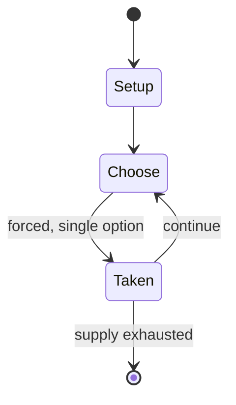

# Klammern

*card game*

`klammern` &nbsp; state: **DEEPENED** &nbsp; method: **heuristic**

## Found layer (recorded, not trusted)

| field | value |
| --- | --- |
| wikidata | Q1448997 |
| wikipedia | Klammern |
| genres (source) | -- |
| instance of (source) | ace–ten game, card game |
| country of origin | Switzerland |

## Declared layer (orders bench work)

| field | value |
| --- | --- |
| year created | -- |
| epoch | -- |
| region | EUROPE_WEST |
| media | CARD, TRICK_TAKING |
| players | 3-4 |
| age band | -- |
| exogenous process | -- |
| loss shape | -- |
| live axes | DISCARD |
| horizon | -- |
| scoring shape | SET_COLLECTION_CONVEX |
| information | -- |
| interaction | TEAM |
| turn structure | STRICT_TURN |
| tractability | SAMPLING_ONLY |
| randomness | DICE |
| luck factor | 0.58 |
| rules complexity | 2.23 |
| strategic depth | 2.37 |
| novelty | 0.5692 |
| solved status | -- |
| strategies | set_collection, spatial_packing |
| algorithms | -- |

## Object model

```
Episode
  players      : 3-4
  turn_structure: STRICT_TURN
  horizon       : ?
  scoring       : SET_COLLECTION_CONVEX

Deck           -- ordered multiset, drawn without replacement
Hand           -- private multiset held by one player
DiscardPile    -- public accumulation of spent cards
Trick          -- one card per player; a winner is determined
Trump          -- suit that dominates the ordering
DiscardChoice  -- what is given up to satisfy a limit
```

## State transition diagram



## Research item -- turn trace

```
# Klammern -- simulated turn events
# generated from the DECLARED vector, not from a rulebook.
# structure: exo=None loss=None horizon=None scoring=SET_COLLECTION_CONVEX axes=DISCARD

t=0    SETUP        players=3  pot=0  capacity=5
t=1    FORCED       p1 single legal option taken (pot_gain=+1.8)
t=2    DISCARD      p1 discards to hand limit
t=3    FORCED       p1 single legal option taken (pot_gain=+1.7)
t=4    ENDTURN      turn passes to p2
t=5    FORCED       p2 single legal option taken (pot_gain=+1.0)
t=6    DISCARD      p2 discards to hand limit
t=7    ENDTURN      turn passes to p3
t=8    FORCED       p3 single legal option taken (pot_gain=+1.5)
t=9    DISCARD      p3 discards to hand limit
t=10   FORCED       p3 single legal option taken (pot_gain=+1.2)
t=11   FORCED       p3 single legal option taken (pot_gain=+0.8)
t=12   FORCED       p3 single legal option taken (pot_gain=+1.2)
t=13   FORCED       p3 single legal option taken (pot_gain=+0.7)
t=14   FORCED       p3 single legal option taken (pot_gain=+1.2)
t=15   FORCED       p3 single legal option taken (pot_gain=+0.7)
t=16   FORCED       p3 single legal option taken (pot_gain=+1.4)
t=17   DISCARD      p3 discards to hand limit
t=18   FORCED       p3 single legal option taken (pot_gain=+0.8)
t=19   DISCARD      p3 discards to hand limit
t=20   FORCED       p3 single legal option taken (pot_gain=+1.6)
t=21   FORCED       p3 single legal option taken (pot_gain=+0.6)
t=22   FORCED       p3 single legal option taken (pot_gain=+1.0)
t=23   FORCED       p3 single legal option taken (pot_gain=+1.9)
t=24   DISCARD      p3 discards to hand limit
t=25   ENDTURN      turn passes to p1
t=26   FORCED       p1 single legal option taken (pot_gain=+1.5)
t=27   DISCARD      p1 discards to hand limit
t=28   ENDTURN      turn passes to p2

terminal: VARIABLE
```

## Conditions

| kind | threshold | effect | trigger |
| --- | --- | --- | --- |
| BOUNDARY | 82 points | -- | Half of the maximum, excluding melds, is 82 points. |
| WIN | -- | -- | It is possible to win the match early. |
| WIN | -- | -- | The player or team whose die comes back to “six” first wins the round. |
| TERMINATE | -- | -- | If a player revokes i.e. discards the wrong suit despite holding a card of the led suit, the deal ends immediately. |
| LOSE | -- | -- | This indicates they are sure that the opponents will lose the game and thus doubles the "little " points. |
| PENALTY | -- | -- | If the second trick has already taken place when they are announced, the points scored for Terz and fifty are forfeited. |
| PENALTY | -- | -- | If Bella is not announced when discarding the trump queen or trump king, the bonus points are forfeited. |

## Source extract

Klammern is an ace–ten card game and variant of Jass, which is particularly widespread in the
Alemannic region. It is played mainly in Switzerland, Liechtenstein, the Austrian state of
Vorarlberg and in parts of southern Germany and Alsace. But the game is also finding more and
more fans in the north-west of Germany, mainly in North Rhine-Westphalia. In Hamburg the game
goes under the name Klapperjazz or Klapperjass and was initially played mainly by stevedores for
"nen Heiermann", a 5 Mark piece. A die was used to keep score. In other parts of North Germany
it is called Klappern or Klapper-Jas and was popular in the 1950s and 60s in pubs and bars and
also among lorry drivers as they waited, for example, for customs clearance at Hamburg's free
port. Klapperjass may be over a century old as the word is recorded in an Alsatian dictionary in
1899 as a card game and as a children's word for a beating or spanking, from which
verklapperjassen, "to beat at cards" or "to beat by cheating", is derived. No rules are given.
== Rules == In Klammern, 4 players play in two teams of 4 using a 32-card French-suited pack.
The partners sit opposite each other. But it is also possible for just two

<sub>Wikipedia, CC BY-SA. Retained as evidence for the structural
classification above. Every rule inferred from it is HYPOTHESIZED
until audited against a rulebook.</sub>
