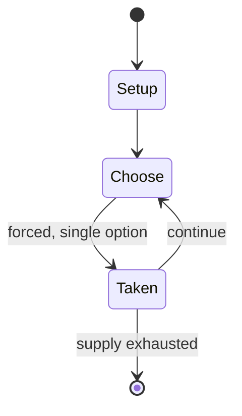

# Knucklebones

`knucklebones` &nbsp; state: **DEEPENED** &nbsp; method: **heuristic**

## Found layer (recorded, not trusted)

| field | value |
| --- | --- |
| wikidata | Q20452 |
| wikipedia | Knucklebones |
| genres (source) | -- |
| instance of (source) | -- |
| country of origin | -- |

## Declared layer (orders bench work)

| field | value |
| --- | --- |
| year created | -- |
| epoch | -- |
| region | -- |
| media | DICE |
| players | -- |
| age band | -- |
| exogenous process | -- |
| loss shape | -- |
| live axes | - |
| horizon | -- |
| scoring shape | -- |
| information | -- |
| interaction | -- |
| turn structure | -- |
| tractability | SAMPLING_ONLY |
| randomness | DICE |
| luck factor | 0.58 |
| rules complexity | 1.74 |
| strategic depth | 1.87 |
| novelty | 0.0914 |
| solved status | -- |
| strategies | -- |
| algorithms | -- |

## Object model

```
Episode
  players      : ?
  turn_structure: ?
  horizon       : ?
  scoring       : ?

DicePool       -- n dice, each an iid categorical draw
Roll           -- realised outcome of a pool
```

## State transition diagram



## Research item -- turn trace

```
# Knucklebones -- simulated turn events
# generated from the DECLARED vector, not from a rulebook.
# structure: exo=None loss=None horizon=None scoring=None axes=-

t=0    SETUP        players=2  pot=0  capacity=3
t=1    FORCED       p1 single legal option taken (pot_gain=+0.8)
t=2    FORCED       p1 single legal option taken (pot_gain=+1.7)
t=3    FORCED       p1 single legal option taken (pot_gain=+0.6)
t=4    FORCED       p1 single legal option taken (pot_gain=+1.9)
t=5    ENDTURN      turn passes to p2
t=6    FORCED       p2 single legal option taken (pot_gain=+1.6)
t=7    ENDTURN      turn passes to p1
t=8    FORCED       p1 single legal option taken (pot_gain=+2.0)
t=9    ENDTURN      turn passes to p2
t=10   FORCED       p2 single legal option taken (pot_gain=+1.9)
t=11   ENDTURN      turn passes to p1
t=12   FORCED       p1 single legal option taken (pot_gain=+1.4)
t=13   ENDTURN      turn passes to p2
t=14   FORCED       p2 single legal option taken (pot_gain=+0.8)
t=15   FORCED       p2 single legal option taken (pot_gain=+1.4)
t=16   FORCED       p2 single legal option taken (pot_gain=+1.6)
t=17   ENDTURN      turn passes to p1
t=18   FORCED       p1 single legal option taken (pot_gain=+1.5)
t=19   FORCED       p1 single legal option taken (pot_gain=+1.4)
t=20   FORCED       p1 single legal option taken (pot_gain=+1.3)
t=21   FORCED       p1 single legal option taken (pot_gain=+0.6)
t=22   ENDTURN      turn passes to p2
t=23   FORCED       p2 single legal option taken (pot_gain=+1.5)
t=24   ENDTURN      turn passes to p1
t=25   FORCED       p1 single legal option taken (pot_gain=+0.7)
t=26   FORCED       p1 single legal option taken (pot_gain=+1.0)

terminal: VARIABLE
```

## Conditions

| kind | threshold | effect | trigger |
| --- | --- | --- | --- |
| PENALTY | -- | -- | If the player touches more than one pebble on the table, they forfeit their turn. |

## Source extract

Knucklebones, also known as scatter jacks, snobs, astragaloi (singular: astragalus), tali, dibs,
fivestones, jacks, jackstones, or jinks, among many other names, is a game of dexterity played
with a number of small objects that are thrown up, caught, and manipulated in various manners.
It is ancient in origin and is found in various cultures worldwide. The name "knucklebones" is
derived from the Ancient Greek version of the game, which uses the astragalus (a bone in the
ankle, or hock) of a sheep. However, different variants of the game from various cultures use
other objects, including stones and metal cubes. The game was mentioned by Plato and Herodotus,
the latter claiming although the game was famous in Athens it was not native to the city,
ascribing Lydian origins to it (West of Anatolia), a story he recounts in his work The
Histories. Modern knucklebones consist of six points, or knobs, projecting from a common base
and are usually made of metal or plastic. The winner is the first player to successfully
complete a prescribed series of throws, which, though similar, differ widely in detail. The
simplest throw consists in either tossing up one stone, the jack, or bouncing a bal

<sub>Wikipedia, CC BY-SA. Retained as evidence for the structural
classification above. Every rule inferred from it is HYPOTHESIZED
until audited against a rulebook.</sub>
