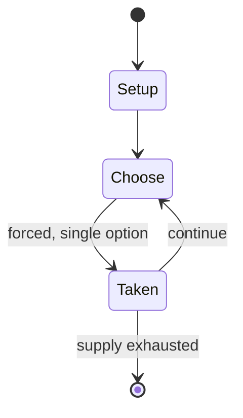

# Konane

`konane` &nbsp; state: **DEEPENED** &nbsp; method: **heuristic**

## Found layer (recorded, not trusted)

| field | value |
| --- | --- |
| wikidata | -- |
| wikipedia | Konane |
| genres (source) | -- |
| instance of (source) | -- |
| country of origin | -- |

## Declared layer (orders bench work)

| field | value |
| --- | --- |
| year created | -- |
| epoch | -- |
| region | -- |
| media | BOARD |
| players | -- |
| age band | -- |
| exogenous process | NONE |
| loss shape | OPPORTUNITY_ONLY |
| live axes | SPATIAL |
| horizon | -- |
| scoring shape | -- |
| information | PERFECT |
| interaction | SOLITAIRE |
| turn structure | STRICT_TURN |
| tractability | SAMPLING_ONLY |
| randomness | NONE |
| luck factor | 0.35 |
| rules complexity | 2.15 |
| strategic depth | 2.0 |
| novelty | 0.5238 |
| solved status | -- |
| strategies | -- |
| algorithms | -- |

## Object model

```
Episode
  players      : ?
  turn_structure: STRICT_TURN
  horizon       : ?
  scoring       : ?

Board          -- spatial substrate; cells carry position and occupancy
Piece          -- movable token owned by a player
Placement      -- position subject to geometric legality
```

## State transition diagram



## Research item -- turn trace

```
# Konane -- simulated turn events
# generated from the DECLARED vector, not from a rulebook.
# structure: exo=NONE loss=OPPORTUNITY_ONLY horizon=None scoring=None axes=SPATIAL

t=0    SETUP        players=2  pot=0  capacity=6
t=1    FORCED       p1 single legal option taken (pot_gain=+0.6)
t=2    ENDTURN      turn passes to p2
t=3    FORCED       p2 single legal option taken (pot_gain=+1.9)
t=4    SPATIAL      p2 places at (3,1); adjacency legal
t=5    FORCED       p2 single legal option taken (pot_gain=+1.6)
t=6    ENDTURN      turn passes to p1
t=7    FORCED       p1 single legal option taken (pot_gain=+1.6)
t=8    FORCED       p1 single legal option taken (pot_gain=+1.0)
t=9    SPATIAL      p1 places at (6,2); adjacency legal
t=10   ENDTURN      turn passes to p2
t=11   FORCED       p2 single legal option taken (pot_gain=+1.6)
t=12   SPATIAL      p2 places at (2,1); adjacency legal
t=13   FORCED       p2 single legal option taken (pot_gain=+1.4)
t=14   FORCED       p2 single legal option taken (pot_gain=+1.1)
t=15   SPATIAL      p2 places at (2,6); adjacency legal
t=16   FORCED       p2 single legal option taken (pot_gain=+1.9)
t=17   FORCED       p2 single legal option taken (pot_gain=+1.7)
t=18   FORCED       p2 single legal option taken (pot_gain=+1.5)
t=19   FORCED       p2 single legal option taken (pot_gain=+0.9)
t=20   FORCED       p2 single legal option taken (pot_gain=+1.8)
t=21   FORCED       p2 single legal option taken (pot_gain=+1.1)
t=22   FORCED       p2 single legal option taken (pot_gain=+1.2)
t=23   FORCED       p2 single legal option taken (pot_gain=+1.3)
t=24   ENDTURN      turn passes to p1
t=25   FORCED       p1 single legal option taken (pot_gain=+1.5)
t=26   ENDTURN      turn passes to p2

terminal: VARIABLE
```

## Conditions

| kind | threshold | effect | trigger |
| --- | --- | --- | --- |
| WIN | -- | -- | The player unable to make a capture is the loser; their opponent is the winner. |
| BOUNDARY | -- | -- | The player can stop hopping over enemy pieces at any time, but must at least capture one enemy piece in a turn. |

## Source extract

Kōnane (or rarely mū) is a two-player Hawaiian strategy board game invented and played by its
native people. The game is played on a rectangular board and begins with black and white
counters filling the board in an alternating pattern. Players then hop over one another's
pieces, capturing them. All moves are capturing moves.   == Background == The game was
traditionally played using a large carved rock that functioned as both the board and a table,
with small pieces of white coral and black lava as the game pieces. The Puʻuhonua o Hōnaunau
National Historical Park has one of these stone gameboards on its premises.  The kōnane was
recorded in the Kumulipo, and was also noted by James Cook, who described the game during his
only visit to Hawaii on his third and final voyage prior to his death there. The word mū may
have referred the act of capturing people.  Kōnane has some resemblance to games like mū tōrere
from Aotearoa, leap frog and brainvita (also called peg solitaire) from England, fanorona from
Madagascar, and main cuki (also spelled chuki or tjuki) from Malaysia and Java. The game also
has some similarities as well with checkers or draughts.  The Bishop Museum organized the

<sub>Wikipedia, CC BY-SA. Retained as evidence for the structural
classification above. Every rule inferred from it is HYPOTHESIZED
until audited against a rulebook.</sub>
