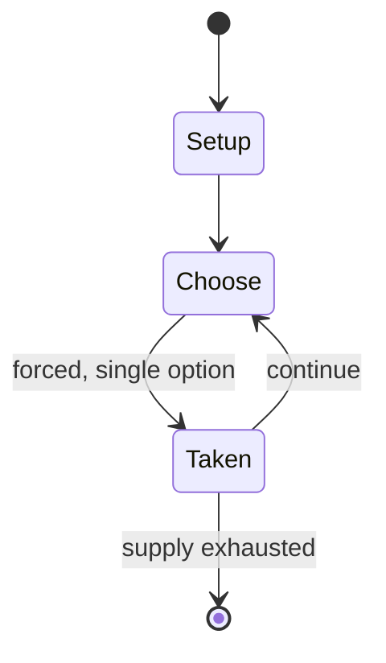

# Krur

*traditional African mancala game*

`krur` &nbsp; state: **DEEPENED** &nbsp; method: **heuristic**

## Found layer (recorded, not trusted)

| field | value |
| --- | --- |
| wikidata | Q657144 |
| wikipedia | Krur |
| genres (source) | -- |
| instance of (source) | board game, mancala |
| country of origin | -- |

## Declared layer (orders bench work)

| field | value |
| --- | --- |
| year created | -- |
| epoch | -- |
| region | -- |
| media | MANCALA |
| players | -- |
| age band | CHILD |
| exogenous process | -- |
| loss shape | -- |
| live axes | - |
| horizon | -- |
| scoring shape | -- |
| information | -- |
| interaction | COMPETITIVE |
| turn structure | -- |
| tractability | SAMPLING_ONLY |
| randomness | -- |
| luck factor | 0.35 |
| rules complexity | 1.73 |
| strategic depth | 2.0 |
| novelty | 0.3553 |
| solved status | -- |
| strategies | -- |
| algorithms | -- |

## Object model

```
Episode
  players      : ?
  turn_structure: ?
  horizon       : ?
  scoring       : ?

Pits           -- cyclic array of counts
Store          -- player's banked seeds
```

## State transition diagram



## Research item -- turn trace

```
# Krur -- simulated turn events
# generated from the DECLARED vector, not from a rulebook.
# structure: exo=None loss=None horizon=None scoring=None axes=-

t=0    SETUP        players=2  pot=0  capacity=6
t=1    FORCED       p1 single legal option taken (pot_gain=+1.3)
t=2    FORCED       p1 single legal option taken (pot_gain=+1.0)
t=3    FORCED       p1 single legal option taken (pot_gain=+0.6)
t=4    FORCED       p1 single legal option taken (pot_gain=+1.6)
t=5    FORCED       p1 single legal option taken (pot_gain=+1.5)
t=6    FORCED       p1 single legal option taken (pot_gain=+0.8)
t=7    FORCED       p1 single legal option taken (pot_gain=+1.3)
t=8    FORCED       p1 single legal option taken (pot_gain=+1.4)
t=9    FORCED       p1 single legal option taken (pot_gain=+1.4)
t=10   FORCED       p1 single legal option taken (pot_gain=+1.9)
t=11   FORCED       p1 single legal option taken (pot_gain=+0.8)
t=12   FORCED       p1 single legal option taken (pot_gain=+0.9)
t=13   FORCED       p1 single legal option taken (pot_gain=+1.6)
t=14   FORCED       p1 single legal option taken (pot_gain=+1.1)
t=15   FORCED       p1 single legal option taken (pot_gain=+1.7)
t=16   FORCED       p1 single legal option taken (pot_gain=+1.9)
t=17   FORCED       p1 single legal option taken (pot_gain=+0.9)
t=18   FORCED       p1 single legal option taken (pot_gain=+1.4)
t=19   FORCED       p1 single legal option taken (pot_gain=+1.0)
t=20   FORCED       p1 single legal option taken (pot_gain=+0.6)
t=21   FORCED       p1 single legal option taken (pot_gain=+1.9)
t=22   FORCED       p1 single legal option taken (pot_gain=+1.7)
t=23   FORCED       p1 single legal option taken (pot_gain=+2.0)
t=24   ENDTURN      turn passes to p2
t=25   FORCED       p2 single legal option taken (pot_gain=+1.8)
t=26   ENDTURN      turn passes to p1

terminal: VARIABLE
```

## Source extract

Krur (also spelled Crur) is a traditional mancala game played by the Hassaniya people in western
Sahara, along the border of Nigeria and Mauritania, in southern Morocco, in Algeria, in northern
Senegal, in Mali and in Niger. It is a children's game, very close to other simple African
mancala such as Layli Goobalay (Somalia) and Nsa Isong (Nigeria).   == Rules == The game of Krur
is usually called a match. The board has two rows with four holes in each row. At the beginning
of each game, each hole start off with four seeds. Each player controls their side of the board
with the four holes on their side.  On the players turn, they pick up the contents of one of the
holes and puts them in each hole in an anti clockwise direction. The turn ends once the seed is
put into an empty hole. The turn also ends if a seed is put into a hole of the opponent and it
comes to a collection of four seeds and it is marked.  If the last seed of the collection on a
turn is dropped into an occupied hole, the player must pick up all the contents and continue
until the last seed is dropped into an empty hole. When a seed is put into a hole, the term is
called "sowing." Sowing cannot begin from a captured ho

<sub>Wikipedia, CC BY-SA. Retained as evidence for the structural
classification above. Every rule inferred from it is HYPOTHESIZED
until audited against a rulebook.</sub>
