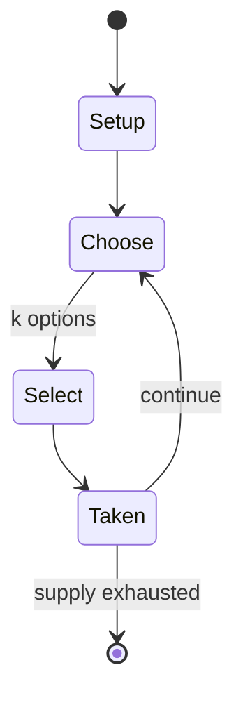

# Kursk

*1980 WWII board wargame*

`kursk` &nbsp; state: **DEEPENED** &nbsp; method: **heuristic**

## Found layer (recorded, not trusted)

| field | value |
| --- | --- |
| wikidata | Q110552738 |
| wikipedia | Kursk (board game) |
| genres (source) | -- |
| instance of (source) | board wargame |
| country of origin | -- |

## Declared layer (orders bench work)

| field | value |
| --- | --- |
| year created | -- |
| epoch | -- |
| region | -- |
| media | WARGAME |
| players | -- |
| age band | -- |
| exogenous process | -- |
| loss shape | -- |
| live axes | SELECT, SPATIAL |
| horizon | -- |
| scoring shape | -- |
| information | -- |
| interaction | -- |
| turn structure | PHASE_STRUCTURED |
| tractability | SAMPLING_ONLY |
| randomness | -- |
| luck factor | -- |
| rules complexity | 4.25 |
| strategic depth | 2.0 |
| novelty | 0.497 |
| solved status | -- |
| strategies | -- |
| algorithms | -- |

## Object model

```
Episode
  players      : ?
  turn_structure: PHASE_STRUCTURED
  horizon       : ?
  scoring       : ?

OptionSet      -- the choices available after an exogenous draw
Placement      -- position subject to geometric legality
```

## State transition diagram



## Research item -- turn trace

```
# Kursk -- simulated turn events
# generated from the DECLARED vector, not from a rulebook.
# structure: exo=None loss=None horizon=None scoring=None axes=SELECT,SPATIAL

t=0    SETUP        players=2  pot=0  capacity=8
t=1    SELECT       p1 2 options; take #2  (pot_gain=+3.1, capacity=-2)
t=2    SELECT       p1 4 options; take #1  (pot_gain=+1.7, capacity=-0)
t=3    SELECT       p1 1 options; take #1  (pot_gain=+2.8, capacity=-1)
t=4    SPATIAL      p1 places at (5,7); adjacency legal
t=5    SELECT       p1 2 options; take #1  (pot_gain=+2.7, capacity=-2)
t=6    SPATIAL      p1 places at (6,3); adjacency legal
t=7    SELECT       p1 3 options; take #1  (pot_gain=+2.4, capacity=-2)
t=8    ENDTURN      turn passes to p2
t=9    SELECT       p2 4 options; take #2  (pot_gain=+2.8, capacity=-1)
t=10   ENDTURN      turn passes to p1
t=11   SELECT       p1 1 options; take #1  (pot_gain=+1.8, capacity=-0)
t=12   SPATIAL      p1 places at (6,1); adjacency legal
t=13   ENDTURN      turn passes to p2
t=14   SELECT       p2 2 options; take #1  (pot_gain=+0.6, capacity=-2)
t=15   ENDTURN      turn passes to p1
t=16   SELECT       p1 4 options; take #3  (pot_gain=+3.3, capacity=-1)
t=17   SPATIAL      p1 places at (3,0); adjacency legal
t=18   SELECT       p1 4 options; take #4  (pot_gain=+1.9, capacity=-1)
t=19   ENDTURN      turn passes to p2
t=20   SELECT       p2 3 options; take #2  (pot_gain=+2.1, capacity=-0)
t=21   SELECT       p2 1 options; take #1  (pot_gain=+2.9, capacity=-2)
t=22   SELECT       p2 1 options; take #1  (pot_gain=+2.3, capacity=-2)
t=23   SELECT       p2 4 options; take #3  (pot_gain=+2.2, capacity=-2)
t=24   SPATIAL      p2 places at (3,0); adjacency legal
t=25   ENDTURN      turn passes to p1
t=26   SELECT       p1 3 options; take #1  (pot_gain=+1.2, capacity=-2)

terminal: VARIABLE
```

## Conditions

| kind | threshold | effect | trigger |
| --- | --- | --- | --- |
| WIN | -- | -- | The player with the most points at the end of the scenario is the winner. |

## Source extract

Kursk: History's Greatest Tank Battle, July 1943 is a board wargame published by Simulations
Publications Inc. (SPI) in 1980 that simulates the 1943 Battle of Kursk during World War II. The
game proved popular, reaching the top of SPI's Bestseller list, and was well received by
critics.   == Background == In July 1943, the German summer offensive in Russia ran into a
strongly defended Russian tank army near the city of Kursk. Nearly 1400 tanks and assault guns
were involved in what became known as the largest tank battle in history, resulting in the
destruction of almost 300 tanks on each side. Although the Russians withdrew, the battle was the
final strategic offensive that the Germans were able to launch on the Eastern Front. A month
later, the Russians launched a counteroffensive that marked the slow German retreat back to
Berlin and the end of the war.   == Description == Kursk is a tactical wargame for two players
(or two teams) that covers various aspects of the battle. Three scenarios are provided:  Von
Manstein's Plan (May 1943): A "what if" scenario based on the original plan of attack that
should have happened two months earlier, before the Russians were dug in. Hitler's

<sub>Wikipedia, CC BY-SA. Retained as evidence for the structural
classification above. Every rule inferred from it is HYPOTHESIZED
until audited against a rulebook.</sub>
