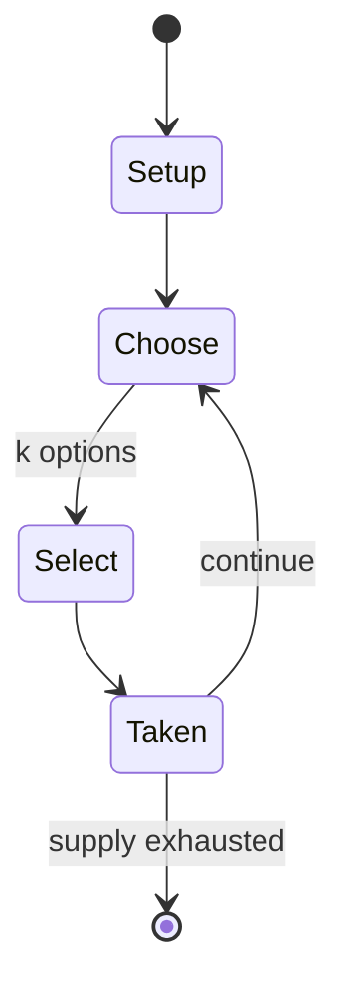

# La'b Hakimi

*mancala game*

`la_b_hakimi` &nbsp; state: **DEEPENED** &nbsp; method: **heuristic**

## Found layer (recorded, not trusted)

| field | value |
| --- | --- |
| wikidata | Q6460635 |
| wikipedia | La'b Hakimi |
| genres (source) | -- |
| instance of (source) | board game, mancala |
| country of origin | -- |

## Declared layer (orders bench work)

| field | value |
| --- | --- |
| year created | -- |
| epoch | -- |
| region | -- |
| media | MANCALA |
| players | -- |
| age band | -- |
| exogenous process | -- |
| loss shape | -- |
| live axes | SELECT |
| horizon | -- |
| scoring shape | -- |
| information | -- |
| interaction | -- |
| turn structure | -- |
| tractability | SAMPLING_ONLY |
| randomness | -- |
| luck factor | 0.35 |
| rules complexity | 1.94 |
| strategic depth | 2.0 |
| novelty | 0.0876 |
| solved status | -- |
| strategies | -- |
| algorithms | -- |

## Object model

```
Episode
  players      : ?
  turn_structure: ?
  horizon       : ?
  scoring       : ?

Pits           -- cyclic array of counts
Store          -- player's banked seeds
OptionSet      -- the choices available after an exogenous draw
```

## State transition diagram



## Research item -- turn trace

```
# La'b Hakimi -- simulated turn events
# generated from the DECLARED vector, not from a rulebook.
# structure: exo=None loss=None horizon=None scoring=None axes=SELECT

t=0    SETUP        players=2  pot=0  capacity=4
t=1    SELECT       p1 2 options; take #1  (pot_gain=+3.5, capacity=-2)
t=2    SELECT       p1 2 options; take #1  (pot_gain=+2.4, capacity=-0)
t=3    SELECT       p1 3 options; take #1  (pot_gain=+2.0, capacity=-2)
t=4    SELECT       p1 1 options; take #1  (pot_gain=+3.5, capacity=-0)
t=5    ENDTURN      turn passes to p2
t=6    SELECT       p2 3 options; take #1  (pot_gain=+3.1, capacity=-1)
t=7    SELECT       p2 4 options; take #3  (pot_gain=+1.2, capacity=-0)
t=8    SELECT       p2 1 options; take #1  (pot_gain=+1.3, capacity=-1)
t=9    SELECT       p2 1 options; take #1  (pot_gain=+1.4, capacity=-1)
t=10   SELECT       p2 3 options; take #1  (pot_gain=+1.0, capacity=-0)
t=11   ENDTURN      turn passes to p1
t=12   SELECT       p1 1 options; take #1  (pot_gain=+2.9, capacity=-2)
t=13   ENDTURN      turn passes to p2
t=14   SELECT       p2 1 options; take #1  (pot_gain=+0.7, capacity=-2)
t=15   SELECT       p2 4 options; take #1  (pot_gain=+1.8, capacity=-1)
t=16   SELECT       p2 2 options; take #1  (pot_gain=+1.5, capacity=-0)
t=17   ENDTURN      turn passes to p1
t=18   SELECT       p1 3 options; take #2  (pot_gain=+0.8, capacity=-2)
t=19   SELECT       p1 3 options; take #3  (pot_gain=+1.6, capacity=-2)
t=20   SELECT       p1 1 options; take #1  (pot_gain=+1.7, capacity=-0)
t=21   SELECT       p1 4 options; take #4  (pot_gain=+0.9, capacity=-1)
t=22   SELECT       p1 4 options; take #2  (pot_gain=+2.9, capacity=-0)
t=23   ENDTURN      turn passes to p2
t=24   SELECT       p2 2 options; take #2  (pot_gain=+3.0, capacity=-2)
t=25   SELECT       p2 3 options; take #2  (pot_gain=+2.0, capacity=-1)
t=26   SELECT       p2 4 options; take #1  (pot_gain=+2.3, capacity=-0)

terminal: VARIABLE
```

## Source extract

La'b Hakimi (Rational game), also known as La'b Akili (Intelligent Game), is a mancala game
played in Syria.   == Rules == The game has the same rules as La'b Madjnuni (Crazy Game) except
the following:  At the beginning of the game, seven pieces are placed in each house Each player
may choose one of the seven houses under their control, instead of first taking from the house
on their right.   == References ==

<sub>Wikipedia, CC BY-SA. Retained as evidence for the structural
classification above. Every rule inferred from it is HYPOTHESIZED
until audited against a rulebook.</sub>
