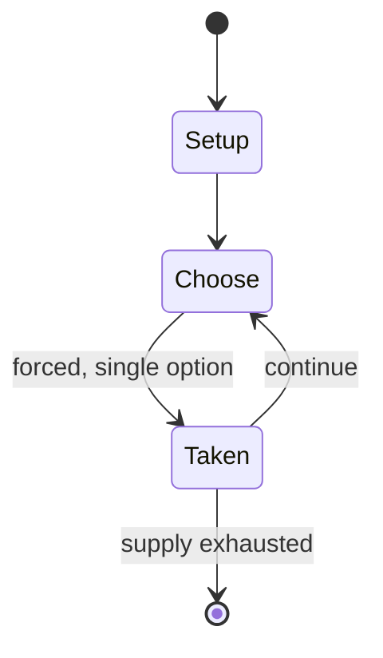

# La'b Madjnuni

*mancala game*

`la_b_madjnuni` &nbsp; state: **DEEPENED** &nbsp; method: **heuristic**

## Found layer (recorded, not trusted)

| field | value |
| --- | --- |
| wikidata | Q6460636 |
| wikipedia | La'b Madjnuni |
| genres (source) | -- |
| instance of (source) | board game, mancala |
| country of origin | -- |

## Declared layer (orders bench work)

| field | value |
| --- | --- |
| year created | -- |
| epoch | -- |
| region | -- |
| media | MANCALA |
| players | -- |
| age band | CHILD |
| exogenous process | -- |
| loss shape | -- |
| live axes | - |
| horizon | VARIABLE |
| scoring shape | -- |
| information | -- |
| interaction | -- |
| turn structure | -- |
| tractability | SAMPLING_ONLY |
| randomness | -- |
| luck factor | 0.35 |
| rules complexity | 1.73 |
| strategic depth | 2.0 |
| novelty | 0.4823 |
| solved status | -- |
| strategies | -- |
| algorithms | -- |

## Object model

```
Episode
  players      : ?
  turn_structure: ?
  horizon       : VARIABLE
  scoring       : ?

Pits           -- cyclic array of counts
Store          -- player's banked seeds
```

## State transition diagram



## Research item -- turn trace

```
# La'b Madjnuni -- simulated turn events
# generated from the DECLARED vector, not from a rulebook.
# structure: exo=None loss=None horizon=VARIABLE scoring=None axes=-

t=0    SETUP        players=2  pot=0  capacity=5
t=1    FORCED       p1 single legal option taken (pot_gain=+0.7)
t=2    ENDTURN      turn passes to p2
t=3    FORCED       p2 single legal option taken (pot_gain=+0.7)
t=4    FORCED       p2 single legal option taken (pot_gain=+1.9)
t=5    ENDTURN      turn passes to p1
t=6    FORCED       p1 single legal option taken (pot_gain=+0.9)
t=7    FORCED       p1 single legal option taken (pot_gain=+0.8)
t=8    ENDTURN      turn passes to p2
t=9    FORCED       p2 single legal option taken (pot_gain=+0.7)
t=10   ENDTURN      turn passes to p1
t=11   FORCED       p1 single legal option taken (pot_gain=+1.3)
t=12   FORCED       p1 single legal option taken (pot_gain=+1.6)
t=13   FORCED       p1 single legal option taken (pot_gain=+1.7)
t=14   FORCED       p1 single legal option taken (pot_gain=+1.6)
t=15   FORCED       p1 single legal option taken (pot_gain=+0.6)
t=16   ENDTURN      turn passes to p2
t=17   FORCED       p2 single legal option taken (pot_gain=+1.6)
t=18   FORCED       p2 single legal option taken (pot_gain=+1.4)
t=19   FORCED       p2 single legal option taken (pot_gain=+1.2)
t=20   FORCED       p2 single legal option taken (pot_gain=+0.9)
t=21   FORCED       p2 single legal option taken (pot_gain=+0.5)
t=22   FORCED       p2 single legal option taken (pot_gain=+1.3)
t=23   FORCED       p2 single legal option taken (pot_gain=+1.7)
t=24   FORCED       p2 single legal option taken (pot_gain=+0.5)
t=25   FORCED       p2 single legal option taken (pot_gain=+1.6)
t=26   FORCED       p2 single legal option taken (pot_gain=+1.2)
t=27   ENDTURN      turn passes to p1

terminal: VARIABLE
```

## Conditions

| kind | threshold | effect | trigger |
| --- | --- | --- | --- |
| BOUNDARY | 2 pieces | -- | At the beginning of the game, at least 2 pieces are placed in each pit. |
| WIN | -- | -- | The player who captured most pieces wins the game. |
| TERMINATE | -- | -- | Culin wrote that the "game ends when all the pits are empty", but that's not possible. |

## Source extract

La'b Madjnuni, also known as Crazy Game,  is a mancala game played in Damascus (Syria) in the
late 19th century.   == Rules == Source:  The La'b Madjnuni board has seven pits, called bute,
"houses," in front of each player. At the beginning of the game, at least 2 pieces are placed in
each pit. The first player takes all the pieces from the hole at the right of his row and drops
them counterclockwise, one at a time. If the last piece ends in an occupied pit, then all the
pieces in that pit including the last one are distributed as before. These multiple turns
continue until the distribution process ends, either the last piece drops into an empty hole, or
it drops into a hole containing one or three pieces. If the last piece ends up in a pit which,
after sowing, contains exactly two or four pieces, all pieces in this pit are captured with
those in the hole opposite.  Also, if there is a continuous line of pits with either 2 or 4
pieces before the one where the capture has occurred, all the pieces in those and their opposite
pits are captured as well. Culin wrote that the "game ends when all the pits are empty", but
that's not possible. The exact ending rules is, therefore, unknown.

<sub>Wikipedia, CC BY-SA. Retained as evidence for the structural
classification above. Every rule inferred from it is HYPOTHESIZED
until audited against a rulebook.</sub>
