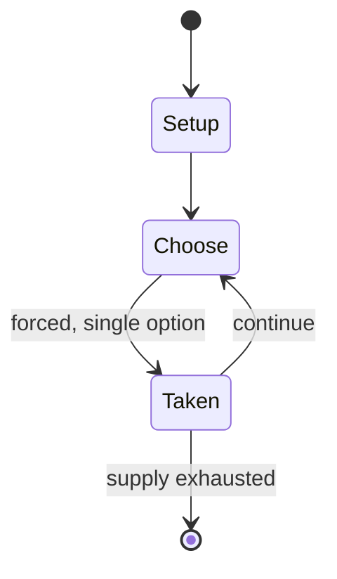

# Ladies' Gaelic football

`ladies_gaelic_football` &nbsp; state: **DEEPENED** &nbsp; method: **heuristic**

## Found layer (recorded, not trusted)

| field | value |
| --- | --- |
| wikidata | Q3778516 |
| wikipedia | Ladies' Gaelic football |
| genres (source) | -- |
| instance of (source) | -- |
| country of origin | -- |

## Declared layer (orders bench work)

| field | value |
| --- | --- |
| year created | -- |
| epoch | -- |
| region | -- |
| media | SPORT |
| players | -- |
| age band | -- |
| exogenous process | -- |
| loss shape | -- |
| live axes | - |
| horizon | -- |
| scoring shape | -- |
| information | -- |
| interaction | TEAM |
| turn structure | -- |
| tractability | SAMPLING_ONLY |
| randomness | -- |
| luck factor | 0.35 |
| rules complexity | 1.71 |
| strategic depth | 2.0 |
| novelty | 0.4956 |
| solved status | -- |
| strategies | blocking |
| algorithms | -- |

## Object model

```
Episode
  players      : ?
  turn_structure: ?
  horizon       : ?
  scoring       : ?

Pitch          -- bounded physical region
Player         -- embodied agent with a foul count
Clock          -- counts down; stoppages are rule events
Official       -- detects infractions and applies penalties
```

## State transition diagram



## Research item -- turn trace

```
# Ladies' Gaelic football -- simulated turn events
# generated from the DECLARED vector, not from a rulebook.
# structure: exo=None loss=None horizon=None scoring=None axes=-

t=0    SETUP        players=2  pot=0  capacity=6
t=1    FORCED       p1 single legal option taken (pot_gain=+2.0)
t=2    FORCED       p1 single legal option taken (pot_gain=+0.7)
t=3    ENDTURN      turn passes to p2
t=4    FORCED       p2 single legal option taken (pot_gain=+1.9)
t=5    FORCED       p2 single legal option taken (pot_gain=+1.7)
t=6    FORCED       p2 single legal option taken (pot_gain=+0.6)
t=7    ENDTURN      turn passes to p1
t=8    FORCED       p1 single legal option taken (pot_gain=+1.6)
t=9    ENDTURN      turn passes to p2
t=10   FORCED       p2 single legal option taken (pot_gain=+1.8)
t=11   FORCED       p2 single legal option taken (pot_gain=+1.5)
t=12   ENDTURN      turn passes to p1
t=13   FORCED       p1 single legal option taken (pot_gain=+2.0)
t=14   FORCED       p1 single legal option taken (pot_gain=+0.7)
t=15   FORCED       p1 single legal option taken (pot_gain=+1.4)
t=16   FORCED       p1 single legal option taken (pot_gain=+0.6)
t=17   ENDTURN      turn passes to p2
t=18   FORCED       p2 single legal option taken (pot_gain=+1.3)
t=19   ENDTURN      turn passes to p1
t=20   FORCED       p1 single legal option taken (pot_gain=+1.1)
t=21   FORCED       p1 single legal option taken (pot_gain=+1.0)
t=22   FORCED       p1 single legal option taken (pot_gain=+1.7)
t=23   FORCED       p1 single legal option taken (pot_gain=+1.7)
t=24   ENDTURN      turn passes to p2
t=25   FORCED       p2 single legal option taken (pot_gain=+1.1)
t=26   FORCED       p2 single legal option taken (pot_gain=+1.3)
t=27   ENDTURN      turn passes to p1

terminal: VARIABLE
```

## Source extract

Ladies' Gaelic football (Irish: Peil Ghaelach na mBan) is an Irish team sport for women. It is
the women's equivalent of Gaelic football. Ladies' football is organised by the Ladies' Gaelic
Football Association. Two teams of 15 players kick or hand-pass a round ball towards goals at
each end of a grass pitch. The sport is an all island sport played in all 4 provinces of Ireland
( Ulster, Munster, Leinster and Connacht), where the two main competitions are the All-Ireland
Senior Ladies' Football Championship and the Ladies' National Football League. Both competitions
feature teams representing the traditional Gaelic games counties. The 2017 All-Ireland Senior
Ladies' Football Championship final was the best attended women's sports final of 2017. The 2019
final, after the 2019 FIFA Women's World Cup Final, was the second largest attendance at any
women's sporting final during 2019. Historically Cork and Kerry have been the sport's most
successful counties. Waterford, Monaghan and Mayo have also experienced spells of success. In
more recent years, 2017 to 2020, Dublin have been the dominant team. Ladies' Gaelic football is
also played in Africa, Asia, Great Britain, Canada, Europe, So

<sub>Wikipedia, CC BY-SA. Retained as evidence for the structural
classification above. Every rule inferred from it is HYPOTHESIZED
until audited against a rulebook.</sub>
