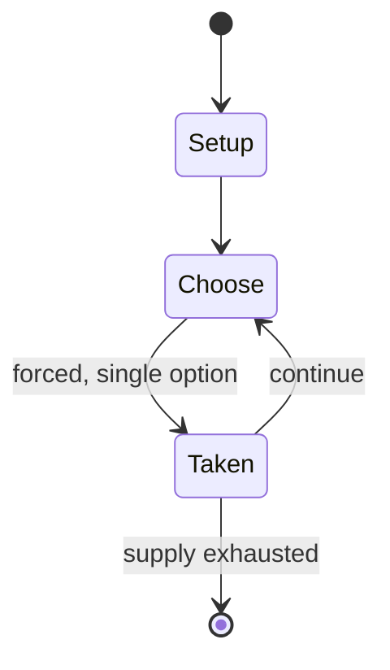

# Lamlameta

*traditional mancala game*

`lamlameta` &nbsp; state: **DEEPENED** &nbsp; method: **heuristic**

## Found layer (recorded, not trusted)

| field | value |
| --- | --- |
| wikidata | Q1431363 |
| wikipedia | Lamlameta |
| genres (source) | -- |
| instance of (source) | board game, mancala |
| country of origin | -- |

## Declared layer (orders bench work)

| field | value |
| --- | --- |
| year created | -- |
| epoch | -- |
| region | -- |
| media | MANCALA |
| players | 2 |
| age band | -- |
| exogenous process | -- |
| loss shape | -- |
| live axes | - |
| horizon | VARIABLE |
| scoring shape | -- |
| information | -- |
| interaction | COMPETITIVE |
| turn structure | -- |
| tractability | SAMPLING_ONLY |
| randomness | -- |
| luck factor | 0.35 |
| rules complexity | 1.72 |
| strategic depth | 2.0 |
| novelty | 0.5263 |
| solved status | -- |
| strategies | -- |
| algorithms | -- |

## Object model

```
Episode
  players      : 2
  turn_structure: ?
  horizon       : VARIABLE
  scoring       : ?

Pits           -- cyclic array of counts
Store          -- player's banked seeds
```

## State transition diagram



## Research item -- turn trace

```
# Lamlameta -- simulated turn events
# generated from the DECLARED vector, not from a rulebook.
# structure: exo=None loss=None horizon=VARIABLE scoring=None axes=-

t=0    SETUP        players=2  pot=0  capacity=6
t=1    FORCED       p1 single legal option taken (pot_gain=+1.2)
t=2    FORCED       p1 single legal option taken (pot_gain=+0.7)
t=3    FORCED       p1 single legal option taken (pot_gain=+0.8)
t=4    FORCED       p1 single legal option taken (pot_gain=+1.3)
t=5    ENDTURN      turn passes to p2
t=6    FORCED       p2 single legal option taken (pot_gain=+0.8)
t=7    FORCED       p2 single legal option taken (pot_gain=+1.5)
t=8    FORCED       p2 single legal option taken (pot_gain=+1.1)
t=9    ENDTURN      turn passes to p1
t=10   FORCED       p1 single legal option taken (pot_gain=+1.3)
t=11   FORCED       p1 single legal option taken (pot_gain=+0.8)
t=12   FORCED       p1 single legal option taken (pot_gain=+1.6)
t=13   ENDTURN      turn passes to p2
t=14   FORCED       p2 single legal option taken (pot_gain=+1.1)
t=15   FORCED       p2 single legal option taken (pot_gain=+1.7)
t=16   FORCED       p2 single legal option taken (pot_gain=+1.3)
t=17   FORCED       p2 single legal option taken (pot_gain=+1.5)
t=18   FORCED       p2 single legal option taken (pot_gain=+1.6)
t=19   FORCED       p2 single legal option taken (pot_gain=+0.5)
t=20   FORCED       p2 single legal option taken (pot_gain=+1.3)
t=21   ENDTURN      turn passes to p1
t=22   FORCED       p1 single legal option taken (pot_gain=+0.9)
t=23   FORCED       p1 single legal option taken (pot_gain=+1.0)
t=24   ENDTURN      turn passes to p2
t=25   FORCED       p2 single legal option taken (pot_gain=+1.3)
t=26   FORCED       p2 single legal option taken (pot_gain=+1.3)

terminal: VARIABLE
```

## Conditions

| kind | threshold | effect | trigger |
| --- | --- | --- | --- |
| TERMINATE | -- | -- | The player's move ends when the last seed of a sowing is dropped in an empty pit. |
| TERMINATE | -- | -- | The game ends when one of the players has no seeds left. |

## Source extract

Lamlameta is a traditional mancala game played by the Konso people living in the Olanta area of
central Ethiopia. It was first described in 1971 by British academic Richard Pankhurst. It is
usually played by men. The name "Lamlaleta" means "in couples".   == Rules == The board used to
play Lamlameta, called toma tagéga, comprises 2 rows (one per player) of 12 pits each; pits are
termed awa. At game setup, two seeds (tagéga) are placed in each pit. At his turn, the player
takes all the seeds from one of his pits and relay-sows them counterclockwise. Usually, the
opening move is from one of the two rightmost pits. With the sole exception of the opening move
(meaning the first move of the first player), in all subsequent sowings any opponent's pit
holding exactly two seeds is skipped.   The player's move ends when the last seed of a sowing is
dropped in an empty pit. If that pit is in the player's own row, and the opposite pit in the
opponent's row contains exactly two seeds, then a capture occurs. In this case, all of the
opponent's seeds in any pit containing two seeds are removed from the board.  The game ends when
one of the players has no seeds left. The opponent then captures al

<sub>Wikipedia, CC BY-SA. Retained as evidence for the structural
classification above. Every rule inferred from it is HYPOTHESIZED
until audited against a rulebook.</sub>
