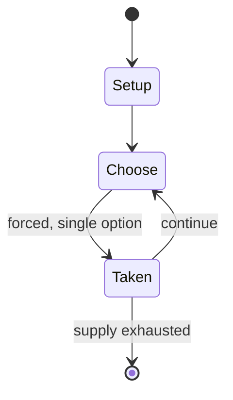

# Langdi (sport)

`langdi_sport` &nbsp; state: **DEEPENED** &nbsp; method: **heuristic**

## Found layer (recorded, not trusted)

| field | value |
| --- | --- |
| wikidata | Q17068517 |
| wikipedia | Langdi (sport) |
| genres (source) | -- |
| instance of (source) | -- |
| country of origin | -- |

## Declared layer (orders bench work)

| field | value |
| --- | --- |
| year created | -- |
| epoch | -- |
| region | -- |
| media | SPORT |
| players | -- |
| age band | -- |
| exogenous process | NONE |
| loss shape | OPPORTUNITY_ONLY |
| live axes | - |
| horizon | -- |
| scoring shape | SET_COLLECTION_CONVEX |
| information | PERFECT |
| interaction | -- |
| turn structure | -- |
| tractability | SAMPLING_ONLY |
| randomness | NONE |
| luck factor | 0.02 |
| rules complexity | 1.91 |
| strategic depth | 2.65 |
| novelty | 0.6798 |
| solved status | -- |
| strategies | set_collection |
| algorithms | -- |

## Object model

```
Episode
  players      : ?
  turn_structure: ?
  horizon       : ?
  scoring       : SET_COLLECTION_CONVEX

Pitch          -- bounded physical region
Player         -- embodied agent with a foul count
Clock          -- counts down; stoppages are rule events
Official       -- detects infractions and applies penalties
```

## State transition diagram



## Research item -- turn trace

```
# Langdi (sport) -- simulated turn events
# generated from the DECLARED vector, not from a rulebook.
# structure: exo=NONE loss=OPPORTUNITY_ONLY horizon=None scoring=SET_COLLECTION_CONVEX axes=-

t=0    SETUP        players=2  pot=0  capacity=3
t=1    FORCED       p1 single legal option taken (pot_gain=+0.7)
t=2    FORCED       p1 single legal option taken (pot_gain=+0.9)
t=3    FORCED       p1 single legal option taken (pot_gain=+1.8)
t=4    FORCED       p1 single legal option taken (pot_gain=+0.6)
t=5    ENDTURN      turn passes to p2
t=6    FORCED       p2 single legal option taken (pot_gain=+1.3)
t=7    FORCED       p2 single legal option taken (pot_gain=+0.9)
t=8    ENDTURN      turn passes to p1
t=9    FORCED       p1 single legal option taken (pot_gain=+1.8)
t=10   FORCED       p1 single legal option taken (pot_gain=+2.0)
t=11   FORCED       p1 single legal option taken (pot_gain=+1.7)
t=12   FORCED       p1 single legal option taken (pot_gain=+0.9)
t=13   FORCED       p1 single legal option taken (pot_gain=+1.1)
t=14   FORCED       p1 single legal option taken (pot_gain=+1.3)
t=15   FORCED       p1 single legal option taken (pot_gain=+1.9)
t=16   FORCED       p1 single legal option taken (pot_gain=+0.8)
t=17   FORCED       p1 single legal option taken (pot_gain=+0.8)
t=18   FORCED       p1 single legal option taken (pot_gain=+2.0)
t=19   FORCED       p1 single legal option taken (pot_gain=+1.8)
t=20   FORCED       p1 single legal option taken (pot_gain=+1.6)
t=21   FORCED       p1 single legal option taken (pot_gain=+1.4)
t=22   FORCED       p1 single legal option taken (pot_gain=+1.3)
t=23   ENDTURN      turn passes to p2
t=24   FORCED       p2 single legal option taken (pot_gain=+0.5)
t=25   ENDTURN      turn passes to p1
t=26   FORCED       p1 single legal option taken (pot_gain=+1.9)
t=27   ENDTURN      turn passes to p2

terminal: VARIABLE
```

## Conditions

| kind | threshold | effect | trigger |
| --- | --- | --- | --- |
| BOUNDARY | -- | -- | The field is a maximum size of 18 metres (59 ft) by 18 metres (59 ft), with the main playing area being a square of about 10 metres (33 ft) on each side. |

## Source extract

Langdi is a traditional South Asian field sport which combines elements of tag and hopscotch. It
was originally played during the Pandiyan Dynasty and called "Nondiyaattam" at that time. The
teams alternate chasing (attacking) and defending roles in each of the 4 innings of the game,
with the chasing team's players restricted to hopping around on one foot, and attempting to
score points by tagging as many defenders as possible within the 9 minutes of each inning. It is
described by Marathis as a sport with a Marathi ethos. Langdi is considered to be useful in
training for sports like kho kho, volleyball and gymnastics. The National Langdi Federation
received national recognition in 2010. Langdi in Maharashtra is a popular childhood pastime, it
is described as the foundation of all sports. Suresh Gandhi, Secretary of Langdi Federation of
India acknowledges playing langdi isn't financially rewarding. Stake holders have to arrange for
funds out of their own resources. Mumbai University will be the first Indian university to
introduce langdi at the college level, for female students thus revitalising the traditional
sport. 5 lakh female students study in the university in 700 colleges

<sub>Wikipedia, CC BY-SA. Retained as evidence for the structural
classification above. Every rule inferred from it is HYPOTHESIZED
until audited against a rulebook.</sub>
