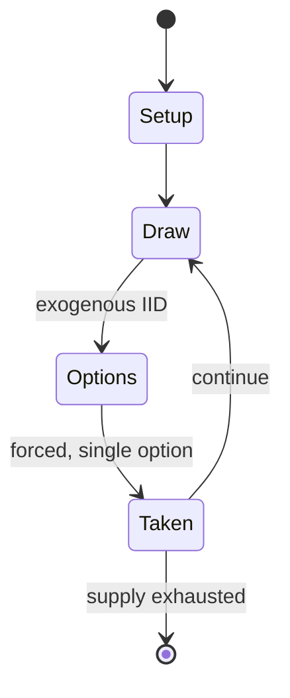

# Laquet

*Castilian tables game*

`laquet` &nbsp; state: **DEEPENED** &nbsp; method: **heuristic**

## Found layer (recorded, not trusted)

| field | value |
| --- | --- |
| wikidata | Q109635684 |
| wikipedia | Laquet |
| genres (source) | -- |
| instance of (source) | Verquere |
| country of origin | Castile |

## Declared layer (orders bench work)

| field | value |
| --- | --- |
| year created | -- |
| epoch | -- |
| region | -- |
| media | DICE |
| players | -- |
| age band | -- |
| exogenous process | IID |
| loss shape | -- |
| live axes | - |
| horizon | -- |
| scoring shape | -- |
| information | ASYMMETRIC |
| interaction | COMPETITIVE |
| turn structure | -- |
| tractability | EXACT_WITH_CUT |
| randomness | DICE |
| luck factor | 0.58 |
| rules complexity | 1.87 |
| strategic depth | 1.87 |
| novelty | 0.6949 |
| solved status | -- |
| strategies | -- |
| algorithms | -- |

## Object model

```
Episode
  players      : ?
  turn_structure: ?
  horizon       : ?
  scoring       : ?

DicePool       -- n dice, each an iid categorical draw
Roll           -- realised outcome of a pool
```

## State transition diagram



## Research item -- turn trace

```
# Laquet -- simulated turn events
# generated from the DECLARED vector, not from a rulebook.
# structure: exo=IID loss=None horizon=None scoring=None axes=-

t=0    SETUP        players=2  pot=0  capacity=7
t=1    DRAW         p1 roll from d6 pool -> outcome #2  (p=0.002)
t=2    FORCED       p1 single legal option taken (pot_gain=+1.7)
t=3    ENDTURN      turn passes to p2
t=4    DRAW         p2 roll from d6 pool -> outcome #6  (p=0.157)
t=5    FORCED       p2 single legal option taken (pot_gain=+1.8)
t=6    DRAW         p2 roll from d6 pool -> outcome #4  (p=0.298)
t=7    FORCED       p2 single legal option taken (pot_gain=+0.7)
t=8    DRAW         p2 roll from d6 pool -> outcome #6  (p=0.295)
t=9    FORCED       p2 single legal option taken (pot_gain=+0.9)
t=10   ENDTURN      turn passes to p1
t=11   DRAW         p1 roll from d6 pool -> outcome #4  (p=0.280)
t=12   FORCED       p1 single legal option taken (pot_gain=+1.0)
t=13   ENDTURN      turn passes to p2
t=14   DRAW         p2 roll from d6 pool -> outcome #6  (p=0.001)
t=15   FORCED       p2 single legal option taken (pot_gain=+1.2)
t=16   DRAW         p2 roll from d6 pool -> outcome #5  (p=0.274)
t=17   FORCED       p2 single legal option taken (pot_gain=+1.6)
t=18   DRAW         p2 roll from d6 pool -> outcome #5  (p=0.144)
t=19   FORCED       p2 single legal option taken (pot_gain=+0.7)
t=20   ENDTURN      turn passes to p1
t=21   DRAW         p1 roll from d6 pool -> outcome #5  (p=0.278)
t=22   FORCED       p1 single legal option taken (pot_gain=+1.9)
t=23   DRAW         p1 roll from d6 pool -> outcome #2  (p=0.124)
t=24   FORCED       p1 single legal option taken (pot_gain=+0.6)
t=25   ENDTURN      turn passes to p2
t=26   DRAW         p2 roll from d6 pool -> outcome #3  (p=0.270)
t=27   FORCED       p2 single legal option taken (pot_gain=+0.6)

terminal: VARIABLE
```

## Source extract

Laquet is an historical Castilian tables game that was described as a new game in the 13th
century. It may be the ancestor of Jacquet. Unlike Backgammon and most other tables games, it
has an asymmetrical starting position; only three of the four quadrants are used and the pieces
may not be 'hit'.   == History == Laquet is described in the Libro de los Juegos, a game book
written for King Alfonso of Castile between 1251 and 1283. It was described as being a "new
game". It shares with the much later French game of Jacquet the ludeme, unusual for games of the
tables family that an isolated hostile man may not be 'hit'. It may therefore be ancestral to
Jacquet. Golladay translates the name of the game as "Quest."   == Equipment == The game was
played on a tables board of 24 points (such as a Backgammon board) using 30 pieces or 'men' of
two different colours, two dice and two dice cups.   == Starting position ==  Both players start
in the first quadrant at the bottom right (see picture). The board is dressed asymmetrically as
follows (see illustration) assuming Player A (white) is at the bottom and Player B (black) is at
the top:  Player A (white) places one man in the outer corner of

<sub>Wikipedia, CC BY-SA. Retained as evidence for the structural
classification above. Every rule inferred from it is HYPOTHESIZED
until audited against a rulebook.</sub>
