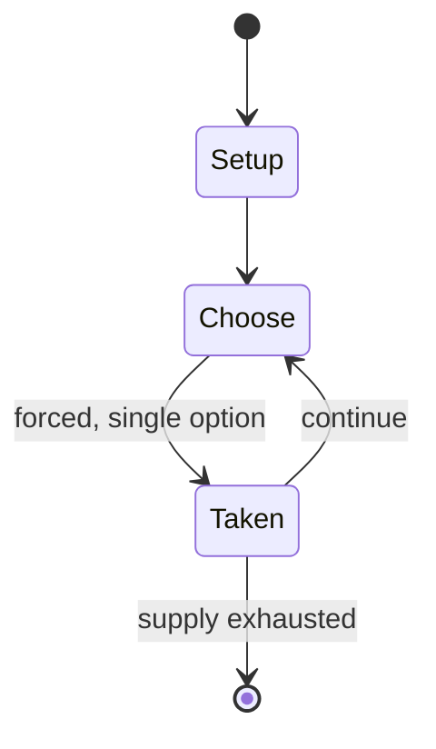

# Laser Clay Shooting System

*video game accessory product*

`laser_clay_shooting_system` &nbsp; state: **DEEPENED** &nbsp; method: **heuristic**

## Found layer (recorded, not trusted)

| field | value |
| --- | --- |
| wikidata | Q6492984 |
| wikipedia | Laser Clay Shooting System |
| genres (source) | -- |
| instance of (source) | video game |
| country of origin | Japan |

## Declared layer (orders bench work)

| field | value |
| --- | --- |
| year created | 1973 |
| epoch | DIGITAL |
| region | EAST_ASIA |
| media | VIDEO |
| players | -- |
| age band | -- |
| exogenous process | -- |
| loss shape | -- |
| live axes | COMMIT_BLIND, TRADE |
| horizon | -- |
| scoring shape | -- |
| information | SIMULTANEOUS |
| interaction | COMPETITIVE |
| turn structure | -- |
| tractability | SAMPLING_ONLY |
| randomness | SIMULTANEOUS_CHOICE |
| luck factor | 0.35 |
| rules complexity | 1.74 |
| strategic depth | 2.0 |
| novelty | 0.0938 |
| solved status | -- |
| strategies | -- |
| algorithms | -- |

## Object model

```
Episode
  players      : ?
  turn_structure: ?
  horizon       : ?
  scoring       : ?

WorldState     -- simulation state advanced by the engine
Avatar         -- player-controlled agent
Clock          -- frame or tick counter
SealedChoice   -- irrevocable choice made without observation
Offer          -- proposed exchange between two agents
```

## State transition diagram



## Research item -- turn trace

```
# Laser Clay Shooting System -- simulated turn events
# generated from the DECLARED vector, not from a rulebook.
# structure: exo=None loss=None horizon=None scoring=None axes=COMMIT_BLIND,TRADE

t=0    SETUP        players=2  pot=0  capacity=8
t=1    FORCED       p1 single legal option taken (pot_gain=+1.9)
t=2    TRADE        p1 offers 2:1 exchange to p2
t=3    FORCED       p1 single legal option taken (pot_gain=+1.8)
t=4    TRADE        p1 offers 2:1 exchange to p2
t=5    FORCED       p1 single legal option taken (pot_gain=+1.0)
t=6    FORCED       p1 single legal option taken (pot_gain=+2.0)
t=7    TRADE        p1 offers 2:1 exchange to p2
t=8    FORCED       p1 single legal option taken (pot_gain=+1.4)
t=9    TRADE        p1 offers 2:1 exchange to p2
t=10   FORCED       p1 single legal option taken (pot_gain=+1.3)
t=11   ENDTURN      turn passes to p2
t=12   FORCED       p2 single legal option taken (pot_gain=+1.0)
t=13   ENDTURN      turn passes to p1
t=14   FORCED       p1 single legal option taken (pot_gain=+1.7)
t=15   FORCED       p1 single legal option taken (pot_gain=+1.7)
t=16   ENDTURN      turn passes to p2
t=17   FORCED       p2 single legal option taken (pot_gain=+1.7)
t=18   FORCED       p2 single legal option taken (pot_gain=+1.4)
t=19   TRADE        p2 offers 2:1 exchange to p1
t=20   FORCED       p2 single legal option taken (pot_gain=+1.9)
t=21   TRADE        p2 offers 2:1 exchange to p1
t=22   FORCED       p2 single legal option taken (pot_gain=+1.0)
t=23   ENDTURN      turn passes to p1
t=24   FORCED       p1 single legal option taken (pot_gain=+1.1)
t=25   TRADE        p1 offers 2:1 exchange to p2
t=26   FORCED       p1 single legal option taken (pot_gain=+1.3)
t=27   TRADE        p1 offers 2:1 exchange to p2

terminal: VARIABLE
```

## Conditions

| kind | threshold | effect | trigger |
| --- | --- | --- | --- |
| PENALTY | -- | -- | The first Laser Clay Shooting System was unveiled to the public in early 1973, despite technical setbacks which were fixed in extremis on the same day it was unveiled. |

## Source extract

The Laser Clay Shooting System (レーザークレー射撃システム) is a light gun shooting simulation game created
by Nintendo in 1973. The game consisted of an overhead projector which displayed moving targets
behind a background; players would fire at the targets with a rifle, in which a mechanism of
reflections would determine whether or not the "laser shot" from the rifle hit the target. The
concept behind the Laser Clay Shooting System came from Hiroshi Yamauchi, while Gunpei Yokoi was
behind the development of the system. It was released in deserted bowling alleys in Japan in
1973; upon release, it was a commercial success, but the success of the system quickly
evaporated as a result of the 1973 oil crisis and the ensuing recession in Japan, which left
Nintendo ¥5 billion in debt and on the verge of bankruptcy. In 1974, Yamauchi, in an attempt to
revive Nintendo, released a smaller, cheaper version of the Laser Clay Shooting System, titled
"Mini Laser Clay". Deployed mostly in arcades, players shoot moving targets, provided by a 16mm
film projector, at an arcade cabinet. This system featured several games and achieved
significant success for Nintendo throughout the 1970s, which helped the compan

<sub>Wikipedia, CC BY-SA. Retained as evidence for the structural
classification above. Every rule inferred from it is HYPOTHESIZED
until audited against a rulebook.</sub>
