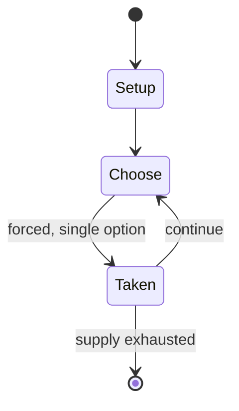

# Latho

*mamcala solitaire game*

`latho` &nbsp; state: **DEEPENED** &nbsp; method: **heuristic**

## Found layer (recorded, not trusted)

| field | value |
| --- | --- |
| wikidata | Q3827461 |
| wikipedia | Latho |
| genres (source) | -- |
| instance of (source) | board game, mancala |
| country of origin | -- |

## Declared layer (orders bench work)

| field | value |
| --- | --- |
| year created | -- |
| epoch | -- |
| region | -- |
| media | BOARD, MANCALA, SOLITAIRE |
| players | -- |
| age band | -- |
| exogenous process | -- |
| loss shape | -- |
| live axes | COMMIT_BLIND |
| horizon | -- |
| scoring shape | -- |
| information | -- |
| interaction | SOLITAIRE |
| turn structure | -- |
| tractability | SAMPLING_ONLY |
| randomness | -- |
| luck factor | 0.35 |
| rules complexity | 2.02 |
| strategic depth | 2.0 |
| novelty | 0.3965 |
| solved status | -- |
| strategies | -- |
| algorithms | -- |

## Object model

```
Episode
  players      : ?
  turn_structure: ?
  horizon       : ?
  scoring       : ?

Board          -- spatial substrate; cells carry position and occupancy
Piece          -- movable token owned by a player
Pits           -- cyclic array of counts
Store          -- player's banked seeds
SealedChoice   -- irrevocable choice made without observation
```

## State transition diagram



## Research item -- turn trace

```
# Latho -- simulated turn events
# generated from the DECLARED vector, not from a rulebook.
# structure: exo=None loss=None horizon=None scoring=None axes=COMMIT_BLIND

t=0    SETUP        players=2  pot=0  capacity=5
t=1    FORCED       p1 single legal option taken (pot_gain=+1.0)
t=2    FORCED       p1 single legal option taken (pot_gain=+1.7)
t=3    FORCED       p1 single legal option taken (pot_gain=+1.8)
t=4    FORCED       p1 single legal option taken (pot_gain=+1.2)
t=5    FORCED       p1 single legal option taken (pot_gain=+1.4)
t=6    FORCED       p1 single legal option taken (pot_gain=+0.5)
t=7    FORCED       p1 single legal option taken (pot_gain=+2.0)
t=8    FORCED       p1 single legal option taken (pot_gain=+1.3)
t=9    FORCED       p1 single legal option taken (pot_gain=+1.6)
t=10   FORCED       p1 single legal option taken (pot_gain=+1.6)
t=11   FORCED       p1 single legal option taken (pot_gain=+1.2)
t=12   FORCED       p1 single legal option taken (pot_gain=+1.4)
t=13   FORCED       p1 single legal option taken (pot_gain=+0.8)
t=14   ENDTURN      turn passes to p2
t=15   FORCED       p2 single legal option taken (pot_gain=+1.7)
t=16   FORCED       p2 single legal option taken (pot_gain=+1.1)
t=17   FORCED       p2 single legal option taken (pot_gain=+1.0)
t=18   FORCED       p2 single legal option taken (pot_gain=+1.2)
t=19   FORCED       p2 single legal option taken (pot_gain=+1.3)
t=20   FORCED       p2 single legal option taken (pot_gain=+0.7)
t=21   ENDTURN      turn passes to p1
t=22   FORCED       p1 single legal option taken (pot_gain=+1.3)
t=23   FORCED       p1 single legal option taken (pot_gain=+0.6)
t=24   ENDTURN      turn passes to p2
t=25   FORCED       p2 single legal option taken (pot_gain=+1.3)
t=26   FORCED       p2 single legal option taken (pot_gain=+0.8)

terminal: VARIABLE
```

## Source extract

Latho is a traditional solitaire game played by the Dorzé people of Ethiopia. The equipment
needed to play the game is similar to that used for mancala games, i.e., a board with 2 rows of
6 "pits", and 30 counters ("seeds"). The game was first described by British academic Richard
Pankhurst in 1971.   == Rules == At game setup, the 30 seeds are placed in the 2x6 pits
according to the following scheme:  2 3 1 3 2 4 2 3 1 3 2 4 Although the game is technically a
solitaire, it requires a second person besides the player, who has the function of a "dealer".
The dealer and player must first agree about the pit of the board from which to start. The
player then closes his eyes (or is blindfolded) and must declare out loud the number of seeds in
each of the pits of the board, counterclockwise from the starting pit. The traditional
declarations used in Ethiopia are:   oydo éka ("take from four") héza éka ("take from three")
namo éka ("take from two") isimo éka ("take from one") afo éka ("don't take") As long as the
declaration is correct (i.e., the pit has that exact number of seeds), the dealer will remove
one seed from the pit. The game will thus continue until the board is empty (in whic

<sub>Wikipedia, CC BY-SA. Retained as evidence for the structural
classification above. Every rule inferred from it is HYPOTHESIZED
until audited against a rulebook.</sub>
