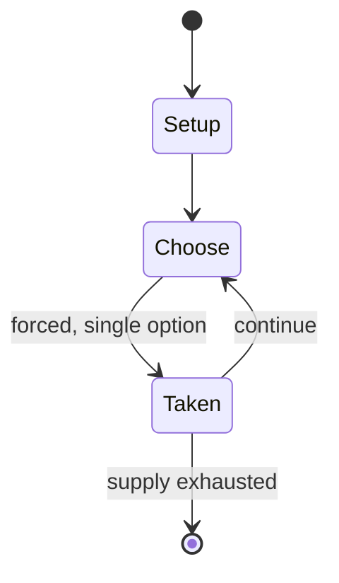

# Lau kata kati

`lau_kata_kati` &nbsp; state: **DEEPENED** &nbsp; method: **heuristic**

## Found layer (recorded, not trusted)

| field | value |
| --- | --- |
| wikidata | Q10514556 |
| wikipedia | Lau kata kati |
| genres (source) | -- |
| instance of (source) | abstract strategy game |
| country of origin | -- |

## Declared layer (orders bench work)

| field | value |
| --- | --- |
| year created | -- |
| epoch | -- |
| region | -- |
| media | ABSTRACT |
| players | -- |
| age band | -- |
| exogenous process | NONE |
| loss shape | OPPORTUNITY_ONLY |
| live axes | SPATIAL |
| horizon | -- |
| scoring shape | -- |
| information | PERFECT |
| interaction | COMPETITIVE |
| turn structure | -- |
| tractability | EXACT_WITH_CUT |
| randomness | NONE |
| luck factor | 0.02 |
| rules complexity | 2.62 |
| strategic depth | 2.4 |
| novelty | 0.7343 |
| solved status | -- |
| strategies | -- |
| algorithms | -- |

## Object model

```
Episode
  players      : ?
  turn_structure: ?
  horizon       : ?
  scoring       : ?

Placement      -- position subject to geometric legality
```

## State transition diagram



## Research item -- turn trace

```
# Lau kata kati -- simulated turn events
# generated from the DECLARED vector, not from a rulebook.
# structure: exo=NONE loss=OPPORTUNITY_ONLY horizon=None scoring=None axes=SPATIAL

t=0    SETUP        players=2  pot=0  capacity=7
t=1    FORCED       p1 single legal option taken (pot_gain=+0.7)
t=2    FORCED       p1 single legal option taken (pot_gain=+1.2)
t=3    SPATIAL      p1 places at (3,0); adjacency legal
t=4    ENDTURN      turn passes to p2
t=5    FORCED       p2 single legal option taken (pot_gain=+1.8)
t=6    FORCED       p2 single legal option taken (pot_gain=+1.4)
t=7    FORCED       p2 single legal option taken (pot_gain=+1.2)
t=8    SPATIAL      p2 places at (1,1); adjacency legal
t=9    FORCED       p2 single legal option taken (pot_gain=+1.2)
t=10   FORCED       p2 single legal option taken (pot_gain=+1.4)
t=11   FORCED       p2 single legal option taken (pot_gain=+1.6)
t=12   FORCED       p2 single legal option taken (pot_gain=+1.5)
t=13   SPATIAL      p2 places at (4,1); adjacency legal
t=14   ENDTURN      turn passes to p1
t=15   FORCED       p1 single legal option taken (pot_gain=+0.9)
t=16   SPATIAL      p1 places at (5,7); adjacency legal
t=17   FORCED       p1 single legal option taken (pot_gain=+1.7)
t=18   SPATIAL      p1 places at (7,0); adjacency legal
t=19   FORCED       p1 single legal option taken (pot_gain=+0.8)
t=20   FORCED       p1 single legal option taken (pot_gain=+1.3)
t=21   SPATIAL      p1 places at (4,5); adjacency legal
t=22   FORCED       p1 single legal option taken (pot_gain=+1.5)
t=23   SPATIAL      p1 places at (1,2); adjacency legal
t=24   FORCED       p1 single legal option taken (pot_gain=+1.8)
t=25   FORCED       p1 single legal option taken (pot_gain=+1.6)
t=26   FORCED       p1 single legal option taken (pot_gain=+1.3)

terminal: VARIABLE
```

## Conditions

| kind | threshold | effect | trigger |
| --- | --- | --- | --- |
| WIN | -- | -- | If a player captures all of their opponent's pieces, he or she is the winner. |

## Source extract

Lau kata kati is a two-player abstract strategy game from India, specifically from Lower Bengal,
and also from United Provinces, Karwi Subdivision where it is called Kowwu Dunki, and it was
described by H.J.R. Murray in A History of Board-Games Other Than Chess (1952). The game is
related to draughts and even more so to Alquerque. Pieces are captured by leaping over them.
The board is a pattern of two triangles joined together at a common vertex with further lines
subdividing them. It is the same game as Butterfly (game) from Mozambique, which suggests a
historical connection between the two games. Lau kata kati belongs to a specific category of
games called Indian War-games, and the other games in this category are Dash-guti, Egara-guti,
Pretwa, Gol-skuish. All Indian War-games have one important thing in common, and that is that
all the pieces are laid out on the patterned board, with only one vacant point in the center.
This forces the first move to be played on the central point, and captured by the other player's
piece.  It is important to realize that Lau kata kati's patterned board is the basis of other
games, in particular, Dash-guti and Egara-guti, as the boards of those

<sub>Wikipedia, CC BY-SA. Retained as evidence for the structural
classification above. Every rule inferred from it is HYPOTHESIZED
until audited against a rulebook.</sub>
