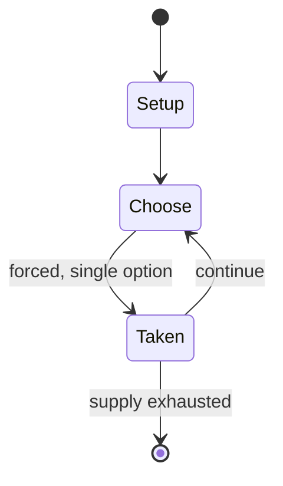

# Le Havre (board game)

`le_havre_board_game` &nbsp; state: **DEEPENED** &nbsp; method: **heuristic**

## Found layer (recorded, not trusted)

| field | value |
| --- | --- |
| wikidata | Q1809927 |
| wikipedia | Le Havre (board game) |
| genres (source) | -- |
| instance of (source) | -- |
| country of origin | -- |

## Declared layer (orders bench work)

| field | value |
| --- | --- |
| year created | 2008 |
| epoch | CONTEMPORARY |
| region | -- |
| media | BOARD |
| players | -- |
| age band | -- |
| exogenous process | -- |
| loss shape | -- |
| live axes | TRADE |
| horizon | -- |
| scoring shape | -- |
| information | -- |
| interaction | NEGOTIATION |
| turn structure | -- |
| tractability | INTRACTABLE |
| randomness | -- |
| luck factor | 0.35 |
| rules complexity | 2.61 |
| strategic depth | 2.25 |
| novelty | 0.9538 |
| solved status | -- |
| strategies | route_optimisation |
| algorithms | -- |

## Object model

```
Episode
  players      : ?
  turn_structure: ?
  horizon       : ?
  scoring       : ?

Board          -- spatial substrate; cells carry position and occupancy
Piece          -- movable token owned by a player
Offer          -- proposed exchange between two agents
```

## State transition diagram



## Research item -- turn trace

```
# Le Havre (board game) -- simulated turn events
# generated from the DECLARED vector, not from a rulebook.
# structure: exo=None loss=None horizon=None scoring=None axes=TRADE

t=0    SETUP        players=2  pot=0  capacity=5
t=1    FORCED       p1 single legal option taken (pot_gain=+1.1)
t=2    TRADE        p1 offers 2:1 exchange to p2
t=3    FORCED       p1 single legal option taken (pot_gain=+0.8)
t=4    ENDTURN      turn passes to p2
t=5    FORCED       p2 single legal option taken (pot_gain=+1.6)
t=6    FORCED       p2 single legal option taken (pot_gain=+0.9)
t=7    FORCED       p2 single legal option taken (pot_gain=+0.7)
t=8    FORCED       p2 single legal option taken (pot_gain=+1.8)
t=9    TRADE        p2 offers 2:1 exchange to p1
t=10   FORCED       p2 single legal option taken (pot_gain=+1.8)
t=11   TRADE        p2 offers 2:1 exchange to p1
t=12   FORCED       p2 single legal option taken (pot_gain=+1.5)
t=13   FORCED       p2 single legal option taken (pot_gain=+1.9)
t=14   TRADE        p2 offers 2:1 exchange to p1
t=15   FORCED       p2 single legal option taken (pot_gain=+0.7)
t=16   TRADE        p2 offers 2:1 exchange to p1
t=17   FORCED       p2 single legal option taken (pot_gain=+1.2)
t=18   TRADE        p2 offers 2:1 exchange to p1
t=19   ENDTURN      turn passes to p1
t=20   FORCED       p1 single legal option taken (pot_gain=+1.1)
t=21   FORCED       p1 single legal option taken (pot_gain=+1.0)
t=22   ENDTURN      turn passes to p2
t=23   FORCED       p2 single legal option taken (pot_gain=+2.0)
t=24   ENDTURN      turn passes to p1
t=25   FORCED       p1 single legal option taken (pot_gain=+0.7)
t=26   TRADE        p1 offers 2:1 exchange to p2

terminal: VARIABLE
```

## Source extract

Le Havre is a board game about the development of the town of Le Havre.  It was inspired by the
games Caylus and Agricola and was developed in December 2007. The game was edited by Uwe
Rosenberg and Hanno Girke and the former gets the main cover credit. The illustrator was Klemens
Franz while the English translator was Melissa Rogerson. Numerous credits are given to others
who assisted with playtesting and other tasks.  The game was published by Lookout Games and
distributed by Heidelberger Spieleverlag. The game was released at Spiel 2008 in both German and
Australian English, with both editions published by Lookout Games. It did not do as well as its
predecessor Agricola in the Fairplay polls, with a rating of 2.51 (1 is best), but has a high
rating of 7.9/10 at BoardGameGeek (a different rating system), ranking among the top 100 games
and is generally considered to be highly regarded by critics. The game was adapted into an iOS
app by Codito Development Inc. and released on June 21, 2012. The game has a Metacritic rating
of 82% based on 6 critic reviews. A two player version called Le Havre: The Inland Port was
released in 2012.  There is also a corresponding iOS app.   == Gamep

<sub>Wikipedia, CC BY-SA. Retained as evidence for the structural
classification above. Every rule inferred from it is HYPOTHESIZED
until audited against a rulebook.</sub>
