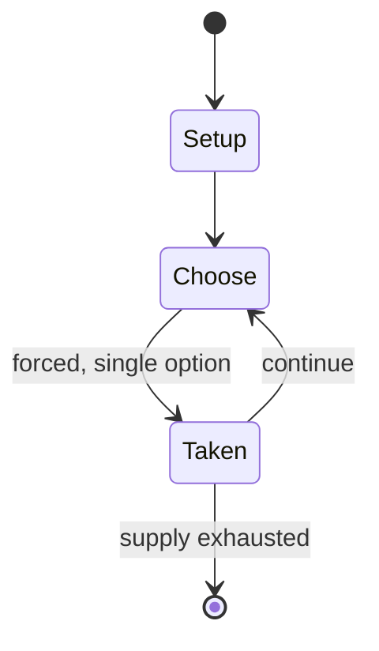

# Le her

`le_her` &nbsp; state: **DEEPENED** &nbsp; method: **heuristic**

## Found layer (recorded, not trusted)

| field | value |
| --- | --- |
| wikidata | Q6507053 |
| wikipedia | Le her |
| genres (source) | -- |
| instance of (source) | -- |
| country of origin | -- |

## Declared layer (orders bench work)

| field | value |
| --- | --- |
| year created | -- |
| epoch | -- |
| region | -- |
| media | CARD |
| players | -- |
| age band | -- |
| exogenous process | -- |
| loss shape | -- |
| live axes | TRADE |
| horizon | -- |
| scoring shape | -- |
| information | -- |
| interaction | -- |
| turn structure | -- |
| tractability | SAMPLING_ONLY |
| randomness | -- |
| luck factor | 0.35 |
| rules complexity | 2.0 |
| strategic depth | 2.25 |
| novelty | 0.0896 |
| solved status | -- |
| strategies | probability_estimation |
| algorithms | -- |

## Object model

```
Episode
  players      : ?
  turn_structure: ?
  horizon       : ?
  scoring       : ?

Deck           -- ordered multiset, drawn without replacement
Hand           -- private multiset held by one player
DiscardPile    -- public accumulation of spent cards
Offer          -- proposed exchange between two agents
```

## State transition diagram



## Research item -- turn trace

```
# Le her -- simulated turn events
# generated from the DECLARED vector, not from a rulebook.
# structure: exo=None loss=None horizon=None scoring=None axes=TRADE

t=0    SETUP        players=2  pot=0  capacity=7
t=1    FORCED       p1 single legal option taken (pot_gain=+0.5)
t=2    ENDTURN      turn passes to p2
t=3    FORCED       p2 single legal option taken (pot_gain=+1.9)
t=4    FORCED       p2 single legal option taken (pot_gain=+1.2)
t=5    TRADE        p2 offers 2:1 exchange to p1
t=6    ENDTURN      turn passes to p1
t=7    FORCED       p1 single legal option taken (pot_gain=+1.7)
t=8    TRADE        p1 offers 2:1 exchange to p2
t=9    FORCED       p1 single legal option taken (pot_gain=+2.0)
t=10   FORCED       p1 single legal option taken (pot_gain=+1.6)
t=11   TRADE        p1 offers 2:1 exchange to p2
t=12   FORCED       p1 single legal option taken (pot_gain=+2.0)
t=13   ENDTURN      turn passes to p2
t=14   FORCED       p2 single legal option taken (pot_gain=+1.4)
t=15   FORCED       p2 single legal option taken (pot_gain=+1.9)
t=16   FORCED       p2 single legal option taken (pot_gain=+0.9)
t=17   TRADE        p2 offers 2:1 exchange to p1
t=18   FORCED       p2 single legal option taken (pot_gain=+1.2)
t=19   ENDTURN      turn passes to p1
t=20   FORCED       p1 single legal option taken (pot_gain=+0.5)
t=21   FORCED       p1 single legal option taken (pot_gain=+0.7)
t=22   ENDTURN      turn passes to p2
t=23   FORCED       p2 single legal option taken (pot_gain=+1.6)
t=24   FORCED       p2 single legal option taken (pot_gain=+1.8)
t=25   TRADE        p2 offers 2:1 exchange to p1
t=26   FORCED       p2 single legal option taken (pot_gain=+1.3)
t=27   TRADE        p2 offers 2:1 exchange to p1

terminal: VARIABLE
```

## Conditions

| kind | threshold | effect | trigger |
| --- | --- | --- | --- |
| WIN | -- | -- | In the case of the dealer and receiver having same ranked cards, the dealer is the winner. |

## Source extract

Le her (or le hère) is a French card game that dates back to the 16th century. It is quoted by
the French poet Marc Papillon de Lasphrise in 1597. Under the name coucou it is mentioned in
Rabelais' long list of games (in Gargantua, 1534). Le Her belongs to the family of Ranter-Go-
Round games. It is played with a standard deck of 52 cards by two people, designated the dealer
and the receiver. King is ranked high and ace low. To play, the dealer gives one card to the
receiver and one to the dealer. The receiver may choose to exchange cards with the dealer,
unless the dealer has a king, in which case no exchange occurs. Then, the dealer may choose to
exchange with the top card of the deck, unless the top card is a king, in which case no exchange
occurs. In the case of the dealer and receiver having same ranked cards, the dealer is the
winner. Le her played a role in the development of the mathematical theory of probability with
solutions, being sought by Bernoulli and de Montmort. The game was analyzed by Charles
Waldegrave, leading to the creation of the Waldegrave problem.   == References ==   == Further
reading == Epstein, Richard (2009). The Theory of Gambling and Statistical Logi

<sub>Wikipedia, CC BY-SA. Retained as evidence for the structural
classification above. Every rule inferred from it is HYPOTHESIZED
until audited against a rulebook.</sub>
