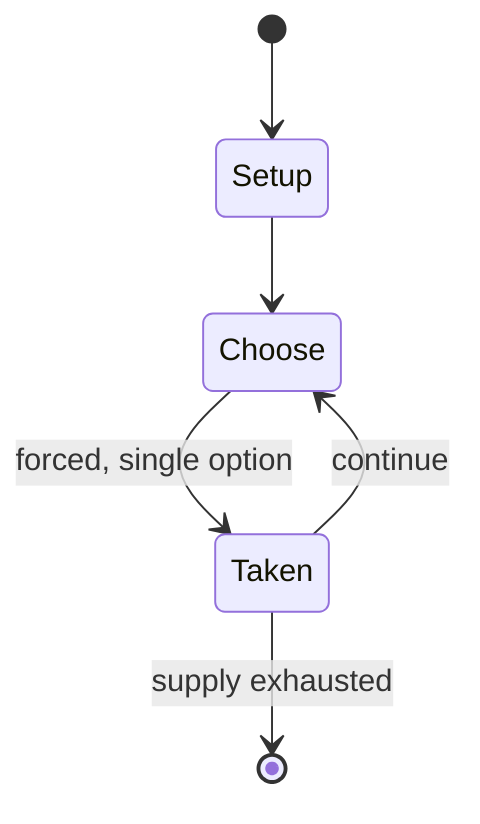

# Leapfrog

`leapfrog` &nbsp; state: **DEEPENED** &nbsp; method: **heuristic**

## Found layer (recorded, not trusted)

| field | value |
| --- | --- |
| wikidata | Q1631315 |
| wikipedia | Leapfrog |
| genres (source) | -- |
| instance of (source) | -- |
| country of origin | -- |

## Declared layer (orders bench work)

| field | value |
| --- | --- |
| year created | -- |
| epoch | -- |
| region | -- |
| media | - |
| players | -- |
| age band | CHILD |
| exogenous process | -- |
| loss shape | -- |
| live axes | - |
| horizon | -- |
| scoring shape | -- |
| information | -- |
| interaction | -- |
| turn structure | STRICT_TURN |
| tractability | SAMPLING_ONLY |
| randomness | -- |
| luck factor | 0.35 |
| rules complexity | 1.72 |
| strategic depth | 2.0 |
| novelty | 0.4256 |
| solved status | -- |
| strategies | -- |
| algorithms | -- |

## Object model

```
Episode
  players      : ?
  turn_structure: STRICT_TURN
  horizon       : ?
  scoring       : ?

State          -- opaque; no medium or axis evidence was found
Player         -- an agent that selects among legal successors
```

## State transition diagram



## Research item -- turn trace

```
# Leapfrog -- simulated turn events
# generated from the DECLARED vector, not from a rulebook.
# structure: exo=None loss=None horizon=None scoring=None axes=-

t=0    SETUP        players=2  pot=0  capacity=4
t=1    FORCED       p1 single legal option taken (pot_gain=+1.2)
t=2    FORCED       p1 single legal option taken (pot_gain=+2.0)
t=3    FORCED       p1 single legal option taken (pot_gain=+1.1)
t=4    ENDTURN      turn passes to p2
t=5    FORCED       p2 single legal option taken (pot_gain=+1.8)
t=6    FORCED       p2 single legal option taken (pot_gain=+1.4)
t=7    FORCED       p2 single legal option taken (pot_gain=+1.9)
t=8    ENDTURN      turn passes to p1
t=9    FORCED       p1 single legal option taken (pot_gain=+0.7)
t=10   FORCED       p1 single legal option taken (pot_gain=+1.1)
t=11   FORCED       p1 single legal option taken (pot_gain=+1.1)
t=12   FORCED       p1 single legal option taken (pot_gain=+1.6)
t=13   ENDTURN      turn passes to p2
t=14   FORCED       p2 single legal option taken (pot_gain=+1.0)
t=15   FORCED       p2 single legal option taken (pot_gain=+1.2)
t=16   FORCED       p2 single legal option taken (pot_gain=+1.2)
t=17   ENDTURN      turn passes to p1
t=18   FORCED       p1 single legal option taken (pot_gain=+1.6)
t=19   FORCED       p1 single legal option taken (pot_gain=+1.7)
t=20   FORCED       p1 single legal option taken (pot_gain=+0.5)
t=21   ENDTURN      turn passes to p2
t=22   FORCED       p2 single legal option taken (pot_gain=+0.6)
t=23   FORCED       p2 single legal option taken (pot_gain=+0.6)
t=24   FORCED       p2 single legal option taken (pot_gain=+1.2)
t=25   FORCED       p2 single legal option taken (pot_gain=+0.9)
t=26   ENDTURN      turn passes to p1

terminal: VARIABLE
```

## Conditions

| kind | threshold | effect | trigger |
| --- | --- | --- | --- |
| BOUNDARY | -- | -- | Games of this sort have been called by this name since at least the late sixteenth century. |

## Source extract

Leapfrog is a children's game of physical movement of the body in which players vault over each
other's stooped backs.  The term has also become a verb describing any situation in which a
person or entity at the rear of a line advances directly to the front.   == History == Games of
this sort have been called by this name since at least the late sixteenth century.   == Gameplay
== The first participant remains still after placing their hands on their own knees while
bending forward, a move known as giving a back. The next player swiftly dashes forward, briefly
plants their hands on the first player's back for support (while straddling legs wide apart)
while hoping to vault over the first player. This jumper, upon landing, advances a few steps
ahead and then gives a back by vaulting over in the next participant in the same manner as the
first player. (Meanwhile, the first player continues giving a back.) A third player leaps over
the first two participants and also gives a back by vaulting over. A fourth jumper would leap
over all previous jumpers successively. Additional players can join in the same way: leaping
over others and then vaulting over (giving a back) to be jumped over b

<sub>Wikipedia, CC BY-SA. Retained as evidence for the structural
classification above. Every rule inferred from it is HYPOTHESIZED
until audited against a rulebook.</sub>
