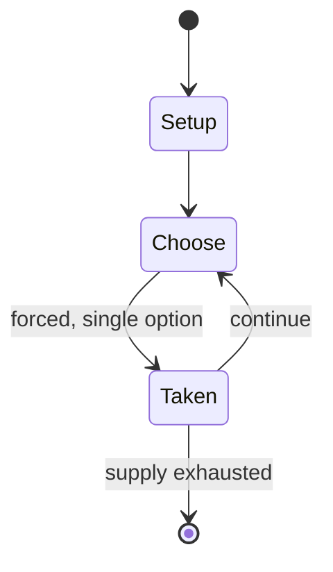

# Lee Moves North

*board wargame*

`lee_moves_north` &nbsp; state: **DEEPENED** &nbsp; method: **heuristic**

## Found layer (recorded, not trusted)

| field | value |
| --- | --- |
| wikidata | Q112228290 |
| wikipedia | Lee Moves North |
| genres (source) | -- |
| instance of (source) | board wargame |
| country of origin | -- |

## Declared layer (orders bench work)

| field | value |
| --- | --- |
| year created | -- |
| epoch | -- |
| region | -- |
| media | WARGAME |
| players | -- |
| age band | -- |
| exogenous process | -- |
| loss shape | -- |
| live axes | SPATIAL |
| horizon | -- |
| scoring shape | -- |
| information | ASYMMETRIC |
| interaction | COMPETITIVE |
| turn structure | -- |
| tractability | SAMPLING_ONLY |
| randomness | DICE |
| luck factor | 0.58 |
| rules complexity | 3.22 |
| strategic depth | 1.87 |
| novelty | 0.5399 |
| solved status | -- |
| strategies | -- |
| algorithms | -- |

## Object model

```
Episode
  players      : ?
  turn_structure: ?
  horizon       : ?
  scoring       : ?

Placement      -- position subject to geometric legality
```

## State transition diagram



## Research item -- turn trace

```
# Lee Moves North -- simulated turn events
# generated from the DECLARED vector, not from a rulebook.
# structure: exo=None loss=None horizon=None scoring=None axes=SPATIAL

t=0    SETUP        players=2  pot=0  capacity=4
t=1    FORCED       p1 single legal option taken (pot_gain=+1.8)
t=2    FORCED       p1 single legal option taken (pot_gain=+0.6)
t=3    FORCED       p1 single legal option taken (pot_gain=+1.9)
t=4    SPATIAL      p1 places at (0,1); adjacency legal
t=5    FORCED       p1 single legal option taken (pot_gain=+0.6)
t=6    SPATIAL      p1 places at (1,3); adjacency legal
t=7    FORCED       p1 single legal option taken (pot_gain=+1.7)
t=8    FORCED       p1 single legal option taken (pot_gain=+1.6)
t=9    FORCED       p1 single legal option taken (pot_gain=+2.0)
t=10   SPATIAL      p1 places at (6,4); adjacency legal
t=11   FORCED       p1 single legal option taken (pot_gain=+1.6)
t=12   FORCED       p1 single legal option taken (pot_gain=+1.8)
t=13   SPATIAL      p1 places at (4,6); adjacency legal
t=14   FORCED       p1 single legal option taken (pot_gain=+1.9)
t=15   FORCED       p1 single legal option taken (pot_gain=+1.0)
t=16   SPATIAL      p1 places at (0,1); adjacency legal
t=17   ENDTURN      turn passes to p2
t=18   FORCED       p2 single legal option taken (pot_gain=+1.5)
t=19   FORCED       p2 single legal option taken (pot_gain=+0.9)
t=20   FORCED       p2 single legal option taken (pot_gain=+1.6)
t=21   ENDTURN      turn passes to p1
t=22   FORCED       p1 single legal option taken (pot_gain=+0.8)
t=23   FORCED       p1 single legal option taken (pot_gain=+1.8)
t=24   SPATIAL      p1 places at (5,3); adjacency legal
t=25   FORCED       p1 single legal option taken (pot_gain=+0.8)
t=26   SPATIAL      p1 places at (3,1); adjacency legal
t=27   ENDTURN      turn passes to p2

terminal: VARIABLE
```

## Source extract

Lee Moves North, originally titled Lee at Gettysburg and subtitled "The Confederate Summer
Offensive, 1862 & 1863", is a board wargame published by Simulations Publications Inc. (SPI) in
1972 that simulates Robert E. Lee's summer offenses of 1862 and 1863 during the American Civil
War   == Description == Lee Moves North is a two-player wargame in which one player controls the
Confederate forces, and the other controls Union forces. The game covers two battles, the Battle
of Antietam in 1862, and the Battle of Gettysburg in 1863. Both are twenty turns long. There are
an addition four non-historical "what if?" scenarios.   === Components === The game box
contains:  22" x 28" paper hex grid map scaled at 7 km (4 mi) per hex 200 die-cut counters a
map-folded rules sheet various player aids and charts   === Gameplay === The game uses a
traditional alternating "I Go, You Go" system, where one player receives reinforcements, moves
and fires. Then the other player does the same, thus completing one turn, marking two days of
game time. There are also rules for leaders, cavalry reconnaissance, fortifications, and rail
movement.  The game also uses an innovative system of hidden movement: all

<sub>Wikipedia, CC BY-SA. Retained as evidence for the structural
classification above. Every rule inferred from it is HYPOTHESIZED
until audited against a rulebook.</sub>
