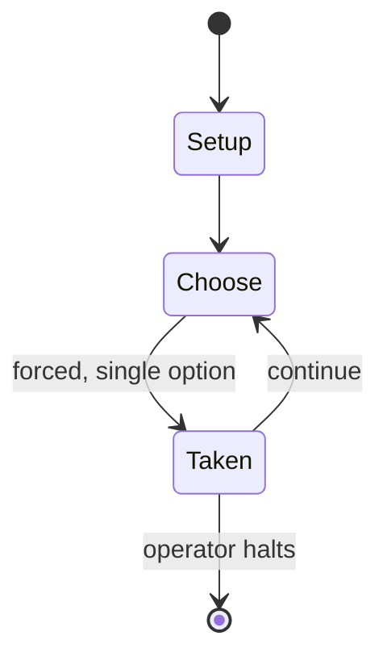

# Lee vs. Grant: The Wilderness Campaign of 1864

*war game*

`lee_vs_grant_the_wilderness_campaign_of_1864` &nbsp; state: **DEEPENED** &nbsp; method: **heuristic**

## Found layer (recorded, not trusted)

| field | value |
| --- | --- |
| wikidata | Q108392280 |
| wikipedia | Lee vs. Grant: The Wilderness Campaign of 1864 |
| genres (source) | -- |
| instance of (source) | board game, board wargame, wargame |
| country of origin | -- |

## Declared layer (orders bench work)

| field | value |
| --- | --- |
| year created | 1988 |
| epoch | DIGITAL |
| region | -- |
| media | BOARD, WARGAME |
| players | 2 |
| age band | -- |
| exogenous process | -- |
| loss shape | -- |
| live axes | SPATIAL |
| horizon | OPEN_ENDED |
| scoring shape | -- |
| information | -- |
| interaction | COMPETITIVE |
| turn structure | -- |
| tractability | SAMPLING_ONLY |
| randomness | DICE |
| luck factor | 0.58 |
| rules complexity | 3.21 |
| strategic depth | 1.87 |
| novelty | 0.5253 |
| solved status | -- |
| strategies | -- |
| algorithms | -- |

## Object model

```
Episode
  players      : 2
  turn_structure: ?
  horizon       : OPEN_ENDED
  scoring       : ?

Board          -- spatial substrate; cells carry position and occupancy
Piece          -- movable token owned by a player
Placement      -- position subject to geometric legality
```

## State transition diagram



## Research item -- turn trace

```
# Lee vs. Grant: The Wilderness Campaign of 1864 -- simulated turn events
# generated from the DECLARED vector, not from a rulebook.
# structure: exo=None loss=None horizon=OPEN_ENDED scoring=None axes=SPATIAL

t=0    SETUP        players=2  pot=0  capacity=7
t=1    FORCED       p1 single legal option taken (pot_gain=+1.8)
t=2    FORCED       p1 single legal option taken (pot_gain=+1.4)
t=3    SPATIAL      p1 places at (1,1); adjacency legal
t=4    FORCED       p1 single legal option taken (pot_gain=+1.5)
t=5    SPATIAL      p1 places at (2,2); adjacency legal
t=6    ENDTURN      turn passes to p2
t=7    FORCED       p2 single legal option taken (pot_gain=+0.8)
t=8    ENDTURN      turn passes to p1
t=9    FORCED       p1 single legal option taken (pot_gain=+0.8)
t=10   SPATIAL      p1 places at (4,5); adjacency legal
t=11   FORCED       p1 single legal option taken (pot_gain=+1.8)
t=12   SPATIAL      p1 places at (3,3); adjacency legal
t=13   FORCED       p1 single legal option taken (pot_gain=+0.6)
t=14   FORCED       p1 single legal option taken (pot_gain=+1.7)
t=15   FORCED       p1 single legal option taken (pot_gain=+1.4)
t=16   ENDTURN      turn passes to p2
t=17   FORCED       p2 single legal option taken (pot_gain=+1.2)
t=18   SPATIAL      p2 places at (1,0); adjacency legal
t=19   FORCED       p2 single legal option taken (pot_gain=+1.7)
t=20   SPATIAL      p2 places at (2,7); adjacency legal
t=21   FORCED       p2 single legal option taken (pot_gain=+0.6)
t=22   FORCED       p2 single legal option taken (pot_gain=+0.9)
t=23   ENDTURN      turn passes to p1
t=24   FORCED       p1 single legal option taken (pot_gain=+0.9)
t=25   SPATIAL      p1 places at (2,7); adjacency legal
t=26   ENDTURN      turn passes to p2

terminal: OPEN_ENDED
```

## Source extract

Lee vs. Grant: The Wilderness Campaign of 1864 is a board game published by Victory Games in
1988 that simulates a campaign of the American Civil War. It earned two Charles  S. Roberts
Awards and would become the first of a series of games known as the Great Campaigns of the
American Civil War.   == Contents == Lee vs. Grant is a two-player strategic board wargame that
simulates the pivotal 1864 Wilderness Campaign at the divisional level.    === Historical
background === In May 1864, Lt. General Ulysses S. Grant attempted to force a quick end to the
American Civil War by marching the Army of the Potomac towards the Confederate capital of
Richmond, Virginia. Confederater General Robert E. Lee interposed the Army of Northern Virginia,
and the two armies fought a series of battles over the next eight weeks.    === Components ===
The game box contains:  hex grid map of the area between Fredericksburg and Petersburg, scaled
at 1:200,000, with each hex representing two miles (3.2 km). 520 die cut counters charts counter
tray rulebook   === Gameplay === The game is split into   a Basic game of six scenarios that
introduces the players to movement and unit activitation; three Advanced sce

<sub>Wikipedia, CC BY-SA. Retained as evidence for the structural
classification above. Every rule inferred from it is HYPOTHESIZED
until audited against a rulebook.</sub>
