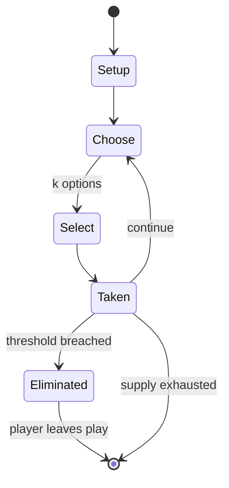

# Legend of the Five Rings

*1995 collectible card game*

`legend_of_the_five_rings` &nbsp; state: **DEEPENED** &nbsp; method: **heuristic**

## Found layer (recorded, not trusted)

| field | value |
| --- | --- |
| wikidata | Q15557333 |
| wikipedia | Legend of the Five Rings (collectible card game) |
| genres (source) | -- |
| instance of (source) | collectible card game |
| country of origin | -- |

## Declared layer (orders bench work)

| field | value |
| --- | --- |
| year created | 2015 |
| epoch | CONTEMPORARY |
| region | -- |
| media | CARD, COLLECTIBLE |
| players | 2-8 |
| age band | -- |
| exogenous process | -- |
| loss shape | ELIMINATION |
| live axes | ORDER, SELECT |
| horizon | -- |
| scoring shape | -- |
| information | -- |
| interaction | COMPETITIVE |
| turn structure | PHASE_STRUCTURED |
| tractability | SAMPLING_ONLY |
| randomness | HIDDEN_INFO |
| luck factor | 0.35 |
| rules complexity | 3.76 |
| strategic depth | 2.0 |
| novelty | 0.608 |
| solved status | -- |
| strategies | -- |
| algorithms | -- |

## Object model

```
Episode
  players      : 2-8
  turn_structure: PHASE_STRUCTURED
  horizon       : ?
  scoring       : ?

Deck           -- ordered multiset, drawn without replacement
Hand           -- private multiset held by one player
DiscardPile    -- public accumulation of spent cards
Sequence       -- the permutation under the player's control
OptionSet      -- the choices available after an exogenous draw
```

## State transition diagram



## Research item -- turn trace

```
# Legend of the Five Rings -- simulated turn events
# generated from the DECLARED vector, not from a rulebook.
# structure: exo=None loss=ELIMINATION horizon=None scoring=None axes=ORDER,SELECT

t=0    SETUP        players=2  pot=0  capacity=4
t=1    SELECT       p1 2 options; take #2  (pot_gain=+2.2, capacity=-2)
t=2    SELECT       p1 1 options; take #1  (pot_gain=+1.8, capacity=-2)
t=3    SELECT       p1 1 options; take #1  (pot_gain=+1.4, capacity=-2)
t=4    ENDTURN      turn passes to p2
t=5    SELECT       p2 2 options; take #1  (pot_gain=+2.7, capacity=-1)
t=6    SELECT       p2 1 options; take #1  (pot_gain=+3.1, capacity=-1)
t=7    ENDTURN      turn passes to p1
t=8    SELECT       p1 3 options; take #1  (pot_gain=+0.8, capacity=-2)
t=9    SELECT       p1 3 options; take #3  (pot_gain=+3.3, capacity=-2)
t=10   SELECT       p1 1 options; take #1  (pot_gain=+0.6, capacity=-0)
t=11   SELECT       p1 1 options; take #1  (pot_gain=+1.3, capacity=-2)
t=12   SELECT       p1 2 options; take #1  (pot_gain=+1.3, capacity=-0)
t=13   ENDTURN      turn passes to p2
t=14   SELECT       p2 3 options; take #2  (pot_gain=+1.5, capacity=-0)
t=15   ENDTURN      turn passes to p1
t=16   SELECT       p1 4 options; take #1  (pot_gain=+1.1, capacity=-1)
t=17   SELECT       p1 3 options; take #2  (pot_gain=+0.7, capacity=-2)
t=18   ENDTURN      turn passes to p2
t=19   SELECT       p2 4 options; take #3  (pot_gain=+2.6, capacity=-2)
t=20   SELECT       p2 3 options; take #2  (pot_gain=+0.6, capacity=-2)
t=21   SELECT       p2 4 options; take #1  (pot_gain=+3.3, capacity=-1)
t=22   SELECT       p2 3 options; take #3  (pot_gain=+2.8, capacity=-1)
t=23   ENDTURN      turn passes to p1
t=24   SELECT       p1 3 options; take #1  (pot_gain=+0.8, capacity=-1)
t=25   SELECT       p1 3 options; take #2  (pot_gain=+2.8, capacity=-1)
t=26   SELECT       p1 2 options; take #2  (pot_gain=+0.8, capacity=-1)

terminal: VARIABLE
```

## Conditions

| kind | threshold | effect | trigger |
| --- | --- | --- | --- |
| BOUNDARY | 40 cards | -- | Each deck must contain at least 40 cards, with no upper limit. |
| ELIMINATE | -- | -- | Another way to achieve victory is by eliminating all opposing players from the game. |
| ELIMINATE | -- | -- | Players can be eliminated in two ways. |
| ELIMINATE | -- | -- | Until Samurai Edition, published in 2007, victory by eliminating other players was termed "military victory" regardless of how the elimination was achieved. |
| ELIMINATE | -- | -- | Several factions were removed from the game, to retain only eight: the original six factions from Imperial Edition, the Scorpion Clan, and the Shadowlands Horde. |
| WIN | -- | -- | A player may win the game by having his or her honor score (representing the public view of his or her clan) reach over 40, at which point he or she will win the game by an honor victory at the beginning of his or her ne |
| WIN | -- | -- | A player may also win by playing all of the titular five rings, representing philosophical mastery of the universe; such a victory is called the enlightenment victory. |
| BOUNDARY | -- | -- | No deck may contain more than three of any particular card, and no more than one of any particular unique card. |

## Source extract

Legend of the Five Rings (L5R) is an out-of-print collectible card game created by a joint
venture featuring Alderac Entertainment Group and ISOMEDIA in 1995 and published until 2015,
when it was announced that the game would be discontinued for a rules-incompatible successor
that will be part of Fantasy Flight Games' Living Card Game line. L5R takes place in the
fictional empire of Rokugan from the Legend of the Five Rings setting, where several clans and
factions vie for domination over the empire. The card game shares some similarities with Magic:
The Gathering but has its own game mechanics and flavor, providing "passive" win conditions like
the Enlightenment Victory, as well as a version of Magic's goal of destroying the opponent.
Games can be very long, with some matches lasting hours. A major distinctive feature of the game
is the importance of the storyline: new fiction pieces advancing the story of Rokugan are
published on a weekly basis, in addition to being released with every expansion, and in a
quarterly publication, the Imperial Herald. Many of these stories reflect the result of
tournaments, where players use their decks to determine which faction will claim a partic

<sub>Wikipedia, CC BY-SA. Retained as evidence for the structural
classification above. Every rule inferred from it is HYPOTHESIZED
until audited against a rulebook.</sub>
