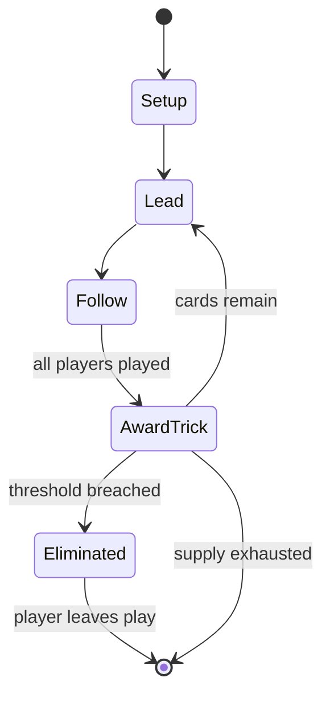

# Lexicon

*card game*

`lexicon` &nbsp; state: **DEEPENED** &nbsp; method: **heuristic**

## Found layer (recorded, not trusted)

| field | value |
| --- | --- |
| wikidata | Q3237349 |
| wikipedia | Lexicon (card game) |
| genres (source) | -- |
| instance of (source) | shedding-type game, trick-taking game |
| country of origin | -- |

## Declared layer (orders bench work)

| field | value |
| --- | --- |
| year created | 1932 |
| epoch | MODERN |
| region | -- |
| media | CARD |
| players | 2-4 |
| age band | -- |
| exogenous process | DEPLETING_DECK |
| loss shape | ELIMINATION |
| live axes | DISCARD, TRADE |
| horizon | -- |
| scoring shape | NEGATIVE_AVOIDANCE |
| information | -- |
| interaction | SOLITAIRE |
| turn structure | TRICK_ROUND |
| tractability | EXACT_WITH_CUT |
| randomness | DECK_SHUFFLE |
| luck factor | 0.35 |
| rules complexity | 2.4 |
| strategic depth | 2.25 |
| novelty | 0.7827 |
| solved status | -- |
| strategies | spatial_packing |
| algorithms | -- |

## Object model

```
Episode
  players      : 2-4
  turn_structure: TRICK_ROUND
  horizon       : ?
  scoring       : NEGATIVE_AVOIDANCE

Deck           -- ordered multiset, drawn without replacement
Hand           -- private multiset held by one player
DiscardPile    -- public accumulation of spent cards
DiscardChoice  -- what is given up to satisfy a limit
Offer          -- proposed exchange between two agents
```

## State transition diagram



## Research item -- turn trace

```
# Lexicon -- simulated turn events
# generated from the DECLARED vector, not from a rulebook.
# structure: exo=DEPLETING_DECK loss=ELIMINATION horizon=None scoring=NEGATIVE_AVOIDANCE axes=DISCARD,TRADE

t=0    SETUP        players=2  pot=0  capacity=8
t=1    DRAW         p1 draw from deck -> outcome #3  (p=0.236)
t=2    FORCED       p1 single legal option taken (pot_gain=+0.7)
t=3    DISCARD      p1 discards to hand limit
t=4    ENDTURN      turn passes to p2
t=5    DRAW         p2 draw from deck -> outcome #4  (p=0.066)
t=6    FORCED       p2 single legal option taken (pot_gain=+1.5)
t=7    TRADE        p2 offers 2:1 exchange to p1
t=8    DRAW         p2 draw from deck -> outcome #5  (p=0.287)
t=9    FORCED       p2 single legal option taken (pot_gain=+1.2)
t=10   DRAW         p2 draw from deck -> outcome #1  (p=0.132)
t=11   FORCED       p2 single legal option taken (pot_gain=+0.5)
t=12   DISCARD      p2 discards to hand limit
t=13   DRAW         p2 draw from deck -> outcome #3  (p=0.143)
t=14   FORCED       p2 single legal option taken (pot_gain=+1.6)
t=15   DISCARD      p2 discards to hand limit
t=16   ENDTURN      turn passes to p1
t=17   DRAW         p1 draw from deck -> outcome #6  (p=0.271)
t=18   FORCED       p1 single legal option taken (pot_gain=+1.1)
t=19   DISCARD      p1 discards to hand limit
t=20   DRAW         p1 draw from deck -> outcome #4  (p=0.169)
t=21   FORCED       p1 single legal option taken (pot_gain=+1.5)
t=22   DRAW         p1 draw from deck -> outcome #2  (p=0.122)
t=23   FORCED       p1 single legal option taken (pot_gain=+0.9)
t=24   TRADE        p1 offers 2:1 exchange to p2
t=25   DISCARD      p1 discards to hand limit
t=26   ENDTURN      turn passes to p2

terminal: VARIABLE
```

## Conditions

| kind | threshold | effect | trigger |
| --- | --- | --- | --- |
| ELIMINATE | 100 penalty | eliminated | When a player has accumulated 100 penalty points over any number of rounds, they are eliminated from the game, and the last player remaining is the winner. |
| ELIMINATE | 7 cards | disqualified | Players retain cards that were picked up for subsequent rounds, but any player who collected more than seven cards is disqualified. |
| ELIMINATE | -- | -- | The object is for a player to eliminate all cards from their hand. |
| WIN | -- | -- | The first player to announce their word wins the round. |
| TERMINATE | -- | -- | When a player has no cards left in their hand, the round ends and the other players each tally the point value of the cards they hold. |

## Source extract

Lexicon is a word game using a dedicated deck of cards for 2 to 4 players published as a
shedding card game. The original game was published by Waddingtons in the United Kingdom, and it
was later distributed and licensed internationally, and has been published with various names
and in different formats. The intellectual property for the game is currently owned by Winning
Moves. Rules for numerous games using the deck of cards for Lexicon have been created, including
for solitaire games and for tournaments.   == Publication history == Lexicon was created by
David Whitelaw in 1932 and originally published by Waddingtons. After a poor launch for an
initial small edition as a market test, Waddingtons upgraded the packaging and increased the
price, and by late 1932 were selling thousands of units per day in stationery shops. A section
in the rulebook was titled "How to arrange a Lexicon drive" for the organisation and execution
of a party or tournament based on Lexicon. By 1934, the game was being sold internationally. In
March 1934, proceeds from a game in Australia were donated towards children's health care. In
the United States, it was distributed by Parker Brothers as Crossword Le

<sub>Wikipedia, CC BY-SA. Retained as evidence for the structural
classification above. Every rule inferred from it is HYPOTHESIZED
until audited against a rulebook.</sub>
