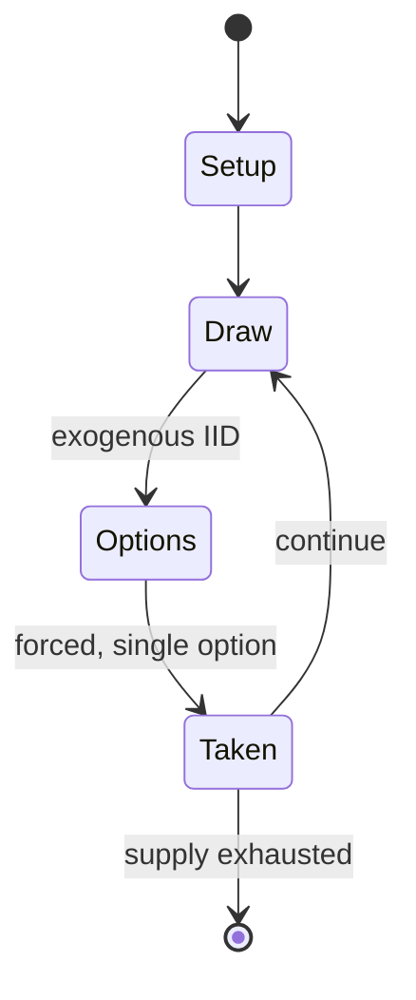

# Lexiko

*word game invented by Alfred Butts; a precursor of Scrabble*

`lexiko` &nbsp; state: **DEEPENED** &nbsp; method: **heuristic**

## Found layer (recorded, not trusted)

| field | value |
| --- | --- |
| wikidata | Q12494674 |
| wikipedia | Lexiko |
| genres (source) | -- |
| instance of (source) | word game |
| country of origin | -- |

## Declared layer (orders bench work)

| field | value |
| --- | --- |
| year created | -- |
| epoch | -- |
| region | -- |
| media | TILE, WORD |
| players | -- |
| age band | -- |
| exogenous process | IID |
| loss shape | -- |
| live axes | - |
| horizon | -- |
| scoring shape | SET_COLLECTION_CONVEX |
| information | -- |
| interaction | -- |
| turn structure | -- |
| tractability | SAMPLING_ONLY |
| randomness | DICE |
| luck factor | 0.35 |
| rules complexity | 1.64 |
| strategic depth | 2.25 |
| novelty | 0.4166 |
| solved status | -- |
| strategies | set_collection |
| algorithms | -- |

## Object model

```
Episode
  players      : ?
  turn_structure: ?
  horizon       : ?
  scoring       : SET_COLLECTION_CONVEX

TileBag        -- unordered draw source
Layout         -- placed tiles and their adjacencies
```

## State transition diagram



## Research item -- turn trace

```
# Lexiko -- simulated turn events
# generated from the DECLARED vector, not from a rulebook.
# structure: exo=IID loss=None horizon=None scoring=SET_COLLECTION_CONVEX axes=-

t=0    SETUP        players=2  pot=0  capacity=5
t=1    DRAW         p1 roll from d6 pool -> outcome #1  (p=0.191)
t=2    FORCED       p1 single legal option taken (pot_gain=+1.6)
t=3    DRAW         p1 roll from d6 pool -> outcome #1  (p=0.290)
t=4    FORCED       p1 single legal option taken (pot_gain=+1.0)
t=5    DRAW         p1 roll from d6 pool -> outcome #6  (p=0.070)
t=6    FORCED       p1 single legal option taken (pot_gain=+0.6)
t=7    DRAW         p1 roll from d6 pool -> outcome #6  (p=0.036)
t=8    FORCED       p1 single legal option taken (pot_gain=+1.5)
t=9    DRAW         p1 roll from d6 pool -> outcome #3  (p=0.031)
t=10   FORCED       p1 single legal option taken (pot_gain=+1.0)
t=11   DRAW         p1 roll from d6 pool -> outcome #1  (p=0.207)
t=12   FORCED       p1 single legal option taken (pot_gain=+0.9)
t=13   DRAW         p1 roll from d6 pool -> outcome #4  (p=0.096)
t=14   FORCED       p1 single legal option taken (pot_gain=+1.5)
t=15   DRAW         p1 roll from d6 pool -> outcome #3  (p=0.197)
t=16   FORCED       p1 single legal option taken (pot_gain=+1.0)
t=17   DRAW         p1 roll from d6 pool -> outcome #4  (p=0.281)
t=18   FORCED       p1 single legal option taken (pot_gain=+1.3)
t=19   DRAW         p1 roll from d6 pool -> outcome #6  (p=0.156)
t=20   FORCED       p1 single legal option taken (pot_gain=+1.6)
t=21   DRAW         p1 roll from d6 pool -> outcome #2  (p=0.236)
t=22   FORCED       p1 single legal option taken (pot_gain=+0.7)
t=23   ENDTURN      turn passes to p2
t=24   DRAW         p2 roll from d6 pool -> outcome #5  (p=0.261)
t=25   FORCED       p2 single legal option taken (pot_gain=+0.9)
t=26   DRAW         p2 roll from d6 pool -> outcome #6  (p=0.046)
t=27   FORCED       p2 single legal option taken (pot_gain=+2.0)

terminal: VARIABLE
```

## Source extract

Lexiko was a word game invented by Alfred Mosher Butts. It was a precursor of Scrabble. The name
comes from the Greek lexicos, meaning "of or for words". Lexiko was played with a set of 100
square cardboard tiles, with the same letter distribution later used by Scrabble (see Scrabble
letter distributions), but no board. Players drew nine tiles at random, and attempted to
construct words from them.   == History == In 1931, Butts wrote a paper entitled "Study of
Games." In his paper, he described three categories of games: board, number games using playing
cards or dice, and letter games (or games that fell into more than one). He noted that, although
the most popular games were of the first two (e.g., chess and backgammon), the best letter game
readily available was Anagrams. Around that time, he was reading "The Gold-Bug" by Edgar Allan
Poe and noticed a line containing the English letter distribution. This gave him an epiphany:
Anagrams would be more fun if the most common letters in English were more common in the game.
He carefully analyzed letter frequencies in newspapers and other printed works to determine the
ideal letter distribution for the game. With a few other changes,

<sub>Wikipedia, CC BY-SA. Retained as evidence for the structural
classification above. Every rule inferred from it is HYPOTHESIZED
until audited against a rulebook.</sub>
