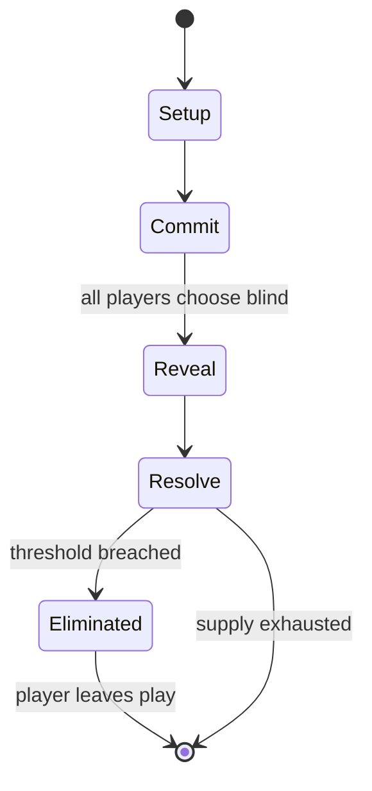

# Liar's dice

*dice game*

`liar_s_dice` &nbsp; state: **DEEPENED** &nbsp; method: **heuristic**

## Found layer (recorded, not trusted)

| field | value |
| --- | --- |
| wikidata | Q20825977 |
| wikipedia | Liar's dice |
| genres (source) | -- |
| instance of (source) | dice game |
| country of origin | -- |

## Declared layer (orders bench work)

| field | value |
| --- | --- |
| year created | 1987 |
| epoch | DIGITAL |
| region | -- |
| media | DICE |
| players | 2-6 |
| age band | -- |
| exogenous process | IID |
| loss shape | ELIMINATION |
| live axes | BID, BLUFF |
| horizon | -- |
| scoring shape | SET_COLLECTION_CONVEX |
| information | IMPERFECT |
| interaction | SOLITAIRE |
| turn structure | SIMULTANEOUS |
| tractability | EXACT_WITH_CUT |
| randomness | DICE, HIDDEN_INFO |
| luck factor | 0.63 |
| rules complexity | 2.68 |
| strategic depth | 2.54 |
| novelty | 0.7456 |
| solved status | -- |
| strategies | bluffing, probability_estimation, set_collection |
| algorithms | -- |

## Object model

```
Episode
  players      : 2-6
  turn_structure: SIMULTANEOUS
  horizon       : ?
  scoring       : SET_COLLECTION_CONVEX

DicePool       -- n dice, each an iid categorical draw
Roll           -- realised outcome of a pool
Auction        -- priced competition resolving to one winner
Belief         -- what an observer is induced to think is true
```

## State transition diagram



## Research item -- turn trace

```
# Liar's dice -- simulated turn events
# generated from the DECLARED vector, not from a rulebook.
# structure: exo=IID loss=ELIMINATION horizon=None scoring=SET_COLLECTION_CONVEX axes=BID,BLUFF

t=0    SETUP        players=2  pot=0  capacity=3
t=1    DRAW         p1 roll from d6 pool -> outcome #2  (p=0.111)
t=2    FORCED       p1 single legal option taken (pot_gain=+1.0)
t=3    DRAW         p1 roll from d6 pool -> outcome #1  (p=0.155)
t=4    FORCED       p1 single legal option taken (pot_gain=+0.9)
t=5    BID          p1 sealed bid of 5 against 1 rivals
t=6    DRAW         p1 roll from d6 pool -> outcome #5  (p=0.224)
t=7    FORCED       p1 single legal option taken (pot_gain=+1.1)
t=8    BLUFF        p1 represents a holding it does not have
t=9    DRAW         p1 roll from d6 pool -> outcome #1  (p=0.105)
t=10   FORCED       p1 single legal option taken (pot_gain=+1.1)
t=11   BLUFF        p1 represents a holding it does not have
t=12   DRAW         p1 roll from d6 pool -> outcome #6  (p=0.133)
t=13   FORCED       p1 single legal option taken (pot_gain=+1.3)
t=14   BID          p1 sealed bid of 3 against 1 rivals
t=15   DRAW         p1 roll from d6 pool -> outcome #1  (p=0.282)
t=16   FORCED       p1 single legal option taken (pot_gain=+0.6)
t=17   BID          p1 sealed bid of 6 against 1 rivals
t=18   BLUFF        p1 represents a holding it does not have
t=19   DRAW         p1 roll from d6 pool -> outcome #5  (p=0.161)
t=20   FORCED       p1 single legal option taken (pot_gain=+1.4)
t=21   BLUFF        p1 represents a holding it does not have
t=22   DRAW         p1 roll from d6 pool -> outcome #3  (p=0.253)
t=23   FORCED       p1 single legal option taken (pot_gain=+1.6)
t=24   DRAW         p1 roll from d6 pool -> outcome #1  (p=0.055)
t=25   FORCED       p1 single legal option taken (pot_gain=+1.1)
t=26   BID          p1 sealed bid of 6 against 1 rivals

terminal: VARIABLE
```

## Conditions

| kind | threshold | effect | trigger |
| --- | --- | --- | --- |
| ELIMINATE | -- | -- | If the loser of the last round was eliminated, the next player starts the new round. |
| WIN | -- | -- | The last player to still retain a die (or dice) is the winner. |
| BOUNDARY | -- | -- | If the bid is valid (at least as many of the face value and any wild aces are showing as were bid), the bidder wins. |
| BOUNDARY | -- | -- | For the same n, the probability P'(q) that at least q dice are showing a given face is the sum of P(x) for all x such that q ≤ x ≤ n, or |
| BOUNDARY | -- | -- | These equations can be used to calculate and chart the probability of exactly q and at least q for any or multiple n. |

## Source extract

Liar's dice is a class of dice games for two or more players in which deception is a significant
gameplay element. In "single hand" liar's dice games, each player is given a set of dice, all
players roll once, and the bids relate to the dice each player can see (their hand) plus all the
concealed dice (the other players' hands). In "common hand" games, there is one set of dice
which is passed from player to player. The bids relate to the dice as they are in front of the
bidder after selected dice have been re-rolled. Originating during the 15th century, the game
subsequently spread to Latin American and European countries. In 1993, a variant, Call My Bluff,
won the Spiel des Jahres.     == Background == Liar's dice originated as a bluffing board game
titled Dudo during the 15th century from the Inca Empire, and subsequently spread to Latin
American countries. The game later spread to European countries via Spanish conquistadors. In
the 1970s, numerous commercial versions of the game were released.   == Single hand ==  Five
dice are used per player with dice cups used for concealment. Each round, each player rolls a
"hand" of dice under their cup and looks at their hand while keepin

<sub>Wikipedia, CC BY-SA. Retained as evidence for the structural
classification above. Every rule inferred from it is HYPOTHESIZED
until audited against a rulebook.</sub>
