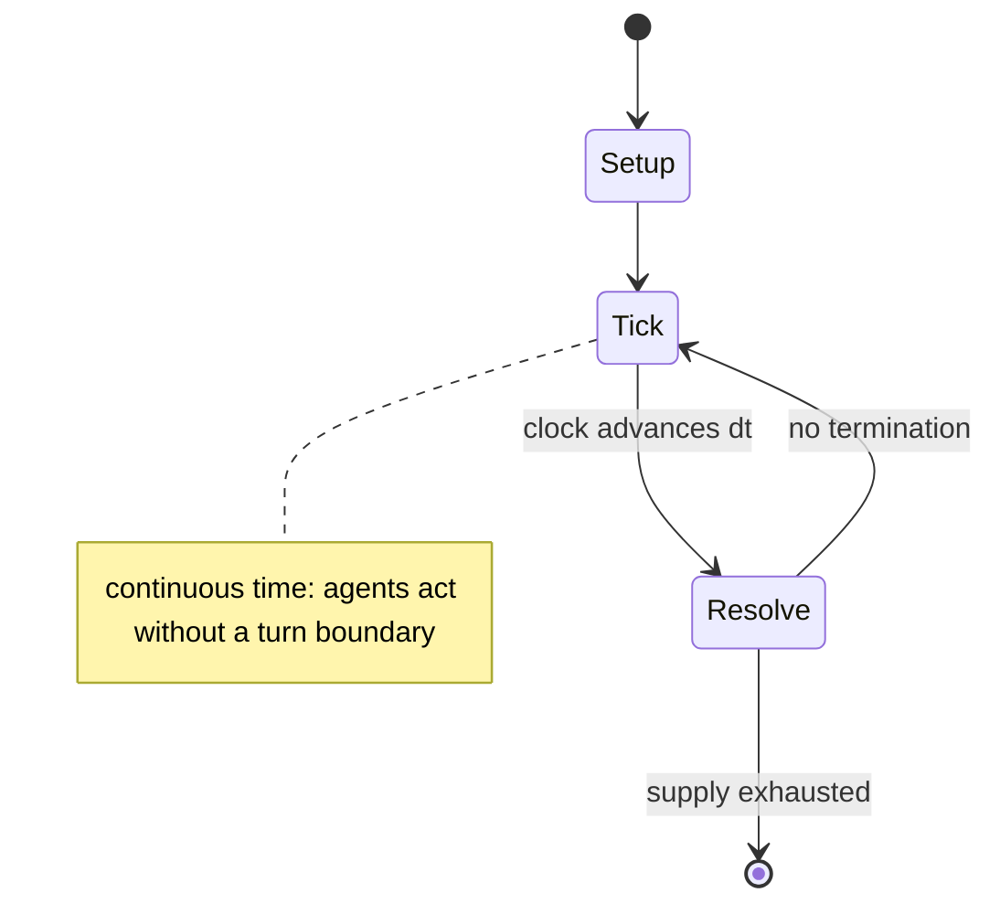

# Lichess

*chess online server*

`lichess` &nbsp; state: **DEEPENED** &nbsp; method: **heuristic**

## Found layer (recorded, not trusted)

| field | value |
| --- | --- |
| wikidata | Q19831807 |
| wikipedia | Lichess |
| genres (source) | -- |
| instance of (source) | free software, nonprofit organization, online chess playing site, online community, website |
| country of origin | -- |

## Declared layer (orders bench work)

| field | value |
| --- | --- |
| year created | 2010 |
| epoch | CONTEMPORARY |
| region | -- |
| media | PUZZLE |
| players | -- |
| age band | -- |
| exogenous process | -- |
| loss shape | -- |
| live axes | - |
| horizon | -- |
| scoring shape | RACE_POSITION |
| information | -- |
| interaction | COMPETITIVE |
| turn structure | REAL_TIME |
| tractability | SAMPLING_ONLY |
| randomness | -- |
| luck factor | 0.35 |
| rules complexity | 1.79 |
| strategic depth | 2.55 |
| novelty | 0.635 |
| solved status | -- |
| strategies | opening_theory |
| algorithms | opening_book |

## Object model

```
Episode
  players      : ?
  turn_structure: REAL_TIME
  horizon       : ?
  scoring       : RACE_POSITION

Configuration  -- the arrangement to be resolved
Constraint     -- predicate a legal configuration must satisfy
```

## State transition diagram



## Research item -- clock trace

```
# Lichess -- simulated clock trace (no turn boundary)
# generated from the DECLARED vector, not from a rulebook.
# structure: exo=None loss=None horizon=None scoring=RACE_POSITION axes=-

clk=0.000s  START        agents=4  clock=free running
clk=2.339s  ACTION       a4 acts continuously; no turn boundary crossed
clk=4.085s  INFRACTION   a4 commits infraction (count=1)
clk=4.679s  ACTION       a2 acts continuously; no turn boundary crossed
clk=6.249s  CONTEST      a3 and a4 contend for the same resource
clk=7.769s  CONTEST      a4 and a1 contend for the same resource
clk=9.441s  CONTEST      a3 and a4 contend for the same resource
clk=9.846s  ACTION       a4 acts continuously; no turn boundary crossed
clk=12.243s  CONTEST      a2 and a3 contend for the same resource
clk=14.880s  STOPPAGE     clock halts; state frozen
clk=15.295s  ACTION       a4 acts continuously; no turn boundary crossed
clk=17.128s  CONTEST      a3 and a4 contend for the same resource
clk=18.192s  INFRACTION   a3 commits infraction (count=1)
clk=19.101s  ACTION       a4 acts continuously; no turn boundary crossed
clk=20.552s  CONTEST      a1 and a2 contend for the same resource
clk=23.153s  ACTION       a3 acts continuously; no turn boundary crossed
clk=23.405s  ACTION       a4 acts continuously; no turn boundary crossed
clk=25.474s  CONTEST      a4 and a1 contend for the same resource
clk=26.213s  STOPPAGE     clock halts; state frozen
clk=27.950s  ACTION       a3 acts continuously; no turn boundary crossed
clk=30.942s  CONTEST      a1 and a2 contend for the same resource
clk=32.992s  CONTEST      a2 and a3 contend for the same resource
clk=35.268s  ACTION       a2 acts continuously; no turn boundary crossed
clk=37.368s  ACTION       a1 acts continuously; no turn boundary crossed
clk=39.159s  ACTION       a3 acts continuously; no turn boundary crossed
clk=39.661s  ACTION       a3 acts continuously; no turn boundary crossed
clk=39.888s  CONTEST      a3 and a4 contend for the same resource

note: elapsed time, not move count, is the episode's ordering variable.
```

## Conditions

| kind | threshold | effect | trigger |
| --- | --- | --- | --- |
| ELIMINATE | -- | -- | The 2021 edition with a prize fund of $12,800 was won by Vladislav Artemiev; in the finals, he beat Andrew Tang, who had knocked out Magnus Carlsen in the semifinals. |
| WIN | -- | -- | In April 2020, Magnus Carlsen and Alireza Firouzja played a bullet match on Lichess, with the winner of the overall match being the first player to reach 100 wins. |

## Source extract

Lichess (, LEE-ches) is an internet chess server that is free and open-source, run by a non-
profit organization of the same name. Users of the site may play anonymously or register an
account to play games to earn a rating on Lichess. Lichess is ad-free and all the features are
available for free, as the site is funded by donations from patrons, who receive a special badge
as thanks for their support. Its features include chess puzzles, computer analysis, tournaments
and chess variants.   == History ==  Lichess was founded in 2010 by French programmer Thibault
Duplessis. The software running Lichess and the design are open source under the AGPL license
and other free and non-free licenses. The name Lichess is a "combination of live/light/libre and
chess". On 11 February 2015, an official Lichess mobile app was released for Android devices. An
app for mobile devices running iOS was released on March 4, 2015. In April 2021, the United
States Chess Federation announced its official endorsement of Lichess's fair play methodology
that automatically detects cheaters based on engine move matching analysis. As of 27 June 2026,
lichess.org had a global rank of 277 on Similarweb, with most o

<sub>Wikipedia, CC BY-SA. Retained as evidence for the structural
classification above. Every rule inferred from it is HYPOTHESIZED
until audited against a rulebook.</sub>
