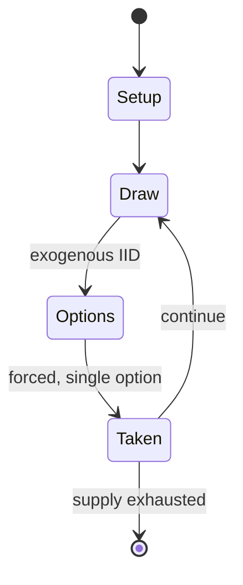

# Lights...Camera...Action!

*1989 pinball machine*

`lights_camera_action` &nbsp; state: **DEEPENED** &nbsp; method: **heuristic**

## Found layer (recorded, not trusted)

| field | value |
| --- | --- |
| wikidata | Q20926333 |
| wikipedia | Lights...Camera...Action! (pinball) |
| genres (source) | -- |
| instance of (source) | video game |
| country of origin | -- |

## Declared layer (orders bench work)

| field | value |
| --- | --- |
| year created | 1989 |
| epoch | DIGITAL |
| region | -- |
| media | CARD, VIDEO |
| players | -- |
| age band | -- |
| exogenous process | IID |
| loss shape | -- |
| live axes | - |
| horizon | -- |
| scoring shape | -- |
| information | -- |
| interaction | -- |
| turn structure | -- |
| tractability | SAMPLING_ONLY |
| randomness | SPINNER |
| luck factor | 0.42 |
| rules complexity | 1.71 |
| strategic depth | 2.0 |
| novelty | 0.3846 |
| solved status | -- |
| strategies | -- |
| algorithms | -- |

## Object model

```
Episode
  players      : ?
  turn_structure: ?
  horizon       : ?
  scoring       : ?

Deck           -- ordered multiset, drawn without replacement
Hand           -- private multiset held by one player
DiscardPile    -- public accumulation of spent cards
WorldState     -- simulation state advanced by the engine
Avatar         -- player-controlled agent
Clock          -- frame or tick counter
```

## State transition diagram



## Research item -- turn trace

```
# Lights...Camera...Action! -- simulated turn events
# generated from the DECLARED vector, not from a rulebook.
# structure: exo=IID loss=None horizon=None scoring=None axes=-

t=0    SETUP        players=2  pot=0  capacity=6
t=1    DRAW         p1 roll from d6 pool -> outcome #3  (p=0.191)
t=2    FORCED       p1 single legal option taken (pot_gain=+1.9)
t=3    DRAW         p1 roll from d6 pool -> outcome #3  (p=0.026)
t=4    FORCED       p1 single legal option taken (pot_gain=+1.5)
t=5    DRAW         p1 roll from d6 pool -> outcome #1  (p=0.110)
t=6    FORCED       p1 single legal option taken (pot_gain=+1.5)
t=7    DRAW         p1 roll from d6 pool -> outcome #1  (p=0.267)
t=8    FORCED       p1 single legal option taken (pot_gain=+1.5)
t=9    ENDTURN      turn passes to p2
t=10   DRAW         p2 roll from d6 pool -> outcome #6  (p=0.035)
t=11   FORCED       p2 single legal option taken (pot_gain=+0.5)
t=12   DRAW         p2 roll from d6 pool -> outcome #1  (p=0.039)
t=13   FORCED       p2 single legal option taken (pot_gain=+2.0)
t=14   ENDTURN      turn passes to p1
t=15   DRAW         p1 roll from d6 pool -> outcome #6  (p=0.295)
t=16   FORCED       p1 single legal option taken (pot_gain=+1.4)
t=17   DRAW         p1 roll from d6 pool -> outcome #5  (p=0.085)
t=18   FORCED       p1 single legal option taken (pot_gain=+1.0)
t=19   DRAW         p1 roll from d6 pool -> outcome #1  (p=0.054)
t=20   FORCED       p1 single legal option taken (pot_gain=+1.9)
t=21   ENDTURN      turn passes to p2
t=22   DRAW         p2 roll from d6 pool -> outcome #1  (p=0.182)
t=23   FORCED       p2 single legal option taken (pot_gain=+1.2)
t=24   DRAW         p2 roll from d6 pool -> outcome #2  (p=0.055)
t=25   FORCED       p2 single legal option taken (pot_gain=+1.8)
t=26   DRAW         p2 roll from d6 pool -> outcome #5  (p=0.170)
t=27   FORCED       p2 single legal option taken (pot_gain=+1.0)

terminal: VARIABLE
```

## Source extract

Lights...Camera...Action! is a pinball machine designed by Jon Norris and released by Gottlieb
in 1989. The game features a movie making theme.   == Description == This is the first of Jon
Norris' designs to use a timed mode feature. The game uses two 20-digit alpha numeric displays.
There are five movie scenes which need to be completed - the gunfight scene, the multiball
scene, the stair scene, the jackpot scene, and the stunt scene. Lights...Camera...Action! was
pinball’s first mode based game. It is based on Gottlieb's system 3, since system 80B could not
handle its demands. The design was originally a card game. The spinner draw card feature was
retained, but the rest of the pinball machine rules were adapted from the cancelled pinball
machine Red Alert. The pinball machine has a mechanical backbox animation in which handguns
raised in a draw. The mode starts when the ball falls into the top hole. The player has to press
the right flipper to beat the villain. At the top of the backbox are colored floodlights. The
upper left of the playfield contains a rotating mini-playfield. In multiplayer games there is a
"catch-up" score feature which increases the scores of players at the

<sub>Wikipedia, CC BY-SA. Retained as evidence for the structural
classification above. Every rule inferred from it is HYPOTHESIZED
until audited against a rulebook.</sub>
