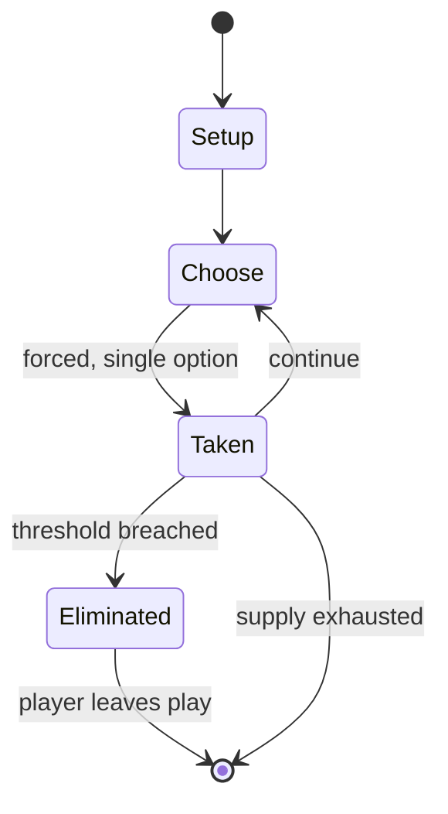

# Lion-Eating Poet in the Stone Den

*one-syllable article by Yuen Ren Chao*

`lion_eating_poet_in_the_stone_den` &nbsp; state: **DEEPENED** &nbsp; method: **heuristic**

## Found layer (recorded, not trusted)

| field | value |
| --- | --- |
| wikidata | Q1059120 |
| wikipedia | Lion-Eating Poet in the Stone Den |
| genres (source) | linguistic example sentence, narrative poetry |
| instance of (source) | one-syllable article, word play |
| country of origin | -- |

## Declared layer (orders bench work)

| field | value |
| --- | --- |
| year created | -- |
| epoch | -- |
| region | -- |
| media | - |
| players | -- |
| age band | -- |
| exogenous process | NONE |
| loss shape | ELIMINATION |
| live axes | - |
| horizon | -- |
| scoring shape | -- |
| information | PERFECT |
| interaction | -- |
| turn structure | -- |
| tractability | EXACT_WITH_CUT |
| randomness | NONE |
| luck factor | 0.02 |
| rules complexity | 2.31 |
| strategic depth | 2.4 |
| novelty | 0.7852 |
| solved status | -- |
| strategies | -- |
| algorithms | -- |

## Object model

```
Episode
  players      : ?
  turn_structure: ?
  horizon       : ?
  scoring       : ?

State          -- opaque; no medium or axis evidence was found
Player         -- an agent that selects among legal successors
```

## State transition diagram



## Research item -- turn trace

```
# Lion-Eating Poet in the Stone Den -- simulated turn events
# generated from the DECLARED vector, not from a rulebook.
# structure: exo=NONE loss=ELIMINATION horizon=None scoring=None axes=-

t=0    SETUP        players=2  pot=0  capacity=7
t=1    FORCED       p1 single legal option taken (pot_gain=+2.0)
t=2    ENDTURN      turn passes to p2
t=3    FORCED       p2 single legal option taken (pot_gain=+1.5)
t=4    FORCED       p2 single legal option taken (pot_gain=+0.9)
t=5    FORCED       p2 single legal option taken (pot_gain=+1.5)
t=6    FORCED       p2 single legal option taken (pot_gain=+0.7)
t=7    FORCED       p2 single legal option taken (pot_gain=+1.9)
t=8    FORCED       p2 single legal option taken (pot_gain=+1.3)
t=9    FORCED       p2 single legal option taken (pot_gain=+0.7)
t=10   FORCED       p2 single legal option taken (pot_gain=+1.1)
t=11   ENDTURN      turn passes to p1
t=12   FORCED       p1 single legal option taken (pot_gain=+1.7)
t=13   FORCED       p1 single legal option taken (pot_gain=+1.1)
t=14   FORCED       p1 single legal option taken (pot_gain=+1.5)
t=15   FORCED       p1 single legal option taken (pot_gain=+1.6)
t=16   FORCED       p1 single legal option taken (pot_gain=+1.5)
t=17   FORCED       p1 single legal option taken (pot_gain=+1.1)
t=18   FORCED       p1 single legal option taken (pot_gain=+1.7)
t=19   FORCED       p1 single legal option taken (pot_gain=+0.7)
t=20   FORCED       p1 single legal option taken (pot_gain=+0.8)
t=21   FORCED       p1 single legal option taken (pot_gain=+0.9)
t=22   FORCED       p1 single legal option taken (pot_gain=+1.5)
t=23   FORCED       p1 single legal option taken (pot_gain=+1.1)
t=24   FORCED       p1 single legal option taken (pot_gain=+1.9)
t=25   FORCED       p1 single legal option taken (pot_gain=+1.2)
t=26   ENDTURN      turn passes to p2

terminal: VARIABLE
```

## Conditions

| kind | threshold | effect | trigger |
| --- | --- | --- | --- |
| ELIMINATE | -- | -- | The poem can be interpreted as an objection to the romanization of Literary Chinese, demonstrating the author's critique of proposals to replace Chinese characters with Latin letters – a move that could potentially lead  |

## Source extract

"Lion-Eating Poet in the Stone Den" (traditional Chinese: 施氏食獅史; simplified Chinese: 施氏食狮史;
lit. 'The Story of Mr. Shi Eating Lions') is a short narrative poem written in Literary Chinese,
with two versions composed of 92 and 94 Chinese characters respectively, which are all
pronounced shi ([ʂɻ̩]) when read in Standard Mandarin, with only the tones differing.  The poem
was originally written by Hu Mingfu (胡明复) and published by linguist Yuen Ren Chao in Volume 11
of The Chinese Students's Monthly in 1916. The poem was then refined by Yuen Ren Chao in the
1930s for demonstrative purposes in his lectures, and he later used it to argue the limits of
the Romanization of Chinese. The poem is coherent and grammatical in Literary Chinese, but due
to the number of Chinese homophones, it becomes difficult to understand in oral speech. In
Mandarin, the poem is incomprehensible when read aloud, since only four syllables cover all the
words of the poem. The poem is somewhat more comprehensible when read in other varieties such as
Cantonese, in which it has 18 different syllables accounting for tone differences, or Hokkien,
in which it has 15 different syllables.   == Background == Lion-Eating P

<sub>Wikipedia, CC BY-SA. Retained as evidence for the structural
classification above. Every rule inferred from it is HYPOTHESIZED
until audited against a rulebook.</sub>
