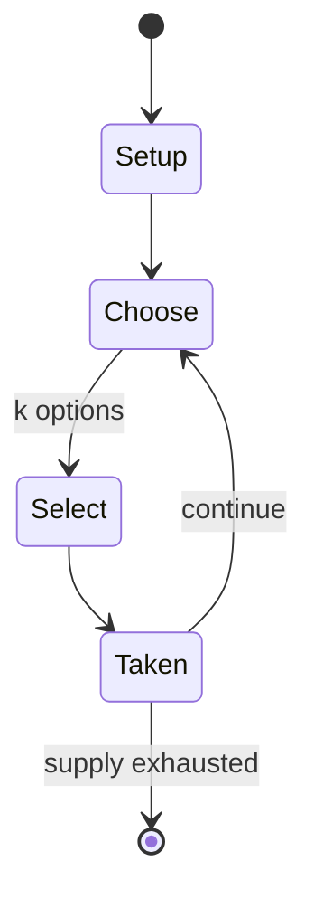

# Liquid War

*open-source action game*

`liquid_war` &nbsp; state: **DEEPENED** &nbsp; method: **heuristic**

## Found layer (recorded, not trusted)

| field | value |
| --- | --- |
| wikidata | Q3087096 |
| wikipedia | Liquid War |
| genres (source) | -- |
| instance of (source) | GNU package, video game |
| country of origin | France |

## Declared layer (orders bench work)

| field | value |
| --- | --- |
| year created | 1995 |
| epoch | DIGITAL |
| region | EUROPE_WEST |
| media | VIDEO |
| players | -- |
| age band | -- |
| exogenous process | -- |
| loss shape | -- |
| live axes | SELECT |
| horizon | VARIABLE |
| scoring shape | -- |
| information | ASYMMETRIC |
| interaction | SOLITAIRE |
| turn structure | -- |
| tractability | SAMPLING_ONLY |
| randomness | DICE |
| luck factor | 0.58 |
| rules complexity | 2.07 |
| strategic depth | 2.37 |
| novelty | 0.6506 |
| solved status | -- |
| strategies | route_optimisation, spatial_packing |
| algorithms | -- |

## Object model

```
Episode
  players      : ?
  turn_structure: ?
  horizon       : VARIABLE
  scoring       : ?

WorldState     -- simulation state advanced by the engine
Avatar         -- player-controlled agent
Clock          -- frame or tick counter
OptionSet      -- the choices available after an exogenous draw
```

## State transition diagram



## Research item -- turn trace

```
# Liquid War -- simulated turn events
# generated from the DECLARED vector, not from a rulebook.
# structure: exo=None loss=None horizon=VARIABLE scoring=None axes=SELECT

t=0    SETUP        players=2  pot=0  capacity=3
t=1    SELECT       p1 3 options; take #3  (pot_gain=+0.9, capacity=-1)
t=2    ENDTURN      turn passes to p2
t=3    SELECT       p2 2 options; take #1  (pot_gain=+2.9, capacity=-1)
t=4    ENDTURN      turn passes to p1
t=5    SELECT       p1 2 options; take #2  (pot_gain=+1.6, capacity=-0)
t=6    ENDTURN      turn passes to p2
t=7    SELECT       p2 2 options; take #2  (pot_gain=+2.0, capacity=-1)
t=8    SELECT       p2 1 options; take #1  (pot_gain=+1.0, capacity=-0)
t=9    SELECT       p2 1 options; take #1  (pot_gain=+3.4, capacity=-2)
t=10   SELECT       p2 1 options; take #1  (pot_gain=+2.7, capacity=-0)
t=11   SELECT       p2 2 options; take #1  (pot_gain=+1.5, capacity=-0)
t=12   SELECT       p2 1 options; take #1  (pot_gain=+2.5, capacity=-2)
t=13   SELECT       p2 2 options; take #1  (pot_gain=+2.5, capacity=-0)
t=14   SELECT       p2 3 options; take #1  (pot_gain=+3.0, capacity=-1)
t=15   SELECT       p2 4 options; take #3  (pot_gain=+2.6, capacity=-0)
t=16   SELECT       p2 4 options; take #4  (pot_gain=+2.1, capacity=-0)
t=17   SELECT       p2 2 options; take #1  (pot_gain=+2.9, capacity=-0)
t=18   SELECT       p2 3 options; take #3  (pot_gain=+1.3, capacity=-2)
t=19   SELECT       p2 2 options; take #1  (pot_gain=+3.2, capacity=-0)
t=20   SELECT       p2 4 options; take #2  (pot_gain=+1.0, capacity=-0)
t=21   SELECT       p2 3 options; take #2  (pot_gain=+1.8, capacity=-2)
t=22   SELECT       p2 3 options; take #1  (pot_gain=+0.9, capacity=-0)
t=23   ENDTURN      turn passes to p1
t=24   SELECT       p1 4 options; take #2  (pot_gain=+2.3, capacity=-0)
t=25   SELECT       p1 1 options; take #1  (pot_gain=+1.1, capacity=-1)
t=26   ENDTURN      turn passes to p2

terminal: VARIABLE
```

## Conditions

| kind | threshold | effect | trigger |
| --- | --- | --- | --- |
| TERMINATE | 1 player | -- | The game ends when one player controls all of the particles or when the time runs out. |

## Source extract

Liquid War is a free software multi-player action game based on particle flow mechanic. Thomas
Colcombet developed the core concept and the original shortest path algorithm, the software was
programmed by Christian Mauduit. Liquid War 6 is a GNU package distributed as free software and
part of the GNU project.   == Gameplay ==  Gameplay takes place on a 2D battlefield, usually
with some obstacles. Each player (2 to 6, computer or human) has an army of particles and a
cursor. The objective of the game is to assimilate all enemy particles. The players can only
move their cursors and cannot directly control the particles. Each particle follows the shortest
path around the obstacles to its team's cursor. A player may have several thousands particles at
a time, giving the collection of particles a look of a liquid blob. When a particle moves into a
particle from a different team, it will fight and if the opponent particle fails to fight back
(it is not moving in the opposite direction) it will eventually be assimilated by its attacker.
As particles cannot die but only change teams, the total number of particles on the map remains
constant. Since a particle can only fight in one directio

<sub>Wikipedia, CC BY-SA. Retained as evidence for the structural
classification above. Every rule inferred from it is HYPOTHESIZED
until audited against a rulebook.</sub>
