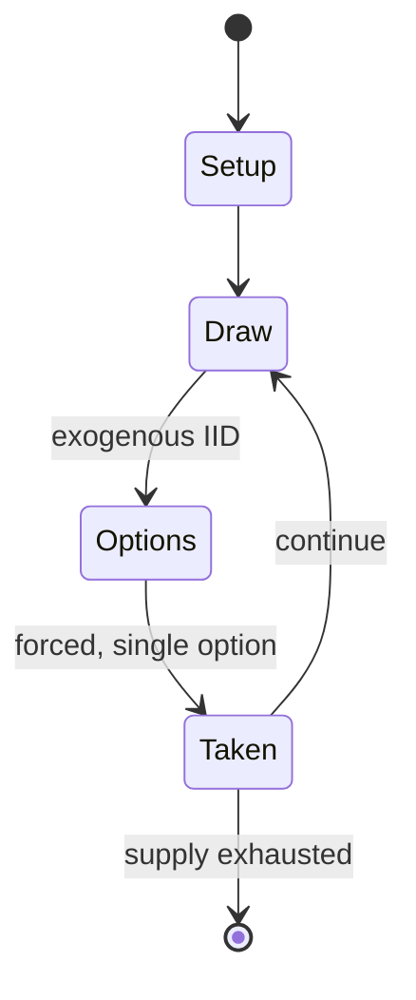

# Liubo

`liubo` &nbsp; state: **DEEPENED** &nbsp; method: **heuristic**

## Found layer (recorded, not trusted)

| field | value |
| --- | --- |
| wikidata | Q1477158 |
| wikipedia | Liubo |
| genres (source) | -- |
| instance of (source) | -- |
| country of origin | -- |

## Declared layer (orders bench work)

| field | value |
| --- | --- |
| year created | -202 |
| epoch | ANCIENT |
| region | -- |
| media | BOARD, DICE |
| players | 2 |
| age band | -- |
| exogenous process | IID |
| loss shape | OPPORTUNITY_ONLY |
| live axes | ORDER |
| horizon | -- |
| scoring shape | SET_COLLECTION_CONVEX |
| information | -- |
| interaction | SOLITAIRE |
| turn structure | STRICT_TURN |
| tractability | EXACT_WITH_CUT |
| randomness | DICE |
| luck factor | 0.58 |
| rules complexity | 2.7 |
| strategic depth | 2.12 |
| novelty | 0.7078 |
| solved status | -- |
| strategies | set_collection |
| algorithms | -- |

## Object model

```
Episode
  players      : 2
  turn_structure: STRICT_TURN
  horizon       : ?
  scoring       : SET_COLLECTION_CONVEX

Board          -- spatial substrate; cells carry position and occupancy
Piece          -- movable token owned by a player
DicePool       -- n dice, each an iid categorical draw
Roll           -- realised outcome of a pool
Sequence       -- the permutation under the player's control
```

## State transition diagram



## Research item -- turn trace

```
# Liubo -- simulated turn events
# generated from the DECLARED vector, not from a rulebook.
# structure: exo=IID loss=OPPORTUNITY_ONLY horizon=None scoring=SET_COLLECTION_CONVEX axes=ORDER

t=0    SETUP        players=2  pot=0  capacity=5
t=1    DRAW         p1 roll from d6 pool -> outcome #1  (p=0.077)
t=2    FORCED       p1 single legal option taken (pot_gain=+1.8)
t=3    DRAW         p1 roll from d6 pool -> outcome #3  (p=0.123)
t=4    FORCED       p1 single legal option taken (pot_gain=+0.7)
t=5    DRAW         p1 roll from d6 pool -> outcome #4  (p=0.127)
t=6    FORCED       p1 single legal option taken (pot_gain=+2.0)
t=7    ENDTURN      turn passes to p2
t=8    DRAW         p2 roll from d6 pool -> outcome #4  (p=0.148)
t=9    FORCED       p2 single legal option taken (pot_gain=+1.7)
t=10   DRAW         p2 roll from d6 pool -> outcome #6  (p=0.033)
t=11   FORCED       p2 single legal option taken (pot_gain=+1.0)
t=12   ENDTURN      turn passes to p1
t=13   DRAW         p1 roll from d6 pool -> outcome #4  (p=0.125)
t=14   FORCED       p1 single legal option taken (pot_gain=+1.6)
t=15   DRAW         p1 roll from d6 pool -> outcome #6  (p=0.151)
t=16   FORCED       p1 single legal option taken (pot_gain=+1.9)
t=17   DRAW         p1 roll from d6 pool -> outcome #2  (p=0.171)
t=18   FORCED       p1 single legal option taken (pot_gain=+2.0)
t=19   DRAW         p1 roll from d6 pool -> outcome #5  (p=0.110)
t=20   FORCED       p1 single legal option taken (pot_gain=+1.6)
t=21   DRAW         p1 roll from d6 pool -> outcome #1  (p=0.204)
t=22   FORCED       p1 single legal option taken (pot_gain=+1.7)
t=23   DRAW         p1 roll from d6 pool -> outcome #3  (p=0.131)
t=24   FORCED       p1 single legal option taken (pot_gain=+1.8)
t=25   DRAW         p1 roll from d6 pool -> outcome #2  (p=0.047)
t=26   FORCED       p1 single legal option taken (pot_gain=+0.7)

terminal: VARIABLE
```

## Conditions

| kind | threshold | effect | trigger |
| --- | --- | --- | --- |
| WIN | 6 points | -- | If one failed to win after having blocked two men, then the opponent would gain six points and win the game. |
| WIN | 6 points | -- | The first player to six points would win the game. |
| BOUNDARY | 1 set | -- | In at least one case the game pieces are not distinguished by colour, but by having an engraving of a tiger on the pieces of one set and an engraving of a dragon on the pieces of the other set. |

## Source extract

Liubo (Chinese: 六博; Old Chinese *kruk pˤak “six sticks”) was an ancient Chinese board game for
two players.  The rules have largely been lost, but it is believed that each player had six game
pieces that were moved around the points of a square game board that had a distinctive,
symmetrical pattern. Moves were determined by the throw of six sticks, which performed the same
function as dice in other race games. The game was invented no later than the middle of the 1st
millennium BCE, and was popular during the Han dynasty (202 BCE – 220 CE). However, after the
Han dynasty it rapidly declined in popularity, possibly due to the rise in popularity of the
game of weiqi (go), and it became totally forgotten. Knowledge of the game has increased in
recent years with archeological discoveries of Liubo game boards and game equipment in ancient
tombs, as well as discoveries of Han dynasty picture stones and picture bricks depicting Liubo
players.   == History ==  It is not known when the game of Liubo originated, although according
to legend it was invented by Wu Cao (烏曹, called Wu Zhou 烏胄 in the early 2nd century CE Shuowen
Jiezi dictionary), a minister to King Jie, the last king of the Xia

<sub>Wikipedia, CC BY-SA. Retained as evidence for the structural
classification above. Every rule inferred from it is HYPOTHESIZED
until audited against a rulebook.</sub>
