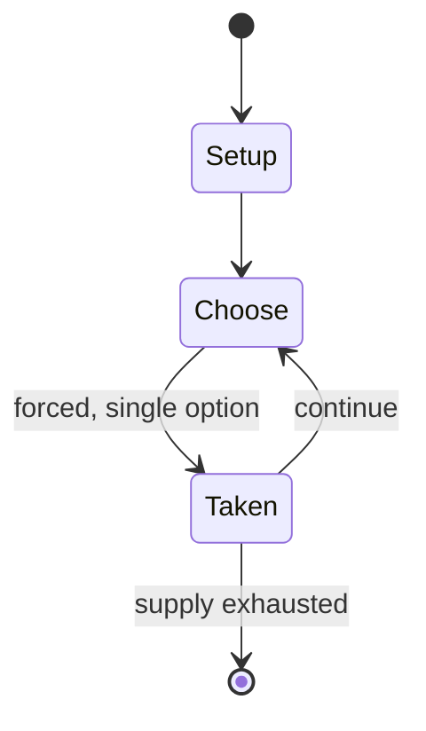

# Logo Board Game

*board game*

`logo_board_game` &nbsp; state: **DEEPENED** &nbsp; method: **heuristic**

## Found layer (recorded, not trusted)

| field | value |
| --- | --- |
| wikidata | Q6667718 |
| wikipedia | Logo Board Game |
| genres (source) | -- |
| instance of (source) | board game |
| country of origin | -- |

## Declared layer (orders bench work)

| field | value |
| --- | --- |
| year created | 2009 |
| epoch | CONTEMPORARY |
| region | -- |
| media | BOARD |
| players | 2-6 |
| age band | -- |
| exogenous process | -- |
| loss shape | -- |
| live axes | - |
| horizon | -- |
| scoring shape | -- |
| information | -- |
| interaction | TEAM |
| turn structure | -- |
| tractability | SAMPLING_ONLY |
| randomness | -- |
| luck factor | 0.35 |
| rules complexity | 1.73 |
| strategic depth | 2.25 |
| novelty | 0.0938 |
| solved status | -- |
| strategies | spatial_packing |
| algorithms | -- |

## Object model

```
Episode
  players      : 2-6
  turn_structure: ?
  horizon       : ?
  scoring       : ?

Board          -- spatial substrate; cells carry position and occupancy
Piece          -- movable token owned by a player
```

## State transition diagram



## Research item -- turn trace

```
# Logo Board Game -- simulated turn events
# generated from the DECLARED vector, not from a rulebook.
# structure: exo=None loss=None horizon=None scoring=None axes=-

t=0    SETUP        players=2  pot=0  capacity=6
t=1    FORCED       p1 single legal option taken (pot_gain=+0.8)
t=2    ENDTURN      turn passes to p2
t=3    FORCED       p2 single legal option taken (pot_gain=+0.8)
t=4    ENDTURN      turn passes to p1
t=5    FORCED       p1 single legal option taken (pot_gain=+1.9)
t=6    FORCED       p1 single legal option taken (pot_gain=+1.1)
t=7    FORCED       p1 single legal option taken (pot_gain=+0.8)
t=8    FORCED       p1 single legal option taken (pot_gain=+0.9)
t=9    FORCED       p1 single legal option taken (pot_gain=+1.0)
t=10   FORCED       p1 single legal option taken (pot_gain=+1.8)
t=11   FORCED       p1 single legal option taken (pot_gain=+0.7)
t=12   FORCED       p1 single legal option taken (pot_gain=+0.9)
t=13   FORCED       p1 single legal option taken (pot_gain=+1.1)
t=14   FORCED       p1 single legal option taken (pot_gain=+0.8)
t=15   ENDTURN      turn passes to p2
t=16   FORCED       p2 single legal option taken (pot_gain=+1.8)
t=17   FORCED       p2 single legal option taken (pot_gain=+0.5)
t=18   FORCED       p2 single legal option taken (pot_gain=+2.0)
t=19   ENDTURN      turn passes to p1
t=20   FORCED       p1 single legal option taken (pot_gain=+1.1)
t=21   FORCED       p1 single legal option taken (pot_gain=+1.0)
t=22   FORCED       p1 single legal option taken (pot_gain=+0.9)
t=23   ENDTURN      turn passes to p2
t=24   FORCED       p2 single legal option taken (pot_gain=+1.6)
t=25   ENDTURN      turn passes to p1
t=26   FORCED       p1 single legal option taken (pot_gain=+1.6)

terminal: VARIABLE
```

## Source extract

The LOGO Board Game (colloquially known as LOGO) is for 2 to 6 players (or teams) aged 12 and
up. Players travel round the board of purple, yellow, green, and red spaces, based on correctly
answered questions, until they reach the winning zone in the center.  The questions are based on
logos, products and packaging of well-known brands. There are three types of question card:
Picture cards Pot luck cards Common theme cards The game includes 1 playing board, 6 playing
pieces, 400 cards containing 1,600 questions and rules. The game was launched by Drumond Park in
2009, and was one of the three top selling adult games in the UK for that year, with Drumond
Park’s Articulate and Rapidough taking the number 2 and 3 spots. The game launched
internationally in 2010, where it was nominated for the Toy of the Year in the Netherlands, and
was awarded the “Grand Prix du Jouet – Jeu D’ambiance” in France. There are other games
following The Logo Board Game format but with a main theme including:  The Best Of British The
Best Of TV & Movies The Best Of Christmas Game The Best Of Christmas Game (Not For Kids) The
Best Of Food His & Hers Logo What Am I? (Aimed at a slightly younger audience) In

<sub>Wikipedia, CC BY-SA. Retained as evidence for the structural
classification above. Every rule inferred from it is HYPOTHESIZED
until audited against a rulebook.</sub>
