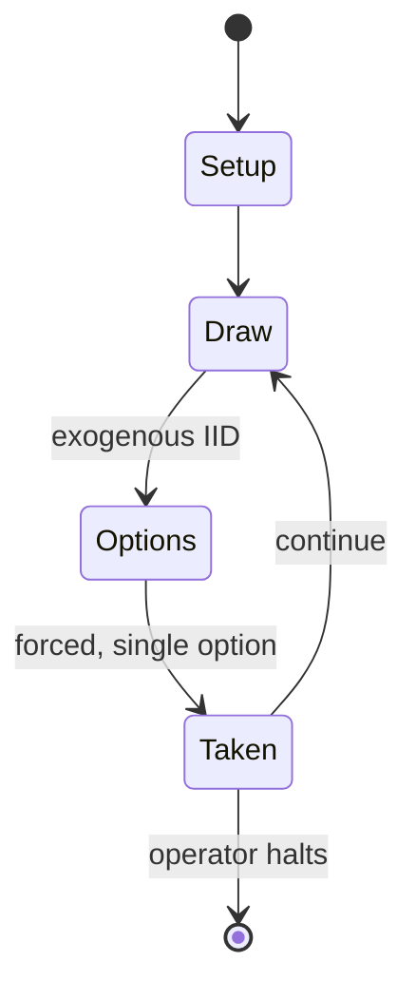

# Lords of Waterdeep

`lords_of_waterdeep` &nbsp; state: **DEEPENED** &nbsp; method: **heuristic**

## Found layer (recorded, not trusted)

| field | value |
| --- | --- |
| wikidata | Q6680185 |
| wikipedia | Lords of Waterdeep |
| genres (source) | -- |
| instance of (source) | -- |
| country of origin | -- |

## Declared layer (orders bench work)

| field | value |
| --- | --- |
| year created | 2012 |
| epoch | CONTEMPORARY |
| region | -- |
| media | BOARD |
| players | 2-5 |
| age band | -- |
| exogenous process | IID |
| loss shape | OPPORTUNITY_ONLY |
| live axes | ALLOCATE |
| horizon | OPEN_ENDED |
| scoring shape | -- |
| information | -- |
| interaction | -- |
| turn structure | -- |
| tractability | SAMPLING_ONLY |
| randomness | HIDDEN_INFO |
| luck factor | 0.35 |
| rules complexity | 2.62 |
| strategic depth | 2.0 |
| novelty | 0.5876 |
| solved status | -- |
| strategies | -- |
| algorithms | -- |

## Object model

```
Episode
  players      : 2-5
  turn_structure: ?
  horizon       : OPEN_ENDED
  scoring       : ?

Board          -- spatial substrate; cells carry position and occupancy
Piece          -- movable token owned by a player
ResourcePool   -- divisible capacity committed across slots
```

## State transition diagram



## Research item -- turn trace

```
# Lords of Waterdeep -- simulated turn events
# generated from the DECLARED vector, not from a rulebook.
# structure: exo=IID loss=OPPORTUNITY_ONLY horizon=OPEN_ENDED scoring=None axes=ALLOCATE

t=0    SETUP        players=2  pot=0  capacity=7
t=1    DRAW         p1 roll from d6 pool -> outcome #6  (p=0.162)
t=2    FORCED       p1 single legal option taken (pot_gain=+1.5)
t=3    ENDTURN      turn passes to p2
t=4    DRAW         p2 roll from d6 pool -> outcome #3  (p=0.198)
t=5    FORCED       p2 single legal option taken (pot_gain=+0.8)
t=6    ALLOCATE     p2 commits 2 of 5 capacity across 3 slots
t=7    DRAW         p2 roll from d6 pool -> outcome #3  (p=0.219)
t=8    FORCED       p2 single legal option taken (pot_gain=+1.5)
t=9    DRAW         p2 roll from d6 pool -> outcome #2  (p=0.123)
t=10   FORCED       p2 single legal option taken (pot_gain=+1.2)
t=11   ALLOCATE     p2 commits 1 of 5 capacity across 4 slots
t=12   DRAW         p2 roll from d6 pool -> outcome #1  (p=0.124)
t=13   FORCED       p2 single legal option taken (pot_gain=+0.9)
t=14   ENDTURN      turn passes to p1
t=15   DRAW         p1 roll from d6 pool -> outcome #5  (p=0.115)
t=16   FORCED       p1 single legal option taken (pot_gain=+1.4)
t=17   DRAW         p1 roll from d6 pool -> outcome #4  (p=0.093)
t=18   FORCED       p1 single legal option taken (pot_gain=+1.3)
t=19   ALLOCATE     p1 commits 1 of 5 capacity across 4 slots
t=20   DRAW         p1 roll from d6 pool -> outcome #6  (p=0.225)
t=21   FORCED       p1 single legal option taken (pot_gain=+0.8)
t=22   ALLOCATE     p1 commits 1 of 5 capacity across 2 slots
t=23   DRAW         p1 roll from d6 pool -> outcome #5  (p=0.196)
t=24   FORCED       p1 single legal option taken (pot_gain=+1.5)
t=25   ENDTURN      turn passes to p2
t=26   DRAW         p2 roll from d6 pool -> outcome #4  (p=0.291)
t=27   FORCED       p2 single legal option taken (pot_gain=+0.9)
t=28   ALLOCATE     p2 commits 3 of 5 capacity across 2 slots

terminal: OPEN_ENDED
```

## Conditions

| kind | threshold | effect | trigger |
| --- | --- | --- | --- |
| WIN | 8 rounds | -- | After eight rounds of worker placements, the player with the most Victory Points wins the game. |

## Source extract

Lords of Waterdeep is a German-style board game designed by Peter Lee and Rodney Thompson and
published by Wizards of the Coast in 2012. The game is set in Waterdeep, a fictional city in the
Forgotten Realms campaign setting for the Dungeons & Dragons role-playing game. Players take the
roles of the masked rulers of Waterdeep, deploying agents and hiring adventurers to complete
quests and increase their influence over the city. In 2013, Wizards of the Coast released the
only expansion to date called Scoundrels of Skullport and an iOS version of the base game in
collaboration with Playdek.   == Gameplay overview == Lords of Waterdeep is a strategy board
game for 2-5 players (up to 6 players with the expansion). Each player is a different masked
Lord of Waterdeep who as a group rule the city in secret, seeking to gain control of both its
treasures and its resources. The players use their agents to recruit adventurers to complete a
number of quests, which earn rewards (usually victory points and other rewards) and expand that
lord's influence in the city. The various adventurer resources, represented as orange, black,
purple, and white cubes, are based on the four classic D&D characte

<sub>Wikipedia, CC BY-SA. Retained as evidence for the structural
classification above. Every rule inferred from it is HYPOTHESIZED
until audited against a rulebook.</sub>
