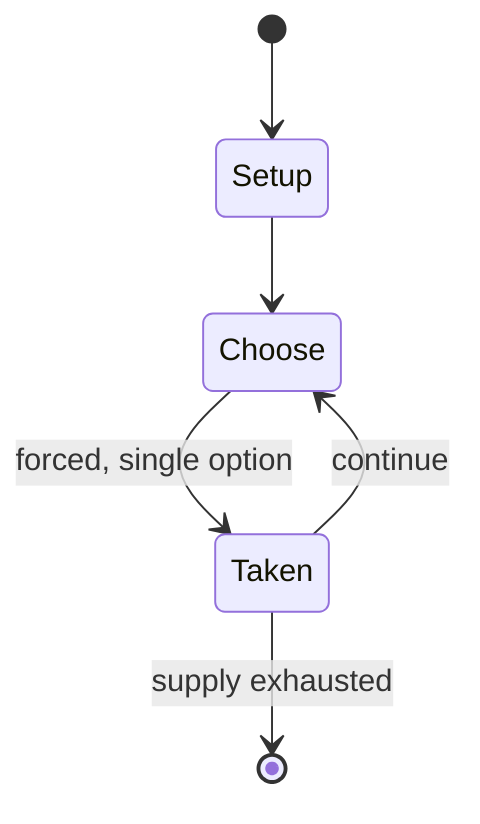

# Lost Battles: Operational Combat in Russia

*board wargame*

`lost_battles_operational_combat_in_russia` &nbsp; state: **DEEPENED** &nbsp; method: **heuristic**

## Found layer (recorded, not trusted)

| field | value |
| --- | --- |
| wikidata | Q112623161 |
| wikipedia | Lost Battles: Operational Combat in Russia |
| genres (source) | -- |
| instance of (source) | board game, wargame |
| country of origin | -- |

## Declared layer (orders bench work)

| field | value |
| --- | --- |
| year created | -- |
| epoch | -- |
| region | -- |
| media | BOARD, WARGAME |
| players | 2 |
| age band | -- |
| exogenous process | -- |
| loss shape | -- |
| live axes | SPATIAL |
| horizon | -- |
| scoring shape | -- |
| information | -- |
| interaction | COMPETITIVE |
| turn structure | PHASE_STRUCTURED |
| tractability | SAMPLING_ONLY |
| randomness | DICE |
| luck factor | 0.58 |
| rules complexity | 3.93 |
| strategic depth | 1.87 |
| novelty | 0.5217 |
| solved status | -- |
| strategies | -- |
| algorithms | -- |

## Object model

```
Episode
  players      : 2
  turn_structure: PHASE_STRUCTURED
  horizon       : ?
  scoring       : ?

Board          -- spatial substrate; cells carry position and occupancy
Piece          -- movable token owned by a player
Placement      -- position subject to geometric legality
```

## State transition diagram



## Research item -- turn trace

```
# Lost Battles: Operational Combat in Russia -- simulated turn events
# generated from the DECLARED vector, not from a rulebook.
# structure: exo=None loss=None horizon=None scoring=None axes=SPATIAL

t=0    SETUP        players=2  pot=0  capacity=3
t=1    FORCED       p1 single legal option taken (pot_gain=+2.0)
t=2    SPATIAL      p1 places at (4,4); adjacency legal
t=3    FORCED       p1 single legal option taken (pot_gain=+1.1)
t=4    SPATIAL      p1 places at (7,3); adjacency legal
t=5    FORCED       p1 single legal option taken (pot_gain=+0.6)
t=6    SPATIAL      p1 places at (6,6); adjacency legal
t=7    FORCED       p1 single legal option taken (pot_gain=+1.4)
t=8    FORCED       p1 single legal option taken (pot_gain=+0.5)
t=9    ENDTURN      turn passes to p2
t=10   FORCED       p2 single legal option taken (pot_gain=+1.0)
t=11   FORCED       p2 single legal option taken (pot_gain=+1.7)
t=12   SPATIAL      p2 places at (4,2); adjacency legal
t=13   FORCED       p2 single legal option taken (pot_gain=+0.6)
t=14   FORCED       p2 single legal option taken (pot_gain=+1.5)
t=15   FORCED       p2 single legal option taken (pot_gain=+1.3)
t=16   SPATIAL      p2 places at (6,7); adjacency legal
t=17   ENDTURN      turn passes to p1
t=18   FORCED       p1 single legal option taken (pot_gain=+0.6)
t=19   FORCED       p1 single legal option taken (pot_gain=+1.2)
t=20   FORCED       p1 single legal option taken (pot_gain=+0.8)
t=21   FORCED       p1 single legal option taken (pot_gain=+1.8)
t=22   SPATIAL      p1 places at (0,5); adjacency legal
t=23   FORCED       p1 single legal option taken (pot_gain=+0.8)
t=24   FORCED       p1 single legal option taken (pot_gain=+1.8)
t=25   FORCED       p1 single legal option taken (pot_gain=+1.4)
t=26   ENDTURN      turn passes to p2

terminal: VARIABLE
```

## Source extract

Lost Battles: Operational Combat in Russia is a board wargame published by Simulations
Publications Inc. (SPI) in 1971 that simulates hypothetical combat situations set in the Soviet
Union during World War II.   == Description == Lost Battles is a two-player operational wargame
in which one player takes the role of Soviet forces, and the other controls the Germans. The
four included scenarios are hypothetical rather than historical, and are intended to convey the
flavor of combat along the southern front from Belgorod to the Sea of Azov rather than simulate
actual battles.      === Components === The original edition, published as a pull-out game,
included:  22" x 28" paper hex grid map scaled at 2 km (1.2 mi) per hex 255 die-cut counters
map-folded rules sheet various charts and player aids The boxed set edition also included an
errata sheet dated May 1973 and a small six-sided die.   === Gameplay === The game uses an
alternating "I Go, You Go" system, with the following phases:  First Movement Combat Ranged
Artillery Combat Initial Armored Combat Final Ground Combat Air-Strike Combat Second Movement
Once one player has completed these phases, the second player is given the same o

<sub>Wikipedia, CC BY-SA. Retained as evidence for the structural
classification above. Every rule inferred from it is HYPOTHESIZED
until audited against a rulebook.</sub>
