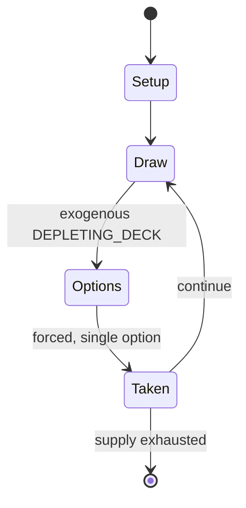

# Luck & Logic

*Japanese media franchise*

`luck_logic` &nbsp; state: **DEEPENED** &nbsp; method: **heuristic**

## Found layer (recorded, not trusted)

| field | value |
| --- | --- |
| wikidata | Q21517265 |
| wikipedia | Luck & Logic |
| genres (source) | LGBT-related television series |
| instance of (source) | anime television series, collectible card game, conflation |
| country of origin | Japan |

## Declared layer (orders bench work)

| field | value |
| --- | --- |
| year created | 2016 |
| epoch | CONTEMPORARY |
| region | EAST_ASIA |
| media | CARD, COLLECTIBLE |
| players | -- |
| age band | -- |
| exogenous process | DEPLETING_DECK |
| loss shape | -- |
| live axes | TRADE |
| horizon | VARIABLE |
| scoring shape | -- |
| information | -- |
| interaction | COMPETITIVE |
| turn structure | PHASE_STRUCTURED |
| tractability | EXACT_WITH_CUT |
| randomness | DECK_SHUFFLE, HIDDEN_INFO |
| luck factor | 0.53 |
| rules complexity | 3.8 |
| strategic depth | 1.95 |
| novelty | 0.0938 |
| solved status | -- |
| strategies | route_optimisation |
| algorithms | -- |

## Object model

```
Episode
  players      : ?
  turn_structure: PHASE_STRUCTURED
  horizon       : VARIABLE
  scoring       : ?

Deck           -- ordered multiset, drawn without replacement
Hand           -- private multiset held by one player
DiscardPile    -- public accumulation of spent cards
Offer          -- proposed exchange between two agents
```

## State transition diagram



## Research item -- turn trace

```
# Luck & Logic -- simulated turn events
# generated from the DECLARED vector, not from a rulebook.
# structure: exo=DEPLETING_DECK loss=None horizon=VARIABLE scoring=None axes=TRADE

t=0    SETUP        players=2  pot=0  capacity=4
t=1    DRAW         p1 draw from deck -> outcome #2  (p=0.199)
t=2    FORCED       p1 single legal option taken (pot_gain=+1.7)
t=3    DRAW         p1 draw from deck -> outcome #4  (p=0.190)
t=4    FORCED       p1 single legal option taken (pot_gain=+1.3)
t=5    DRAW         p1 draw from deck -> outcome #4  (p=0.006)
t=6    FORCED       p1 single legal option taken (pot_gain=+1.3)
t=7    DRAW         p1 draw from deck -> outcome #1  (p=0.156)
t=8    FORCED       p1 single legal option taken (pot_gain=+1.8)
t=9    DRAW         p1 draw from deck -> outcome #2  (p=0.231)
t=10   FORCED       p1 single legal option taken (pot_gain=+1.1)
t=11   ENDTURN      turn passes to p2
t=12   DRAW         p2 draw from deck -> outcome #5  (p=0.029)
t=13   FORCED       p2 single legal option taken (pot_gain=+0.6)
t=14   TRADE        p2 offers 2:1 exchange to p1
t=15   DRAW         p2 draw from deck -> outcome #2  (p=0.037)
t=16   FORCED       p2 single legal option taken (pot_gain=+0.6)
t=17   DRAW         p2 draw from deck -> outcome #3  (p=0.259)
t=18   FORCED       p2 single legal option taken (pot_gain=+0.6)
t=19   TRADE        p2 offers 2:1 exchange to p1
t=20   DRAW         p2 draw from deck -> outcome #3  (p=0.024)
t=21   FORCED       p2 single legal option taken (pot_gain=+1.0)
t=22   TRADE        p2 offers 2:1 exchange to p1
t=23   DRAW         p2 draw from deck -> outcome #2  (p=0.275)
t=24   FORCED       p2 single legal option taken (pot_gain=+1.6)
t=25   TRADE        p2 offers 2:1 exchange to p1
t=26   ENDTURN      turn passes to p1

terminal: VARIABLE
```

## Conditions

| kind | threshold | effect | trigger |
| --- | --- | --- | --- |
| TERMINATE | -- | -- | The game ends when one of two win conditions are met. |

## Source extract

Luck & Logic (ラクエンロジック, Raku en Rojikku) is a media franchise created by Bushiroad with five
other companies: Bandai Visual, Doga Kobo, Nitroplus, Lantis, and Yuhodo. It consists of a
trading card game, with the first products released on February 28, 2016, and an anime
television series by Doga Kobo.   == Plot ==   === Luck & Logic === In the year L.C. 922,
mankind faces an unprecedented crisis. Following the conclusion of a hundred-year war on the
mythical world of Tetra-Heaven, the losing demon gods sought a safe haven and invaded the human
world Septpia. The government forced to fight by employing logicalists belonging to the Another
Logic Counter Agency (ALCA), a special police that protects the streets from foreigners of
another world. Logicalists are given a special power that allows them to enter a trance with
goddesses from the other world. One day, Yoshichika Tsurugi, a civilian who is lacking "Logic"
and lives peacefully with his family, meets the beautiful goddess Athena while helping people
escape from a demon god attack. She wields the "Logic" that Yoshichika should have lost. This
leads Yoshichika to an unexpected destiny with Athena. To the young logicalists whose n

<sub>Wikipedia, CC BY-SA. Retained as evidence for the structural
classification above. Every rule inferred from it is HYPOTHESIZED
until audited against a rulebook.</sub>
