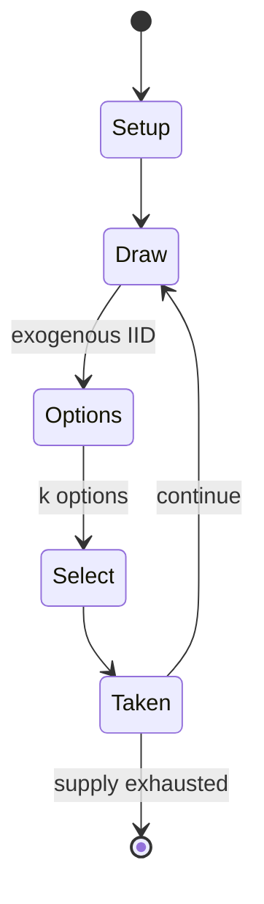

# Ludo

*board game*

`ludo` &nbsp; state: **DEEPENED** &nbsp; method: **heuristic**

## Found layer (recorded, not trusted)

| field | value |
| --- | --- |
| wikidata | Q1030283 |
| wikipedia | Ludo |
| genres (source) | -- |
| instance of (source) | board game, type of sport |
| country of origin | England |

## Declared layer (orders bench work)

| field | value |
| --- | --- |
| year created | -- |
| epoch | -- |
| region | EUROPE_WEST |
| media | BOARD, DICE |
| players | 2-4 |
| age band | -- |
| exogenous process | IID |
| loss shape | -- |
| live axes | SELECT, TRADE |
| horizon | -- |
| scoring shape | RACE_POSITION |
| information | -- |
| interaction | COMPETITIVE |
| turn structure | STRICT_TURN |
| tractability | EXACT_WITH_CUT |
| randomness | DICE |
| luck factor | 0.58 |
| rules complexity | 3.0 |
| strategic depth | 2.12 |
| novelty | 0.9219 |
| solved status | -- |
| strategies | area_control |
| algorithms | -- |

## Object model

```
Episode
  players      : 2-4
  turn_structure: STRICT_TURN
  horizon       : ?
  scoring       : RACE_POSITION

Board          -- spatial substrate; cells carry position and occupancy
Piece          -- movable token owned by a player
DicePool       -- n dice, each an iid categorical draw
Roll           -- realised outcome of a pool
OptionSet      -- the choices available after an exogenous draw
Offer          -- proposed exchange between two agents
```

## State transition diagram



## Research item -- turn trace

```
# Ludo -- simulated turn events
# generated from the DECLARED vector, not from a rulebook.
# structure: exo=IID loss=None horizon=None scoring=RACE_POSITION axes=SELECT,TRADE

t=0    SETUP        players=2  pot=0  capacity=6
t=1    DRAW         p1 roll from d6 pool -> outcome #4  (p=0.007)
t=2    SELECT       p1 1 options; take #1  (pot_gain=+1.6, capacity=-0)
t=3    DRAW         p1 roll from d6 pool -> outcome #2  (p=0.270)
t=4    SELECT       p1 1 options; take #1  (pot_gain=+3.0, capacity=-1)
t=5    DRAW         p1 roll from d6 pool -> outcome #1  (p=0.014)
t=6    SELECT       p1 2 options; take #1  (pot_gain=+1.0, capacity=-2)
t=7    TRADE        p1 offers 2:1 exchange to p2
t=8    DRAW         p1 roll from d6 pool -> outcome #2  (p=0.290)
t=9    SELECT       p1 4 options; take #3  (pot_gain=+2.8, capacity=-2)
t=10   TRADE        p1 offers 2:1 exchange to p2
t=11   DRAW         p1 roll from d6 pool -> outcome #5  (p=0.051)
t=12   SELECT       p1 2 options; take #1  (pot_gain=+2.8, capacity=-2)
t=13   DRAW         p1 roll from d6 pool -> outcome #6  (p=0.205)
t=14   SELECT       p1 2 options; take #1  (pot_gain=+2.3, capacity=-2)
t=15   TRADE        p1 offers 2:1 exchange to p2
t=16   DRAW         p1 roll from d6 pool -> outcome #2  (p=0.116)
t=17   SELECT       p1 3 options; take #3  (pot_gain=+3.1, capacity=-1)
t=18   TRADE        p1 offers 2:1 exchange to p2
t=19   ENDTURN      turn passes to p2
t=20   DRAW         p2 roll from d6 pool -> outcome #4  (p=0.198)
t=21   SELECT       p2 1 options; take #1  (pot_gain=+0.6, capacity=-1)
t=22   DRAW         p2 roll from d6 pool -> outcome #2  (p=0.084)
t=23   SELECT       p2 4 options; take #1  (pot_gain=+0.6, capacity=-0)
t=24   TRADE        p2 offers 2:1 exchange to p1
t=25   DRAW         p2 roll from d6 pool -> outcome #2  (p=0.187)
t=26   SELECT       p2 4 options; take #4  (pot_gain=+1.2, capacity=-1)

terminal: VARIABLE
```

## Conditions

| kind | threshold | effect | trigger |
| --- | --- | --- | --- |
| BOUNDARY | 1 piece | -- | A player cannot move their first piece into the home column unless they have captured at least one piece of any of the opponents. |
| WIN | -- | -- | The first player to bring all their tokens to the finish wins the game. |

## Source extract

Ludo (; from Latin  ludo '[I] play') is a strategy-based board game for two to four players, in
which the players race their four tokens from start to finish according to the rolls of a single
die. Ludo shares characteristics with other cross-and-circle games from around the world; these
types of games include the pre-Columbian Mesoamerican game Patolli, and the Indian game Pachisi.
The game and its variations are popular in many countries and under various names.   == History
==  Ludo uses a cubic die with a dice cup and was marketed as "Ludo" in England in 1896 by
Alfred Coller. Coller eventually patented the game and sold it as "Royal Ludo". The board game
Uckers, popular in the Royal Navy, is based on Ludo.   == Ludo board == Special areas of the
Ludo board are typically coloured bright yellow, green, red, and blue. Each player is assigned a
colour and has four tokens in their colour. The board is normally square with a cross-shaped
playspace, with each arm of the cross having three columns of squares, usually six per column.
The middle columns usually have five squares coloured; these represent a player's home column. A
sixth coloured square not on the home column is a player'

<sub>Wikipedia, CC BY-SA. Retained as evidence for the structural
classification above. Every rule inferred from it is HYPOTHESIZED
until audited against a rulebook.</sub>
