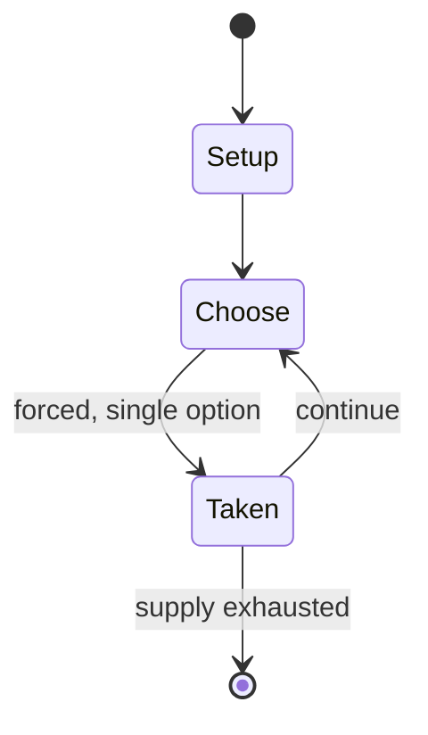

# Ludus latrunculorum

`ludus_latrunculorum` &nbsp; state: **DEEPENED** &nbsp; method: **heuristic**

## Found layer (recorded, not trusted)

| field | value |
| --- | --- |
| wikidata | Q1700280 |
| wikipedia | Ludus latrunculorum |
| genres (source) | -- |
| instance of (source) | -- |
| country of origin | -- |

## Declared layer (orders bench work)

| field | value |
| --- | --- |
| year created | -- |
| epoch | -- |
| region | -- |
| media | BOARD |
| players | -- |
| age band | -- |
| exogenous process | NONE |
| loss shape | OPPORTUNITY_ONLY |
| live axes | ORDER, SPATIAL |
| horizon | -- |
| scoring shape | -- |
| information | PERFECT |
| interaction | SOLITAIRE |
| turn structure | PHASE_STRUCTURED |
| tractability | EXACT_WITH_CUT |
| randomness | NONE |
| luck factor | 0.02 |
| rules complexity | 3.48 |
| strategic depth | 2.4 |
| novelty | 0.7773 |
| solved status | -- |
| strategies | -- |
| algorithms | -- |

## Object model

```
Episode
  players      : ?
  turn_structure: PHASE_STRUCTURED
  horizon       : ?
  scoring       : ?

Board          -- spatial substrate; cells carry position and occupancy
Piece          -- movable token owned by a player
Sequence       -- the permutation under the player's control
Placement      -- position subject to geometric legality
```

## State transition diagram



## Research item -- turn trace

```
# Ludus latrunculorum -- simulated turn events
# generated from the DECLARED vector, not from a rulebook.
# structure: exo=NONE loss=OPPORTUNITY_ONLY horizon=None scoring=None axes=ORDER,SPATIAL

t=0    SETUP        players=2  pot=0  capacity=4
t=1    FORCED       p1 single legal option taken (pot_gain=+1.5)
t=2    FORCED       p1 single legal option taken (pot_gain=+1.4)
t=3    ENDTURN      turn passes to p2
t=4    FORCED       p2 single legal option taken (pot_gain=+0.7)
t=5    SPATIAL      p2 places at (2,0); adjacency legal
t=6    FORCED       p2 single legal option taken (pot_gain=+1.0)
t=7    FORCED       p2 single legal option taken (pot_gain=+1.2)
t=8    FORCED       p2 single legal option taken (pot_gain=+1.6)
t=9    SPATIAL      p2 places at (1,4); adjacency legal
t=10   FORCED       p2 single legal option taken (pot_gain=+1.2)
t=11   FORCED       p2 single legal option taken (pot_gain=+0.9)
t=12   FORCED       p2 single legal option taken (pot_gain=+1.6)
t=13   SPATIAL      p2 places at (4,7); adjacency legal
t=14   ENDTURN      turn passes to p1
t=15   FORCED       p1 single legal option taken (pot_gain=+1.9)
t=16   SPATIAL      p1 places at (7,5); adjacency legal
t=17   FORCED       p1 single legal option taken (pot_gain=+1.4)
t=18   FORCED       p1 single legal option taken (pot_gain=+0.9)
t=19   FORCED       p1 single legal option taken (pot_gain=+0.7)
t=20   FORCED       p1 single legal option taken (pot_gain=+1.4)
t=21   ENDTURN      turn passes to p2
t=22   FORCED       p2 single legal option taken (pot_gain=+2.0)
t=23   FORCED       p2 single legal option taken (pot_gain=+1.8)
t=24   FORCED       p2 single legal option taken (pot_gain=+2.0)
t=25   SPATIAL      p2 places at (0,4); adjacency legal
t=26   FORCED       p2 single legal option taken (pot_gain=+1.4)
t=27   SPATIAL      p2 places at (3,2); adjacency legal

terminal: VARIABLE
```

## Conditions

| kind | threshold | effect | trigger |
| --- | --- | --- | --- |
| BOUNDARY | 2 players | -- | The two players agree about the number of pieces, at least 16, but not more than 24 for each player. |
| WIN | -- | -- | A player who immobilizes the enemy's dux wins the game, even if some of the obstruction is by the dux's own men. |
| WIN | -- | -- | Victory is by capturing more pieces than one's opponent, or by hemming in the opponent's pieces so that movement is impossible. |
| LOSE | -- | -- | A player who loses all his pieces loses the game. |

## Source extract

Ludus latrunculorum, latrunculi, or simply latrones ("the game of brigands", or "the game of
soldiers" from latrunculus, diminutive of latro, mercenary or highwayman) was a two-player
strategy board game played throughout the Roman Empire. It is said to resemble chess or
draughts, as it is generally accepted to be a game of military tactics. Because of the scarcity
of sources, reconstruction of the game's rules and basic structure is difficult, and therefore
there are multiple interpretations of the available evidence.   == History ==   === Sources ===
The game of latrunculi is believed to be a variant of earlier Greek games known variously as
petteia, pessoí, psêphoi, poleis and pente grammaí, to which references are found as early as
Homer's time.  In Plato's Republic, Socrates' opponents are compared to "bad Petteia players,
who are finally cornered and made unable to move." In the Phaedrus, Plato writes that these
games come from Egypt.  Latrunculi is often compared to a draughts-like game with custodial
capture, called seega, known in Egypt from the late 18th century. In his Onomasticon, the Greek
writer Julius Pollux describes poleis as follows:  The game played with many pi

<sub>Wikipedia, CC BY-SA. Retained as evidence for the structural
classification above. Every rule inferred from it is HYPOTHESIZED
until audited against a rulebook.</sub>
