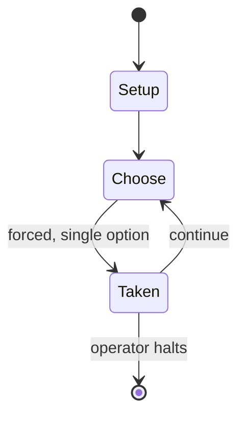

# Luftwaffe

*board wargame*

`luftwaffe` &nbsp; state: **DEEPENED** &nbsp; method: **heuristic**

## Found layer (recorded, not trusted)

| field | value |
| --- | --- |
| wikidata | Q112623214 |
| wikipedia | Luftwaffe (board wargame) |
| genres (source) | -- |
| instance of (source) | board game, board wargame |
| country of origin | -- |

## Declared layer (orders bench work)

| field | value |
| --- | --- |
| year created | 1969 |
| epoch | MODERN |
| region | -- |
| media | BOARD, WARGAME |
| players | 2 |
| age band | -- |
| exogenous process | -- |
| loss shape | -- |
| live axes | SPATIAL |
| horizon | OPEN_ENDED |
| scoring shape | -- |
| information | ASYMMETRIC |
| interaction | COMPETITIVE |
| turn structure | -- |
| tractability | SAMPLING_ONLY |
| randomness | DICE |
| luck factor | 0.58 |
| rules complexity | 3.2 |
| strategic depth | 1.87 |
| novelty | 0.6249 |
| solved status | -- |
| strategies | -- |
| algorithms | -- |

## Object model

```
Episode
  players      : 2
  turn_structure: ?
  horizon       : OPEN_ENDED
  scoring       : ?

Board          -- spatial substrate; cells carry position and occupancy
Piece          -- movable token owned by a player
Placement      -- position subject to geometric legality
```

## State transition diagram



## Research item -- turn trace

```
# Luftwaffe -- simulated turn events
# generated from the DECLARED vector, not from a rulebook.
# structure: exo=None loss=None horizon=OPEN_ENDED scoring=None axes=SPATIAL

t=0    SETUP        players=2  pot=0  capacity=6
t=1    FORCED       p1 single legal option taken (pot_gain=+1.3)
t=2    SPATIAL      p1 places at (0,6); adjacency legal
t=3    FORCED       p1 single legal option taken (pot_gain=+1.6)
t=4    ENDTURN      turn passes to p2
t=5    FORCED       p2 single legal option taken (pot_gain=+1.3)
t=6    FORCED       p2 single legal option taken (pot_gain=+1.8)
t=7    SPATIAL      p2 places at (7,7); adjacency legal
t=8    FORCED       p2 single legal option taken (pot_gain=+0.7)
t=9    FORCED       p2 single legal option taken (pot_gain=+0.8)
t=10   ENDTURN      turn passes to p1
t=11   FORCED       p1 single legal option taken (pot_gain=+1.8)
t=12   SPATIAL      p1 places at (1,5); adjacency legal
t=13   ENDTURN      turn passes to p2
t=14   FORCED       p2 single legal option taken (pot_gain=+1.1)
t=15   SPATIAL      p2 places at (2,1); adjacency legal
t=16   FORCED       p2 single legal option taken (pot_gain=+0.9)
t=17   FORCED       p2 single legal option taken (pot_gain=+1.8)
t=18   SPATIAL      p2 places at (1,2); adjacency legal
t=19   ENDTURN      turn passes to p1
t=20   FORCED       p1 single legal option taken (pot_gain=+0.7)
t=21   SPATIAL      p1 places at (6,0); adjacency legal
t=22   FORCED       p1 single legal option taken (pot_gain=+1.7)
t=23   FORCED       p1 single legal option taken (pot_gain=+1.9)
t=24   ENDTURN      turn passes to p2
t=25   FORCED       p2 single legal option taken (pot_gain=+1.1)
t=26   FORCED       p2 single legal option taken (pot_gain=+0.6)
t=27   SPATIAL      p2 places at (5,6); adjacency legal

terminal: OPEN_ENDED
```

## Source extract

Luftwaffe, subtitled "The Game of Aerial Combat Over Germany 1943-45", is a board wargame
originally published by Poultron Press in 1969 under a different title, then subsequently sold
to Avalon Hill, who republished it in 1971. The game is an operational simulation of the
American bombing campaign against Germany during World War II.   == Description == Luftwaffe is
a two-player operational wargame in which one player controls American bomber and fighter
groups, and the other controls German air defenses.   === Components === The game box includes:
22" x 24" mounted hex grid map scaled at 20 mi (32 km) per hex 180 die-cut counters rulebook
historical analysis book various charts and player aids six-sided die pad of target selection
forms   === Gameplay === The Basic game (twenty turns) represents one air raid, and is designed
to teach the game. Once players are familiar with the game, the Advanced and Tournament rules
require up to ten separate raids representing a three-month bombing campaign, as well as more
rules for increased realism.   == Publication history == In the late 1960s, Avalon Hill
dominated the board wargame market, producing on average, one game per year with wel

<sub>Wikipedia, CC BY-SA. Retained as evidence for the structural
classification above. Every rule inferred from it is HYPOTHESIZED
until audited against a rulebook.</sub>
