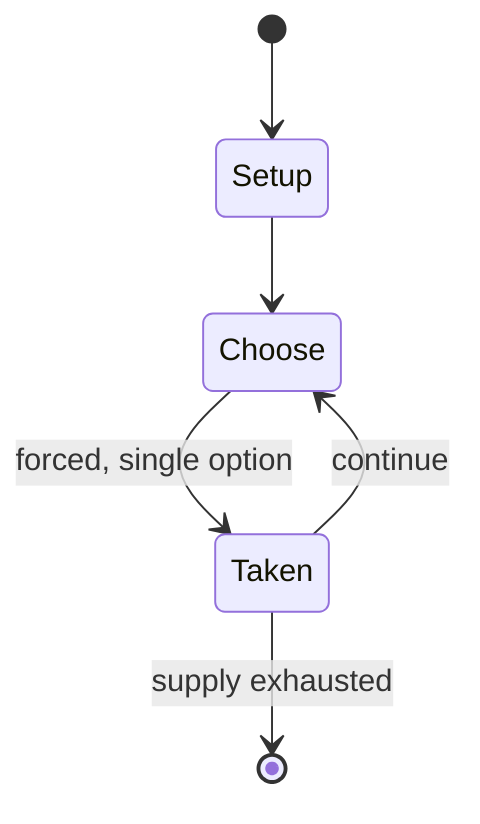

# Luksong baka

`luksong_baka` &nbsp; state: **DEEPENED** &nbsp; method: **heuristic**

## Found layer (recorded, not trusted)

| field | value |
| --- | --- |
| wikidata | Q6702595 |
| wikipedia | Luksong baka |
| genres (source) | -- |
| instance of (source) | -- |
| country of origin | -- |

## Declared layer (orders bench work)

| field | value |
| --- | --- |
| year created | -- |
| epoch | -- |
| region | -- |
| media | - |
| players | -- |
| age band | -- |
| exogenous process | -- |
| loss shape | -- |
| live axes | - |
| horizon | -- |
| scoring shape | SET_COLLECTION_CONVEX |
| information | -- |
| interaction | SOLITAIRE |
| turn structure | -- |
| tractability | SAMPLING_ONLY |
| randomness | -- |
| luck factor | 0.35 |
| rules complexity | 1.71 |
| strategic depth | 2.25 |
| novelty | 0.5007 |
| solved status | -- |
| strategies | set_collection |
| algorithms | -- |

## Object model

```
Episode
  players      : ?
  turn_structure: ?
  horizon       : ?
  scoring       : SET_COLLECTION_CONVEX

State          -- opaque; no medium or axis evidence was found
Player         -- an agent that selects among legal successors
```

## State transition diagram



## Research item -- turn trace

```
# Luksong baka -- simulated turn events
# generated from the DECLARED vector, not from a rulebook.
# structure: exo=None loss=None horizon=None scoring=SET_COLLECTION_CONVEX axes=-

t=0    SETUP        players=2  pot=0  capacity=8
t=1    FORCED       p1 single legal option taken (pot_gain=+0.8)
t=2    FORCED       p1 single legal option taken (pot_gain=+0.6)
t=3    FORCED       p1 single legal option taken (pot_gain=+1.9)
t=4    FORCED       p1 single legal option taken (pot_gain=+1.4)
t=5    FORCED       p1 single legal option taken (pot_gain=+0.8)
t=6    ENDTURN      turn passes to p2
t=7    FORCED       p2 single legal option taken (pot_gain=+1.1)
t=8    FORCED       p2 single legal option taken (pot_gain=+1.9)
t=9    FORCED       p2 single legal option taken (pot_gain=+1.9)
t=10   FORCED       p2 single legal option taken (pot_gain=+1.2)
t=11   FORCED       p2 single legal option taken (pot_gain=+1.5)
t=12   ENDTURN      turn passes to p1
t=13   FORCED       p1 single legal option taken (pot_gain=+0.7)
t=14   FORCED       p1 single legal option taken (pot_gain=+0.7)
t=15   FORCED       p1 single legal option taken (pot_gain=+0.9)
t=16   ENDTURN      turn passes to p2
t=17   FORCED       p2 single legal option taken (pot_gain=+1.5)
t=18   FORCED       p2 single legal option taken (pot_gain=+0.9)
t=19   FORCED       p2 single legal option taken (pot_gain=+1.5)
t=20   FORCED       p2 single legal option taken (pot_gain=+1.9)
t=21   FORCED       p2 single legal option taken (pot_gain=+1.3)
t=22   ENDTURN      turn passes to p1
t=23   FORCED       p1 single legal option taken (pot_gain=+0.7)
t=24   FORCED       p1 single legal option taken (pot_gain=+1.7)
t=25   FORCED       p1 single legal option taken (pot_gain=+1.6)
t=26   FORCED       p1 single legal option taken (pot_gain=+1.8)

terminal: VARIABLE
```

## Conditions

| kind | threshold | effect | trigger |
| --- | --- | --- | --- |
| BOUNDARY | 3 players | -- | It involves a minimum of three players and a maximum of 10 players, and involves them jumping over the person called the baka, or "cow". |

## Source extract

Luksong baka (English: Jump over the Cow, leapfrog) is a traditional Filipino game that
originated in Bulacan. It involves a minimum of three players and a maximum of 10 players, and
involves them jumping over the person called the baka, or "cow". The main goal of the players is
to successfully jump over the baka without touching or falling over the baka.   == Rules == At
the start of the game, one player is designated taya (it), or in this game the bakang lala
(cow). The players should avoid touching or falling over the baka player while jumping over. The
baka player should start with a kneeling-down position (a baka player bends over with their
hands placed on his knees). All players are to jump over the baka until all the players have
jumped. Once the first set of jumping over the baka is done, the baka player will slowly rise up
after jumping over the baka player. Only the hands of the jumper may touch the back of the
person who is bent over. If a player fails to avoid contact or fall over the baka, they will
replace the baka player with a kneeling position (step 3), and the game continues until the all
players decide to end the game.   === Other notes === Players should find a

<sub>Wikipedia, CC BY-SA. Retained as evidence for the structural
classification above. Every rule inferred from it is HYPOTHESIZED
until audited against a rulebook.</sub>
