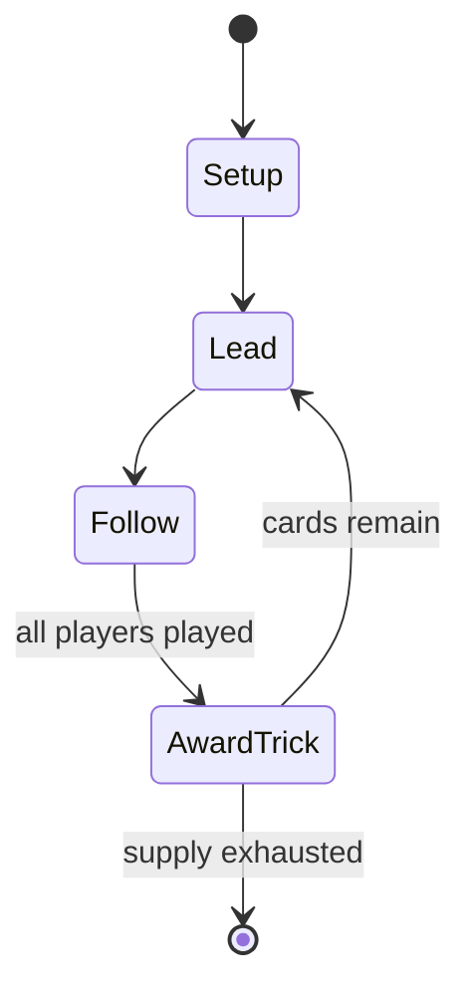

# Lupfen

*card game for 3 to 5 players*

`lupfen` &nbsp; state: **DEEPENED** &nbsp; method: **heuristic**

## Found layer (recorded, not trusted)

| field | value |
| --- | --- |
| wikidata | Q1281279 |
| wikipedia | Lupfen (card game) |
| genres (source) | -- |
| instance of (source) | card game, trick-taking game |
| country of origin | -- |

## Declared layer (orders bench work)

| field | value |
| --- | --- |
| year created | -- |
| epoch | -- |
| region | -- |
| media | CARD, TRICK_TAKING |
| players | 3-5 |
| age band | -- |
| exogenous process | DEPLETING_DECK |
| loss shape | -- |
| live axes | COMMIT_BLIND |
| horizon | -- |
| scoring shape | -- |
| information | -- |
| interaction | SOLITAIRE |
| turn structure | TRICK_ROUND |
| tractability | EXACT_WITH_CUT |
| randomness | DECK_SHUFFLE |
| luck factor | 0.48 |
| rules complexity | 2.1 |
| strategic depth | 2.25 |
| novelty | 0.7287 |
| solved status | -- |
| strategies | spatial_packing |
| algorithms | -- |

## Object model

```
Episode
  players      : 3-5
  turn_structure: TRICK_ROUND
  horizon       : ?
  scoring       : ?

Deck           -- ordered multiset, drawn without replacement
Hand           -- private multiset held by one player
DiscardPile    -- public accumulation of spent cards
Trick          -- one card per player; a winner is determined
Trump          -- suit that dominates the ordering
SealedChoice   -- irrevocable choice made without observation
```

## State transition diagram



## Research item -- turn trace

```
# Lupfen -- simulated turn events
# generated from the DECLARED vector, not from a rulebook.
# structure: exo=DEPLETING_DECK loss=None horizon=None scoring=None axes=COMMIT_BLIND

t=0    SETUP        players=3  pot=0  capacity=3
t=1    DRAW         p1 draw from deck -> outcome #6  (p=0.134)
t=2    FORCED       p1 single legal option taken (pot_gain=+0.5)
t=3    ENDTURN      turn passes to p2
t=4    DRAW         p2 draw from deck -> outcome #3  (p=0.163)
t=5    FORCED       p2 single legal option taken (pot_gain=+1.3)
t=6    DRAW         p2 draw from deck -> outcome #2  (p=0.273)
t=7    FORCED       p2 single legal option taken (pot_gain=+1.1)
t=8    DRAW         p2 draw from deck -> outcome #6  (p=0.229)
t=9    FORCED       p2 single legal option taken (pot_gain=+0.7)
t=10   DRAW         p2 draw from deck -> outcome #3  (p=0.163)
t=11   FORCED       p2 single legal option taken (pot_gain=+1.6)
t=12   ENDTURN      turn passes to p3
t=13   DRAW         p3 draw from deck -> outcome #1  (p=0.107)
t=14   FORCED       p3 single legal option taken (pot_gain=+0.7)
t=15   ENDTURN      turn passes to p1
t=16   DRAW         p1 draw from deck -> outcome #4  (p=0.143)
t=17   FORCED       p1 single legal option taken (pot_gain=+1.0)
t=18   ENDTURN      turn passes to p2
t=19   DRAW         p2 draw from deck -> outcome #5  (p=0.074)
t=20   FORCED       p2 single legal option taken (pot_gain=+1.6)
t=21   DRAW         p2 draw from deck -> outcome #4  (p=0.173)
t=22   FORCED       p2 single legal option taken (pot_gain=+1.7)
t=23   DRAW         p2 draw from deck -> outcome #3  (p=0.295)
t=24   FORCED       p2 single legal option taken (pot_gain=+1.4)
t=25   DRAW         p2 draw from deck -> outcome #1  (p=0.277)
t=26   FORCED       p2 single legal option taken (pot_gain=+1.2)

terminal: VARIABLE
```

## Conditions

| kind | threshold | effect | trigger |
| --- | --- | --- | --- |
| BOUNDARY | 1 player | -- | Force deals are repeated until at least one player fails to take any tricks. |
| BOUNDARY | 1 trick | -- | The remaining players now decide whether or not to take up the challenge by saying "play!" (mit!", literally "with!"), thereby undertaking to win at least one trick. |

## Source extract

Lupfen is a card game for 3–5 players that is played mainly in west Austria and south Germany,
but also in Liechtenstein. The rules vary slightly from region to region, but the basic game in
each variation is identical. It is one of the Rams group of card games characterised by allowing
players to drop out of the current game if they think they will be unable to win any tricks or a
minimum number of tricks.   == History == In many ways, Lupfen resembles the game of Tippen
which was already well known in the 19th century. However, the main differences are that Tippen
is played with 32 cards and no special combinations, whereas Lupfen is played with just 20
cards, players may 'lift' for trump and certain card combinations come into play. Today, Lupfen
is mainly played in the Austrian state of Vorarlberg and in the southern German region of the
Allgäu, usually for small monetary stakes. The first international Lupfen competition was held
Öflingen in the south German state of Baden-Württemberg in 1974. It is also played by students
in Liechtenstein.   == Rules == Lupfen is normally played by three to six players with a pack of
Salzburg or Bavarian pattern cards with the suits of Acorns

<sub>Wikipedia, CC BY-SA. Retained as evidence for the structural
classification above. Every rule inferred from it is HYPOTHESIZED
until audited against a rulebook.</sub>
